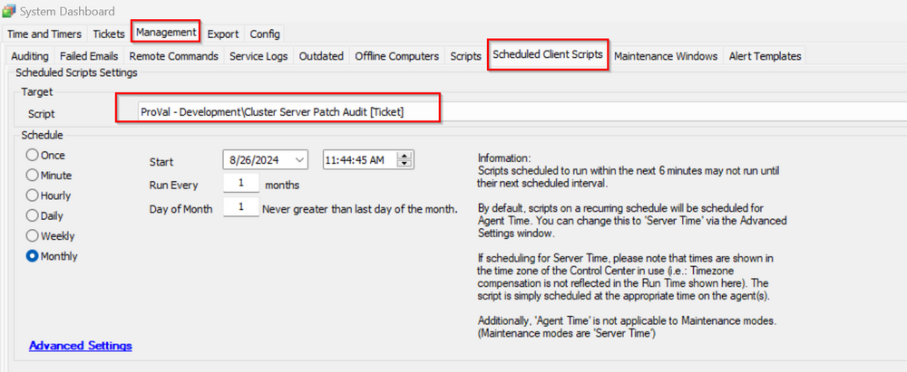

## Summary

This client script creates a ticket for all the cluster hosts where the currently installed Cumulative Update is older than 60 days, as indicated in the [Table - pvl_win_latest_installed_cu](/docs/c03e4def-7efe-4a8b-99e9-d99ac2c65f5a).

## Sample Run

## Dependencies

[Table - pvl_win_latest_installed_cu](/docs/c03e4def-7efe-4a8b-99e9-d99ac2c65f5a)

## Output

- Ticket
- Script log

## Ticketing

**Subject:**  
UPDATES - Cluster Server Patching for @ServerCount@ Servers at @sqlname@

**Body:**  
There are @ServerCount@ server(s) at @sqlname@ that are in need of manual patching, as Automate is not recommended for patching clusters. Please manually patch the machine(s) listed below:

%sqlresult%

Thank you!

