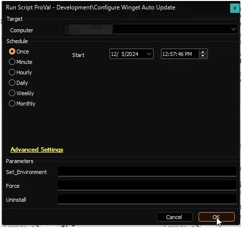
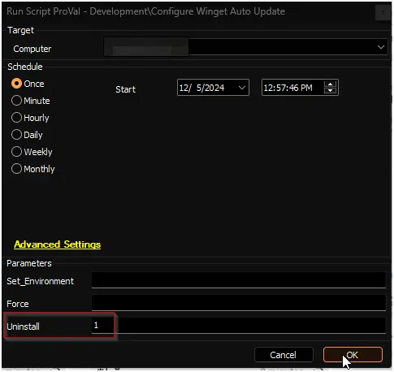
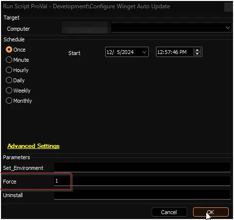
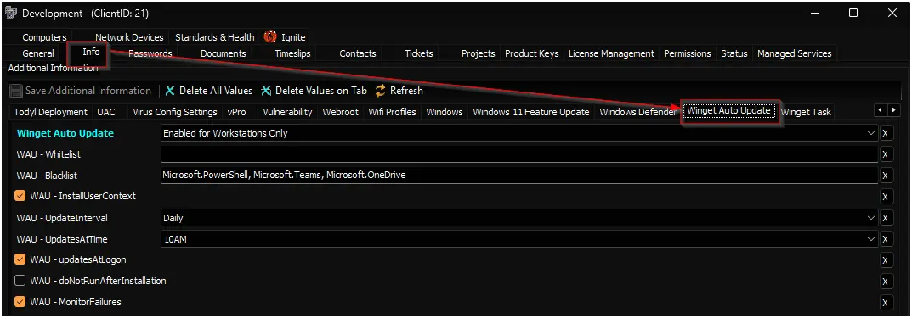

## Summary

The script deploys and configures a self-contained, portable Winget auto-update solution on the endpoint. It is completely independent of any external Winget-AutoUpdate software, using the [Configure-WingetAutoUpdate](/docs/0eb97e73-a060-4f47-a601-439b171d14cf) PowerShell script. The solution deploys a portable copy of Winget and its dependencies, writes approval lists (whitelist/blacklist), stores the auto-update policy for auditing, and registers scheduled tasks for system and optionally user context.

Two remote monitors are created to ensure ongoing health:

- [Winget Auto Update Errors](/docs/68a14948-368f-4064-97a3-d1928e122013) – detects runtime failures in the update process. This monitor is only created when the client‑level EDF `WAU - MonitorFailures` is flagged.
- [Winget Auto Update Configuration Check](/docs/a6200c89-b918-43a9-8632-fa2effac2e0c) – verifies that the scheduled tasks and stored configuration are intact and automatically triggers a repair if they are missing. This monitor is created whenever the Winget Auto Update solution is enabled (i.e., the `Winget Auto Update` EDF is not `Disabled` and the computer/location is not excluded).

Configuration is driven entirely by client, location, and computer EDFs, which are explained later in this document.

## Update Notice: 30‑June‑2026

If you are updating the solution after 30‑June‑2026, you must run the script once with `Set_Environment = 1` to implement the new EDF structure (removal of `WAU - NotificationLevel` and addition of the `Audit Only` dropdown option).

## Sample Run

**First Run / Environment Setup:**  
When setting up the solution for the first time, or when upgrading from a version prior to 30‑June‑2026, run the script with the `Set_Environment` parameter set to `1`. This creates the necessary [pvl_wau_config](/docs/be117f3c-0af2-4edb-8fcc-06da1a4db062) table, inserts all required EDFs, adds the new `Audit Only` option to the Winget Auto Update dropdown, and removes any obsolete EDFs (e.g., `WAU - NotificationLevel`).

**Regular Execution:**  

**Uninstall:**  
Setting `Uninstall` to `1` removes all scheduled tasks, runtime files, stored configuration, and deletes the remote monitors, including [Winget Auto Update Errors](/docs/68a14948-368f-4064-97a3-d1928e122013).    

**Force:**  
The script normally compares the existing configuration with the EDF settings before making changes. Setting `Force` to `1` skips this comparison and re‑deploys all components, including re‑installing the portable Winget files.  

## Dependencies

- [PowerShell - Configure-WingetAutoUpdate](/docs/0eb97e73-a060-4f47-a601-439b171d14cf)
- [Internal Monitor - Execute Script - Configure Winget Auto Update](/docs/a2fa065f-6f76-4442-a0e0-a64365f6c331)
- [Solution - Winget Auto Update](/docs/92b2ccf2-534f-46b6-b1d1-dd77dea47ba8)

## Global Variables

| Name | Value | Accepted Values | Description |
| ---- | ----- | --------------- | ----------- |
| Debug | `False` | `False`, `True` | When `True`, enables informational logging; when `False` (default), informational logs are suppressed to avoid adding entries to the `h_scripts` table. Set to `True` to assist with troubleshooting. |
| ScriptEngineEnableLogger | `False` | `False`, `True` | When `True`, enables final (success/failure) logging; when `False` (default), these logs are suppressed to avoid adding entries to the `h_scripts` table. Set to `True` to assist with troubleshooting. |

## User Parameters

| Name                | Example | Required                        | Description                                                                                                                                                                                                                                    |
|---------------------|---------|---------------------------------|------------------------------------------------------------------------------------------------------------------------------------------------------------------------------------------------------------------------------------------------|
| Set_Environment     | 1       | True (for first execution)     | Run the script with the `Set_Environment` parameter set to `1` for the first run to create the [pvl_wau_config](/docs/be117f3c-0af2-4edb-8fcc-06da1a4db062) table and EDFs used by the solution. Also required when upgrading from a version prior to 30‑June‑2026 to migrate the EDF structure. |
| Force               | 1       | False                           | The script's default nature is to compare the existing configuration before running the installation. Setting the `Force` to `1` will skip the comparison and re‑deploy all components, including portable Winget files.                                                                                          |
| Uninstall           | 1       | False                           | Removes the scheduled tasks, runtime files, stored configuration, and both remote monitors. |

## Client-Level EDF

| Name                          | Example                                                   | Type      | Dropdown Options / Notes                                                                                                                                               | Description                                                                                                                                                                 |
|-------------------------------|-----------------------------------------------------------|-----------|------------------------------------------------------------------------------------------------------------------------------------------------------------------------|-----------------------------------------------------------------------------------------------------------------------------------------------------------------------------|
| Winget Auto Update            | Enabled for Servers and Workstations                      | Dropdown  | <ul><li>Disabled</li><li>Enabled for Workstations Only</li><li>Enabled for Servers and Workstations</li><li>Audit Only</li></ul>                                        | Set this EDF to enable the Winget Auto Update solution. The **Audit Only** mode performs application inventory auditing without installing any update schedules.            |
| WAU - Whitelist               | Ditto.Ditto, Greenshot.Greenshot, HeidiSQL.HeidiSQL...    | Text      |                                                                                                                                                                        | A comma-separated list of applications to update. By default, all applications are updated unless a whitelist is defined. This list overrides the blacklist.                |
| WAU - Blacklist               | Ditto.Ditto, Greenshot.Greenshot, HeidiSQL.HeidiSQL...    | Text      |                                                                                                                                                                        | A comma-separated list of applications to exclude. Only one of Whitelist or Blacklist may be used; Whitelist takes precedence if both are supplied.                         |
| WAU - InstallUserContext      |                                                           | Check-Box |                                                                                                                                                                        | Flag this EDF to enable auto-update for user-level applications in addition to system-wide ones. **Note:** End users may see a PowerShell window during the scheduled update. |
| WAU - UpdateInterval          | Daily                                                     | Dropdown  | Daily · BiDaily · Weekly · BiWeekly · Monthly · Never                                                                                                                   | Specifies the frequency of update checks. Default: Daily.                                                                                                                   |
| WAU - UpdatesAtTime           | 06AM                                                      | Dropdown  | 12‑hour format with 30‑minute increments (see previous dropdown list)                                                                                                  | Specifies the time for updates in 12‑hour format. Default: 06AM.                                                                                                            |
| WAU - updatesAtLogon          |                                                           | Check-Box |                                                                                                                                                                        | When flagged, the update task also runs at user logon. Can be combined with `UpdatesAtTime`.                                                                                |
| WAU - doNotRunAfterInstallation |                                                        | Check-Box |                                                                                                                                                                        | Flag to prevent the update runtime from executing immediately after configuration. By default, it runs once after setup.                                                    |
| WAU - MonitorFailures         |                                                           | Check-Box |                                                                                                                                                                        | Flag to create the [Winget Auto Update Errors](/docs/68a14948-368f-4064-97a3-d1928e122013) remote monitor, which alerts on runtime failures.                                |

*The deprecated `WAU - NotificationLevel` EDF has been removed. Notification settings are no longer configurable; the solution operates silently.*

## Location-Level EDF

| Name                          | Type      | Section    | Description                                                                                      |
|-------------------------------|-----------|------------|--------------------------------------------------------------------------------------------------|
| Exclude From Winget Auto Update | Check-Box | Exclusions | Flag this EDF to exclude the location from the Winget Auto Update solution.                     |

## Computer-Level EDF

| Name                          | Type      | Section    | Description                                                                                      |
|-------------------------------|-----------|------------|--------------------------------------------------------------------------------------------------|
| Exclude From Winget Auto Update | Check-Box | Exclusions | Flag this EDF to exclude the computer from the Winget Auto Update solution.                     |

## Output

### Scheduled Tasks

Two tasks are created under the `\WAU\` path:

| Task Name                        | Context | Description                                                                                 |
|----------------------------------|---------|---------------------------------------------------------------------------------------------|
| `Winget-AutoUpdate`                | SYSTEM  | Runs the update runtime on the defined schedule (and optionally at logon).                 |
| `Winget-AutoUpdate-UserContext`    | User    | Created only if `WAU - InstallUserContext` is flagged. Runs after the system task finishes. |

*Note: The legacy `Winget-AutoUpdate-Notify` and `Winget-AutoUpdate-Policies` tasks are no longer used. They are automatically removed when the new solution is deployed.*

### Files

| Path | Description |
|------|-------------|
| `C:\ProgramData\_Automation\App\Winget\` | Portable Winget and its dependencies. |
| `C:\ProgramData\_Automation\Script\Winget-AutoUpdate\` | Runtime script (`Winget-UpdateApproved.ps1`), invisible launcher (`Invisible.vbs`), approval lists (`included_apps.txt` / `excluded_apps.txt`), and runtime logs. |
| `C:\ProgramData\_Automation\Script\Winget-AutoUpdate\Winget-UpdateApproved-error.txt` | Error log generated by the update runtime. Cleared at the start of each run. |
| `C:\ProgramData\_Automation\Script\Winget-AutoUpdate\Winget-UpdateApproved-log.txt` | Informational log from the update runtime. |

### Remote Monitors

| Monitor Name | Trigger | Behavior |
|--------------|---------|----------|
| [Winget Auto Update Errors](/docs/68a14948-368f-4064-97a3-d1928e122013) | Checks for existence of the runtime error log. If present and recently written, it raises an alert with the failure details. | Created when `WAU - MonitorFailures` is flagged. |
| [Winget Auto Update Configuration Check](/docs/a6200c89-b918-43a9-8632-fa2effac2e0c) | Validates that the scheduled tasks exist (1–2 tasks) and the stored configuration table is present. If either fails, it returns "Force", which triggers a re‑run of the solution with the `-Force` parameter to repair the configuration. | Always created when the solution is enabled, regardless of other EDFs. This monitor runs every hour. |

## Changelog

### 2026-07-01

- Replaced the legacy [Romanitho Winget-AutoUpdate](https://github.com/Romanitho/Winget-AutoUpdate) software with an independent, portable Winget solution using the [Configure-WingetAutoUpdate](/docs/0eb97e73-a060-4f47-a601-439b171d14cf) PowerShell script.
- Removed the `WAU - NotificationLevel` EDF and all related notification settings.
- Added the `Audit Only` option to the `Winget Auto Update` EDF dropdown.
- Introduced a new remote monitor [Winget Auto Update Configuration Check](/docs/a6200c89-b918-43a9-8632-fa2effac2e0c) to automatically detect and repair missing configurations.
- Updated all file paths, scheduled tasks, and monitor logic to reflect the new architecture.
- Cleaned up obsolete EDFs and database columns (e.g., `notification` column in `pvl_wau_config`).

### 2025-04-10

- Fixed the script where it was exiting with Success status when it failed because it wasn't able to download the ps1 file

### 2025-04-08

- Initial version of the document
