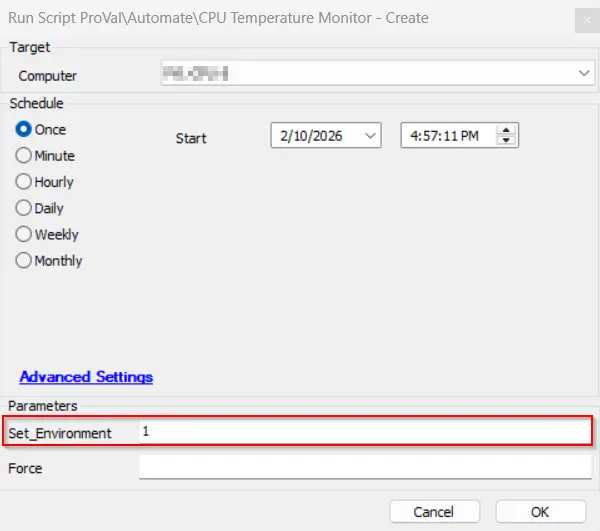
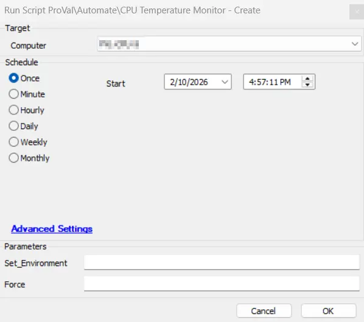
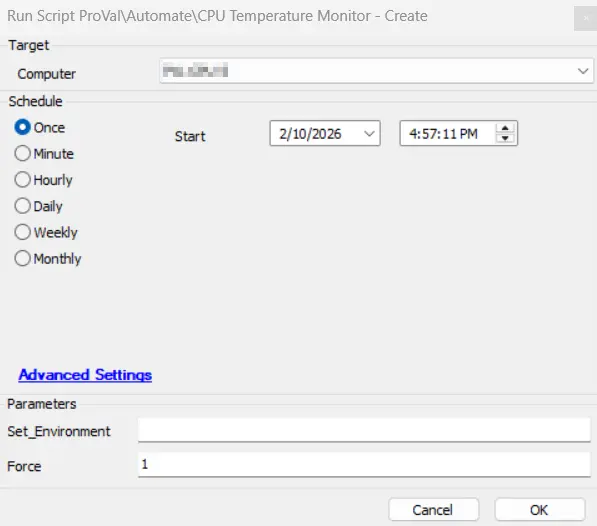

## Summary

This script is designed to establish a remote monitoring system for Windows computers, specifically focusing on tracking CPU temperature. The script utilizes the [**`CPUTempMon`**](/docs/63c35c04-4327-45d0-a249-202cf6c67088) tool to monitor CPU temperatures and generate alerts if any sensor consistently records temperatures exceeding the permissible limit.

> PawnIO application is required to use CPUTempMon.
> Script will install the latest version of PawnIO if missing.
> Download Url: https://github.com//namazso/PawnIO.Setup/releases/latest/download/PawnIO_Setup.exe

## Dependencies

- [CPUTempMon](/docs/63c35c04-4327-45d0-a249-202cf6c67088)
- [Solution - CPU Temperature Monitoring](/docs/cbd87b6f-563f-4fbb-82cf-2861c671f250)

## Sample Run

**First Run:** For the initial run, you must execute the script with the `Set_Environment` parameter set to 1. This is necessary for importing/creating the EDFs and system properties utilized by the solution.

**Regular Execution:**  

**With Force Parameter:** The script's general function is to compare the monitor set currently installed on the machine with the configuration in the EDFs and system properties. If discrepancies are detected, the monitor will be re-created. However, the force switch can be used to forcefully re-create the monitor set.

## User Parameters

| Name                | Example | Required                              | Description                                                                                                                                                                                                 |
|---------------------|---------|---------------------------------------|-------------------------------------------------------------------------------------------------------------------------------------------------------------------------------------------------------------|
| Set_Environment      | 1       | True (For First Run of the script)   | For the initial run, you must execute the script with the `Set_Environment` parameter set to 1. This is necessary for importing/creating the EDFs and system properties utilized by the solution.             |
| Force                | 1       | False                                 | The script’s general function is to compare the monitor set currently installed on the machine with the configuration in the EDFs and system properties. If discrepancies are detected, the monitor will be re-created. However, the force switch can be used to forcefully re-create the monitor set. |

## System Properties

| Name                           | Example | Required | Description                                                                                                                                                                                                 |
|--------------------------------|---------|----------|-------------------------------------------------------------------------------------------------------------------------------------------------------------------------------------------------------------|
| CPUTempMon_Enable_Servers      | 1       | True     | To enable or disable server monitoring, use 1 or 0 respectively. By default, the setting is 1 (enabled).                                                                                                   |
| CPUTempMon_Enable_Workstations  | 1       | True     | To enable or disable workstation monitoring, use 1 or 0 respectively. By default, the setting is 1 (enabled).                                                                                             |
| CPUTempMon_Interval_Seconds    | 300     | True     | Run time interval in seconds of the monitor set. Default value is 300.                                                                                                                                  |
| CPUTempMon_Offset              | 10      | True     | This number represents the number of Celsius degrees to subtract from the maximum temperature allowed by the vendor for a sensor, in order to calculate the monitoring threshold or permissible limit.          |
| CPUTempMon_AlertTemplate_Servers | 172    | True     | This refers to the ID of the alert template that will be applied to the remote monitor for servers. By default, the script will attempt to set the ID of the `△ Custom - Ticket Creation - Computer` alert template. |
| CPUTempMon_AlertTemplate_Workstations | 172 | True     | This refers to the ID of the alert template that will be applied to the remote monitor for workstations. By default, the script will attempt to set the ID of the `△ Custom - Ticket Creation - Computer` alert template. |

## Client-Level EDF

| Name                          | Example               | Type      | Description                                                                                                                                                                                                 |
|-------------------------------|----------------------|-----------|-------------------------------------------------------------------------------------------------------------------------------------------------------------------------------------------------------------|
| CPUTempMon_Exclude_Servers    | Marked or Unmarked    | Check-Box | Mark this EDF if you want to exclude the servers of the client from the CPU Temperature monitoring solution.                                                                                              |
| CPUTempMon_Exclude_Workstations | Marked or Unmarked    | Check-Box | Mark this EDF if you want to exclude the workstations of the client from the CPU Temperature monitoring solution.                                                                                          |
| CPUTempMon_Offset              | 20                   | Text      | This can be used to override the value stored in the system property `CPUTempMon_Offset` for a specific client’s machine.                                                                                 |
| CPUTempMon_AlertTemplate_Servers | 1                   | Text      | This can be used to override the value stored in the system property `CPUTempMon_AlertTemplate_Servers` for a specific client’s machine. Best use case scenario is to disable the alerting for a specific client's servers. |
| CPUTempMon_AlertTemplate_Workstations | 1               | Text      | This can be used to override the value stored in the system property `CPUTempMon_AlertTemplate_Workstations` for a specific client’s machine. Best use case scenario is to disable the alerting for a specific client's workstations. |

## Location-Level EDF

| Name                          | Example               | Type      | Description                                                                                                                                                                                                 |
|-------------------------------|----------------------|-----------|-------------------------------------------------------------------------------------------------------------------------------------------------------------------------------------------------------------|
| CPUTempMon_Exclude_Servers    | Marked or Unmarked    | Check-Box | Mark this EDF if you want to exclude the servers of the location from the CPU Temperature monitoring solution.                                                                                           |
| CPUTempMon_Exclude_Workstations | Marked or Unmarked    | Check-Box | Mark this EDF if you want to exclude the workstations of the location from the CPU Temperature monitoring solution.                                                                                       |

## Computer-Level EDF

| Name                          | Example               | Type      | Description                                                                                                                                                                                                 |
|-------------------------------|----------------------|-----------|-------------------------------------------------------------------------------------------------------------------------------------------------------------------------------------------------------------|
| CPUTempMon_Exclude_Computer   | Marked or Unmarked    | Check-Box | Mark this EDF if you want to exclude the specific computer from the CPU Temperature monitoring solution.                                                                                                  |

## Output

- Script Logs
- Files on Machine
- Remote Monitor

## Changelog

### 2026-05-22

- Updated the script to deploy PawnIO via a standalone PowerShell script instead of Winget.

### 2026-04-30

- Updated script to install PawnIO

### 2026-04-10

- Optimized the Strapper module installation to reduce overall script runtime.

### 2026-04-02

- Modified and hosted the `CPUTempMon.exe` tool on our file server.
- Made changes to the PowerShell scripts used in this script accordingly.
- Code signed the tool.
- Code signed the PowerShell scripts.

### 2025-04-10

- Initial version of the document
