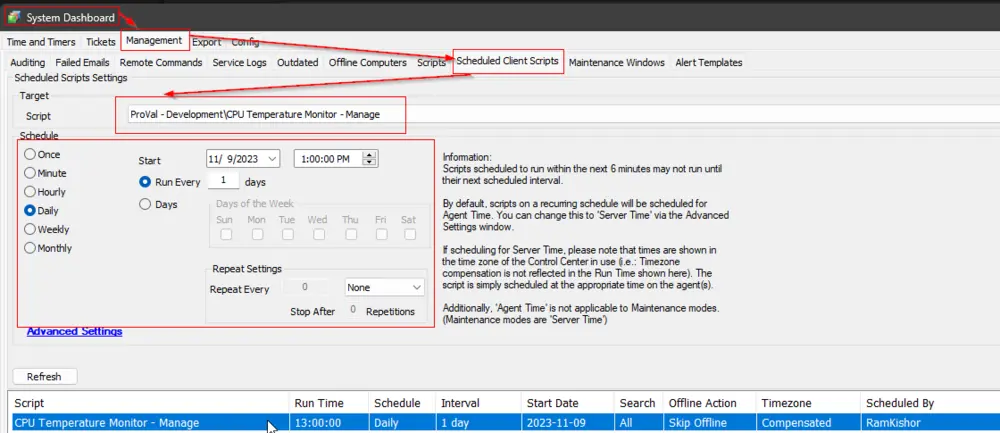

## Summary

This client script manages the remote monitors created by the [EPM - Sensors - Script - CPU Temperature Monitor - Create](/docs/7519f655-224b-4c95-b716-773f59cb7314) script. It compares the installed monitor sets with the configuration in the EDF and System properties.

If the script detects that a machine is excluded from monitoring and the monitor set exists on that machine, it removes the monitor set from the computer and executes a command to remove the dependent files from the machine.

If the script finds that the configuration of the installed monitor set on the machine differs from the configured EDF or system properties, it executes the [EPM - Sensors - Script - CPU Temperature Monitor - Create](/docs/7519f655-224b-4c95-b716-773f59cb7314) script on the machine to recreate the monitor set with the correct configuration.

The script can also be used to update the monitor set installed on the machines after making any configuration changes. For instance, if a configuration change is made in a client-level EDF, this script can be run against that client, and the changes will be reflected in the end machine's remote monitor after some time.

## Sample Run

For optimal results and to keep the CPU Temperature Monitoring solution up-to-date, it is recommended to schedule the script to run once per day.

## Dependencies

- [EPM - Sensors - Script - CPU Temperature Monitor - Create](/docs/7519f655-224b-4c95-b716-773f59cb7314)
- [EPM - Sensors - Remote Monitor - CPU Temperature Monitoring Process](/docs/84d6587b-2bca-4f0e-9176-c0df064f532c)