## Summary

This document outlines the process for creating remote monitors for CPU usage on Windows machines. The creation of these remote monitors is governed by system properties, as well as client-level, location-level, and computer-level Extra Data Fields (EDFs). These elements are further detailed within this document.

The script creates remote monitors that trigger an alert when the CPU usage on the target machine exceeds a certain upper threshold percentage and remains above a certain lower threshold percentage for a specified duration. These thresholds can be configured in the system properties, which are elaborated in the **System Properties** section of this document.

**Note of Caution**: The remote monitors created by this script utilize PowerShell for monitoring. Therefore, its functionality is not guaranteed on any computer running a version of PowerShell older than 5. Please ensure your systems are updated to at least PowerShell version 5 for optimal performance.

## Update Notice: 22 April, 2025

New client and computer level override EDFs have been introduced to override the value stored in system properties.  
Execute or debug the script against a single client, with the `Set_Environment` parameter set to `1` to create the new EDFs.  
  
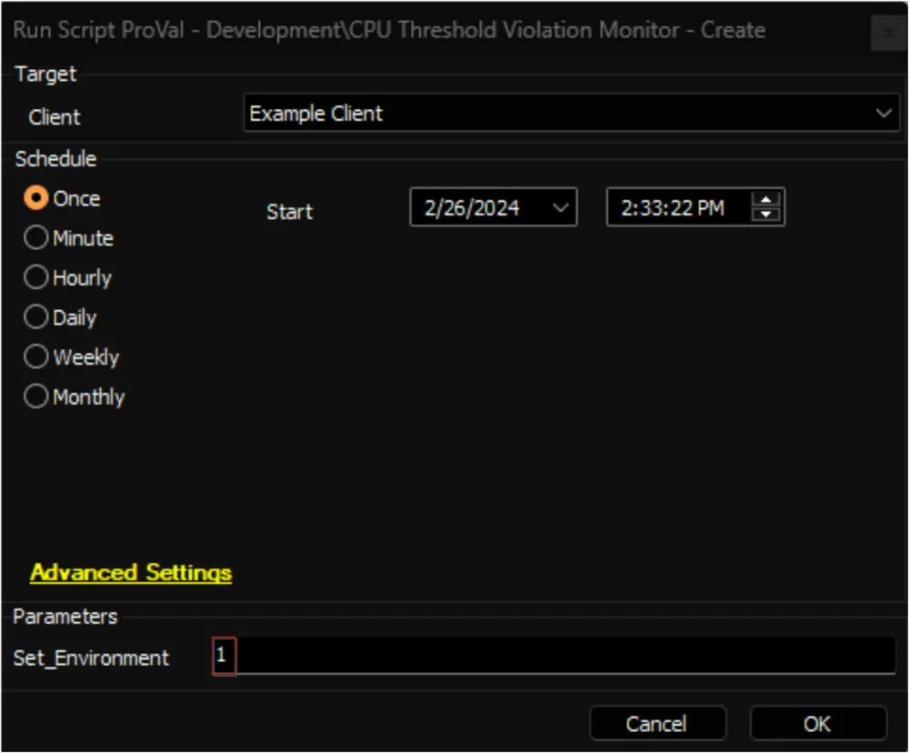

## Implementation

1. **Remove Existing Monitors**
   - Remove the existing `ProVal - Production - CPU Threshold Violation Monitor` monitor set from the groups it's already applied to.
   - Execute this SQL query from a RAWSQL monitor set to get rid of the existing monitors:  
     `Delete From Groupagents where Name = 'ProVal - Production - CPU Threshold Violation Monitor'`
   - Open the `Server Status` tool by navigating to `Help` > `Server Status`.  
     
   - Click the `Do Group Refresh` button to refresh and apply the changes made.  
     
   - Click `OK` to the popup message and wait for a minute to allow the changes to take effect.  
     

2. Import the `△ Custom - Ticket Creation - Computer` alert template from the `ProSync` plugin if it's missing in the environment.

3. Import the [CPU Threshold Violation Monitor - Create](/docs/20b0f192-7315-42d9-a575-9e088c15d79c) script from the `ProSync` plugin.

4. **Run/Debug the Script**
   - Execute or debug the script against a single client, with the `Set_Environment` parameter set to `1`. This action will generate the necessary system properties and Extra Data Fields (EDFs) for managing the remote monitors.  
       
     

5. **Reload System Cache**
   - Refresh the system cache to ensure all changes are updated.  
     

6. **Configure System Properties and EDFs**
   - Navigate to the **System Dashboard --> Config --> Configurations --> Properties**.
   - Find the properties beginning with `CPU_Monitoring`.  
     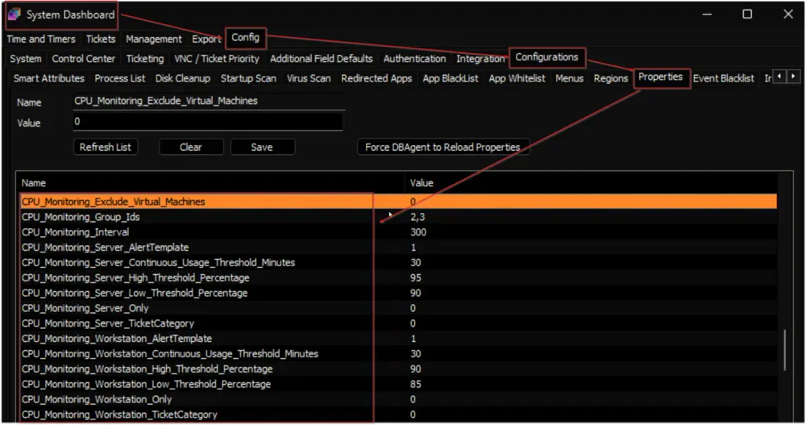
   - The consultant should have provided you with any customizations that are required. Please read through the detailed System Properties and EDF explanations to understand how to configure any customizations.

7. **Schedule the Script**
   - Schedule the script to run once per day, preferably around midnight, from the dashboard for optimal results.  
     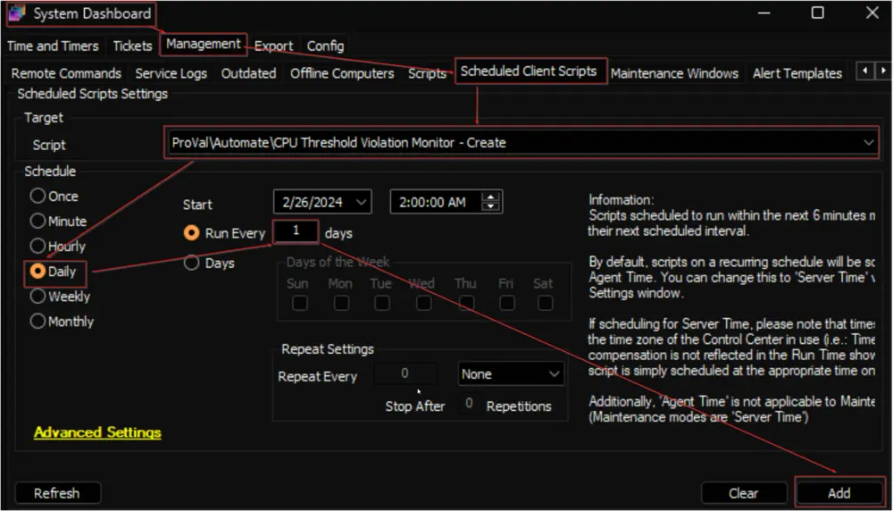

## User Parameters

| Name                                      | Example | Required                      | Description                                                                                                                                                                                                                                       |
|-------------------------------------------|---------|-------------------------------|---------------------------------------------------------------------------------------------------------------------------------------------------------------------------------------------------------------------------------------------------|
| Set_Environment                           | 1       | True (for first run only)    | Set it to 1 during the first run of the script to generate the necessary system properties and EDFs for managing the generated remote monitors.                                                                                                  |

## System Properties

| Name                                           | Example          | Required | Description                                                                                                                                                                                                                                                                                                                                 |
|------------------------------------------------|------------------|----------|-------------------------------------------------------------------------------------------------------------------------------------------------------------------------------------------------------------------------------------------------------------------------------------------------------------------------------------------------|
| CPU_Monitoring_Group_Ids                       | 2,3,855,85       | True     | The script will create remote monitors for the machines that belong to the groups identified by the group IDs specified in this system property. The monitor set will not be associated with the groups themselves but with the individual machines. Multiple IDs can be included by separating them with a comma. The default value is `0`.  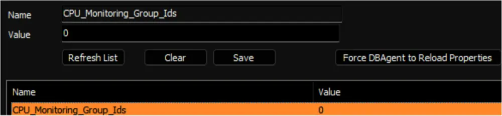 |
| CPU_Monitoring_Server_Only                     | 0                | False    | Setting this system property to `1` will limit the monitor set creation to the Windows Servers only. The default value is `0`. Also, the script will remove the monitor set created for the Windows Workstations after setting this property to `1`.  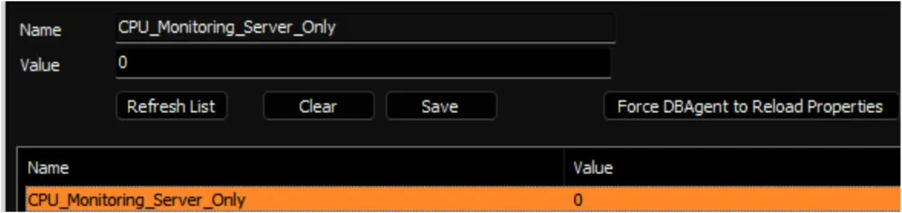 |
| CPU_Monitoring_Workstation_Only                 | 0                | False    | Setting this system property to `1` will limit the monitor set creation to the Windows Workstations only. The default value is `0`. Also, the script will remove the monitor set created for the Windows Servers after setting this property to `1`.  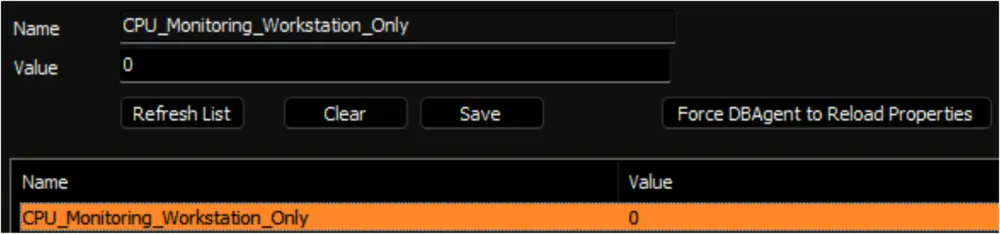 |
| CPU_Monitoring_Exclude_Virtual_Machines        | 0                | False    | Setting this system property to `1` will limit the monitor set creation to the Physical Windows Machines only. The default value is `0`. Also, the script will remove the monitor set created for the Virtual Machines after setting this property to `1`.  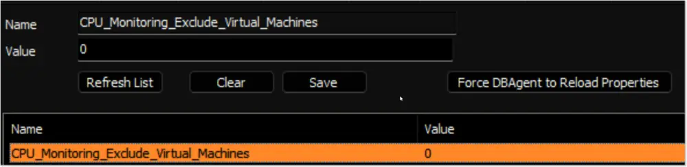 |
| CPU_Monitoring_Interval                         | 300              | True     | Controls the generated Remote Monitor run time interval. The default is 300 seconds.   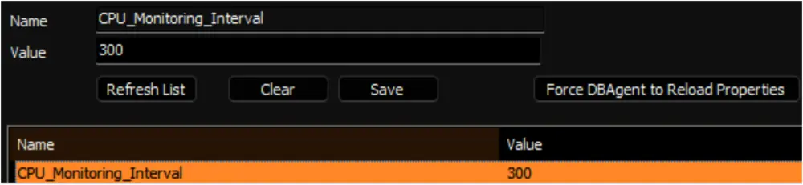  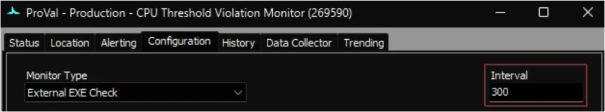 |
| CPU_Monitoring_Server_Continuous_Usage_Threshold_Minutes | 30    | True     | This property determines the duration in minutes during which servers must consistently exhibit high CPU usage before triggering an alert. By default, this duration is set to `30` minutes. In other words, alerts will be generated for remote monitors on servers only if they surpass the high CPU usage threshold and remain above the low CPU usage threshold for more than `30` minutes consecutively.  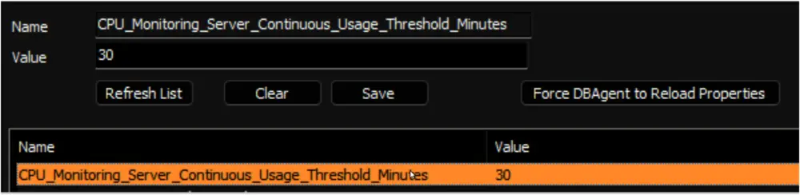 |
| CPU_Monitoring_Workstation_Continuous_Usage_Threshold_Minutes | 30    | True     | This property determines the duration in minutes during which workstations must consistently exhibit high CPU usage before triggering an alert. By default, this duration is set to `30` minutes. In other words, alerts will be generated for remote monitors on workstations only if they surpass the high CPU usage threshold and remain above the low CPU usage threshold for more than `30` minutes consecutively.  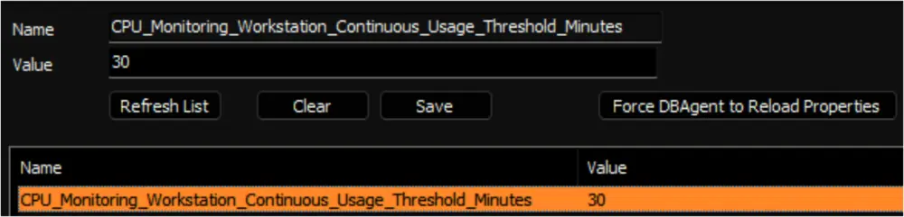 |
| CPU_Monitoring_Server_High_Threshold_Percentage | 95               | True     | This property stores the upper threshold, expressed as a percentage, for CPU usage on servers. The upper threshold is the CPU usage percentage that triggers the timer. Once the CPU usage hits the upper threshold, the monitor set initiates a timer and monitors it until the CPU usage drops below the lower threshold. If the CPU usage remains above the lower threshold for the duration specified in the `CPU_Monitoring_Server_Continuous_Usage_Threshold_Minutes` property, an alert will be generated. The default value is `95`.  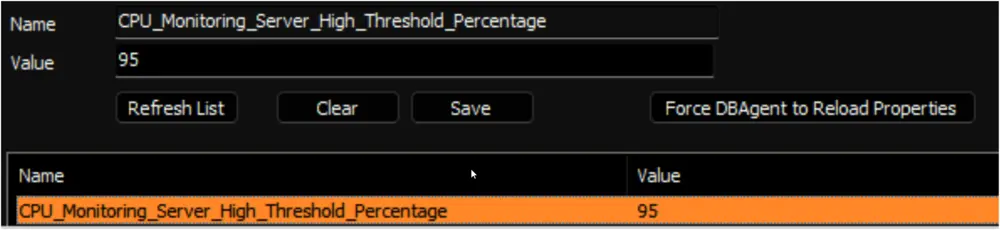 |
| CPU_Monitoring_Workstation_High_Threshold_Percentage | 90           | True     | This property stores the upper threshold, expressed as a percentage, for CPU usage on workstations. The upper threshold is the CPU usage percentage that triggers the timer. Once the CPU usage hits the upper threshold, the monitor set initiates a timer and monitors it until the CPU usage drops below the lower threshold. If the CPU usage remains above the lower threshold for the duration specified in the `CPU_Monitoring_Workstation_Continuous_Usage_Threshold_Minutes` property, an alert will be generated. The default value is `90`.  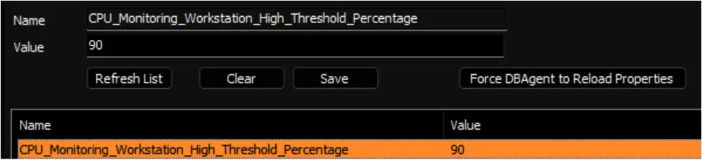 |
| CPU_Monitoring_Server_Low_Threshold_Percentage  | 90               | True     | This property stores the lower threshold, expressed as a percentage, for CPU usage on servers. The lower threshold is the CPU usage percentage that stops the timer. Once the CPU usage goes below the lower threshold, the monitor set stops the timer initiated after hitting the higher threshold stored in the `CPU_Monitoring_Server_High_Threshold_Percentage` property. The monitor set will auto-close the ticket after the CPU usage for the server drops below the percentage stored in this system property. The default value is `90`.  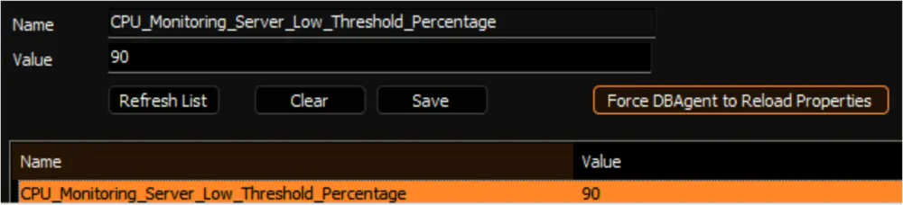 |
| CPU_Monitoring_Workstation_Low_Threshold_Percentage | 85            | True     | This property stores the lower threshold, expressed as a percentage, for CPU usage on workstations. The lower threshold is the CPU usage percentage that stops the timer. Once the CPU usage goes below the lower threshold, the monitor set stops the timer initiated after hitting the higher threshold stored in the `CPU_Monitoring_Workstation_High_Threshold_Percentage` property. The monitor set will auto-close the ticket after the CPU usage for the workstation drops below the percentage stored in this system property. The default value is `90`.  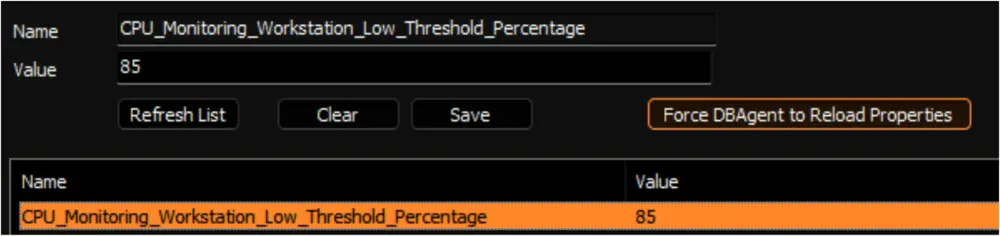 |
| CPU_Monitoring_Server_AlertTemplate             | 1                | True     | This system property stores the id of the `Alert Template` to apply to the remote monitors created for the servers. The default value is `1`, i.e., `Default - Do Nothing.`  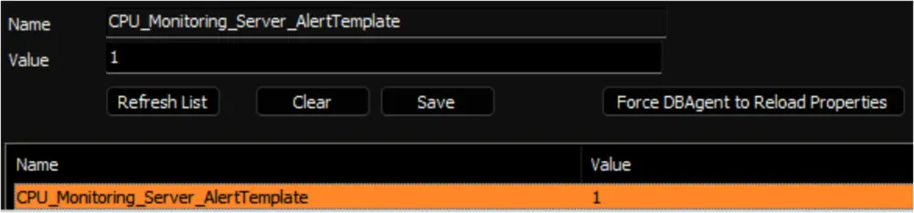   Navigate to the **System Dashboard --> Management --> Alert Templates** to find the Id of the required alert template.     It is suggested to use the `△ Custom - Ticket Creation - Computer` alert for better alerting. The alert template should not be running the very same script for the Warning action as well unless you want to create a ticket for the PowerShell errors too.  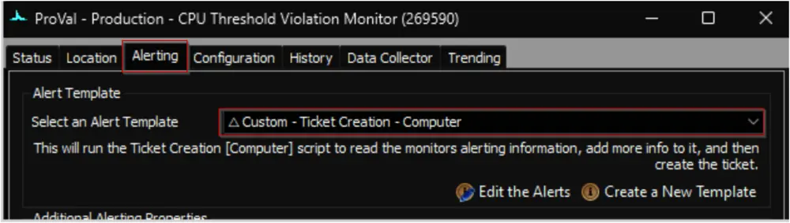 |
| CPU_Monitoring_Workstation_AlertTemplate        | 1                | True     | This system property stores the id of the `Alert Template` to apply to the remote monitors created for the workstations. The default value is `1`, i.e., `Default - Do Nothing.` It is suggested to use the `△ Custom - Ticket Creation - Computer` alert for better alerting. The alert template should not be running the very same script for the Warning action as well unless you want to create a ticket for the PowerShell errors too.  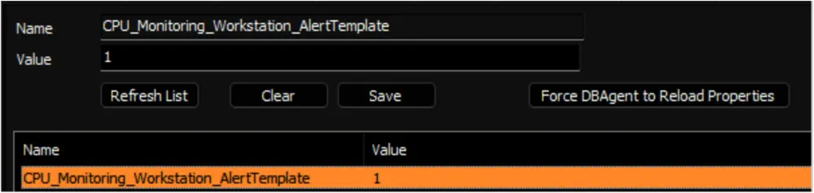 |
| CPU_Monitoring_Server_TicketCategory            | 124              | False    | This system property stores the id of the `Ticket Category` to apply to the remote monitors created for the Servers. The default value is `0`, i.e., `<Not Specified>`.  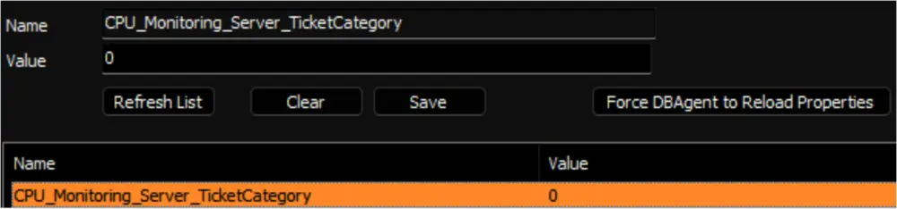   Ticket Categories are used to control the CW Manage service board of the tickets generated by Automate.  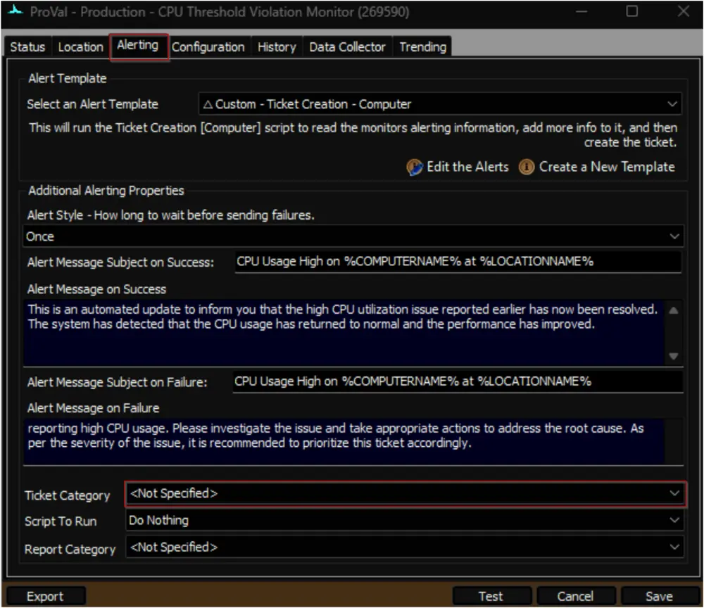   Navigate to the **System Dashboard --> Config --> Information Base Categories** to find the Id of the required ticket category.  |
| CPU_Monitoring_Workstation_TicketCategory       | 125              | False    | This system property stores the id of the `Ticket Category` to apply to the remote monitors created for the Workstations. The default value is `0`, i.e., `<Not Specified>`.  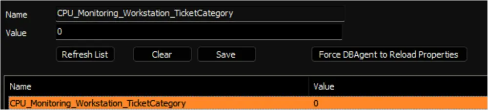|

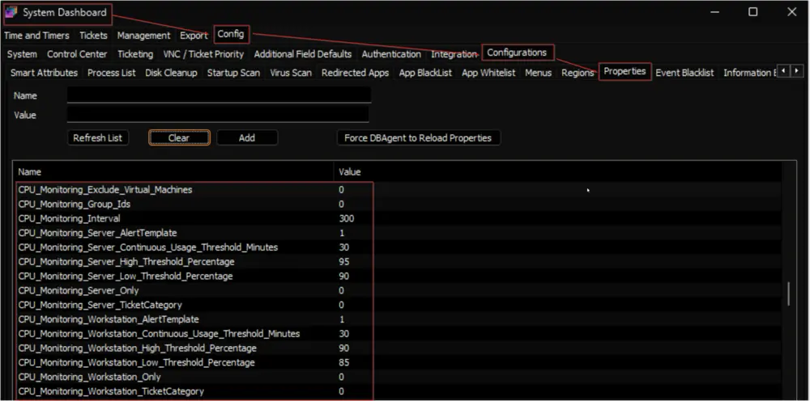

## Client-Level EDF

| Name                                      | Type      | Section      | Description                                                                                                                                                                                                                                                                                                                                 |
|-------------------------------------------|-----------|--------------|-------------------------------------------------------------------------------------------------------------------------------------------------------------------------------------------------------------------------------------------------------------------------------------------------------------------------------------------------|
| CPU Monitoring - Exclude VM          | Check Box | Exclusions    | Selecting this Extra Data Field (EDF) will exclude the virtual machines of the client from the CPU usage monitoring. As a result, the script will not create any remote monitors for the virtual machines under this client. Furthermore, upon marking this EDF, the script will also remove any previously created remote monitors for the virtual machines of this client. |
| CPU Monitoring - Exclude Servers          | Check Box | Exclusions    | Selecting this Extra Data Field (EDF) will exclude the servers of the client from the CPU usage monitoring. As a result, the script will not create any remote monitors for the servers under this client. Furthermore, upon marking this EDF, the script will also remove any previously created remote monitors for the servers of this client. |
| CPU Monitoring - Exclude Workstations     | Check Box | Exclusions    | Selecting this Extra Data Field (EDF) will exclude the workstations of the client from the CPU usage monitoring. As a result, the script will not create any remote monitors for the workstations under this client. Furthermore, upon marking this EDF, the script will also remove any previously created remote monitors for the workstations of this client. |
| CPUM Svr AlertTemplate | Text | CPU Monitoring | Set this EDF to override the value set in the system property `CPU_Monitoring_Server_AlertTemplate` |
| CPUM Svr Usage Threshold Minutes | Text | CPU Monitoring | Set this EDF to override the value set in the system property `CPU_Monitoring_Server_Continuous_Usage_Threshold_Minutes` |
| CPUM Svr High Threshold Percent | Text | CPU Monitoring | Set this EDF to override the value set in the system property `CPU_Monitoring_Server_High_Threshold_Percentage` |
| CPUM Svr Low Threshold Percent | Text | CPU Monitoring | Set this EDF to override the value set in the system property `CPU_Monitoring_Server_Low_Threshold_Percentage` |
| CPUM Svr TicketCategory | Text | CPU Monitoring | Set this EDF to override the value set in the system property `CPU_Monitoring_Server_TicketCategory` |
| CPUM Wks AlertTemplate | Text | CPU Monitoring | Set this EDF to override the value set in the system property `CPU_Monitoring_Workstation_AlertTemplate` |
| CPUM Wks Usage Threshold Minutes | Text | CPU Monitoring | Set this EDF to override the value set in the system property `CPU_Monitoring_Workstation_Continuous_Usage_Threshold_Minutes` |
| CPUM Wks High Threshold Percent | Text | CPU Monitoring | Set this EDF to override the value set in the system property `CPU_Monitoring_Workstation_High_Threshold_Percentage` |
| CPUM Wks Low Threshold Percent | Text | CPU Monitoring | Set this EDF to override the value set in the system property `CPU_Monitoring_Workstation_Low_Threshold_Percentage` |
| CPUM Wks TicketCategory | Text | CPU Monitoring | Set this EDF to override the value set in the system property `CPU_Monitoring_Workstation_TicketCategory` |

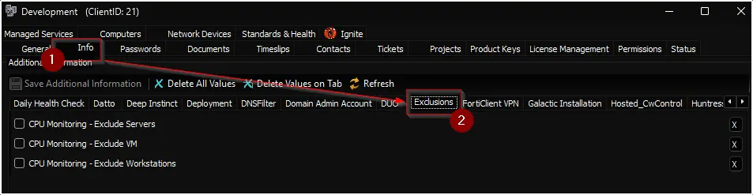  
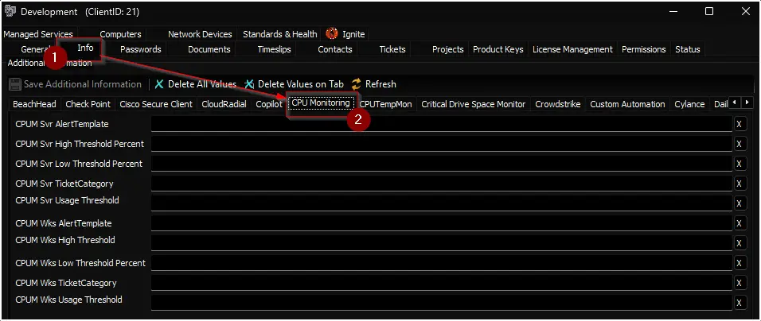

**Note:** Mark all three `Exclusion` EDFs to exclude the client from the monitoring.

## Location-Level EDF

| Name                                      | Type      | Section      | Description                                                                                                                                                                                                                                                                                                                                 |
|-------------------------------------------|-----------|--------------|-------------------------------------------------------------------------------------------------------------------------------------------------------------------------------------------------------------------------------------------------------------------------------------------------------------------------------------------------|
| CPU Monitoring - Exclude Servers          | Check Box | Exclusions    | Selecting this Extra Data Field (EDF) will exclude the servers of the location from the CPU usage monitoring. As a result, the script will not create any remote monitors for the servers under this location. Furthermore, upon marking this EDF, the script will also remove any previously created remote monitors for the servers of this location. |
| CPU Monitoring - Exclude Workstations     | Check Box | Exclusions    | Selecting this Extra Data Field (EDF) will exclude the workstations of the location from the CPU usage monitoring. As a result, the script will not create any remote monitors for the workstations under this location. Furthermore, upon marking this EDF, the script will also remove any previously created remote monitors for the workstations of this location. |

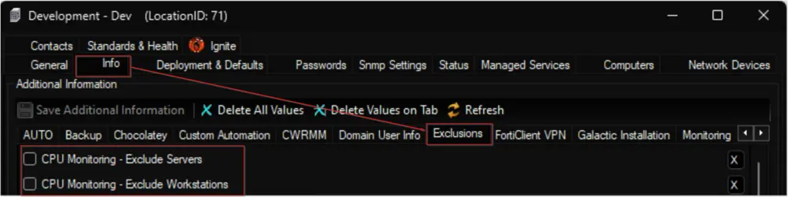

**Note:** Mark both EDFs to exclude the location from the monitoring.

## Computer-Level EDF

| Name                                      | Type      | Section      | Description                                                                                                                                                                                                                                                                                                                                 |
|-------------------------------------------|-----------|--------------|-------------------------------------------------------------------------------------------------------------------------------------------------------------------------------------------------------------------------------------------------------------------------------------------------------------------------------------------------|
| CPU Monitoring - Exclude                  | Check Box | Exclusions    | Selecting this Extra Data Field (EDF) will exclude the computer from the CPU usage monitoring. As a result, the script will not create any remote monitor for this computer. Furthermore, upon marking this EDF, the script will also remove any previously created remote monitor for this computer.                             |
| CPUM AlertTemplate | Text | CPU Monitoring | Setting this EDF will replace the value stored in the system property `CPU_Monitoring_Server_AlertTemplate` for servers or `CPU_Monitoring_Workstation_AlertTemplate` for workstations, as well as the value stored in the client-level EDFs `CPUM Svr AlertTemplate` for servers or `CPUM Wks AlertTemplate` for workstations. |
| CPUM Usage Threshold Minutes | Text | CPU Monitoring | Setting this EDF will replace the value stored in the system property `CPU_Monitoring_Server_Continuous_Usage_Threshold_Minutes` for servers or `CPU_Monitoring_Workstation_Continuous_Usage_Threshold_Minutes` for workstations, as well as the value stored in the client-level EDFs `CPUM Svr Usage Threshold Minutes` for servers or `CPUM Wks Usage Threshold Minutes` for workstations. |
| CPUM High Threshold Percent | Text | CPU Monitoring | Setting this EDF will replace the value stored in the system property `CPU_Monitoring_Server_High_Threshold_Percentage` for servers or `CPU_Monitoring_Workstation_High_Threshold_Percentage` for workstations, as well as the value stored in the client-level EDFs `CPUM Svr High Threshold Percent` for servers or `CPUM Wks High Threshold Percent` for workstations. |
| CPUM Low Threshold Percent | Text | CPU Monitoring | Setting this EDF will replace the value stored in the system property `CPU_Monitoring_Server_Low_Threshold_Percentage` for servers or `CPU_Monitoring_Workstation_Low_Threshold_Percentage` for workstations, as well as the value stored in the client-level EDFs `CPUM Svr Low Threshold Percent` for servers or `CPUM Wks Low Threshold Percent` for workstations. |
| CPUM TicketCategory | Text | CPU Monitoring | Setting this EDF will replace the value stored in the system property `CPU_Monitoring_Server_TicketCategory` for servers or `CPU_Monitoring_Workstation_TicketCategory` for workstations, as well as the value stored in the client-level EDFs `CPUM Svr TicketCategory` for servers or `CPUM Wks TicketCategory` for workstations. |

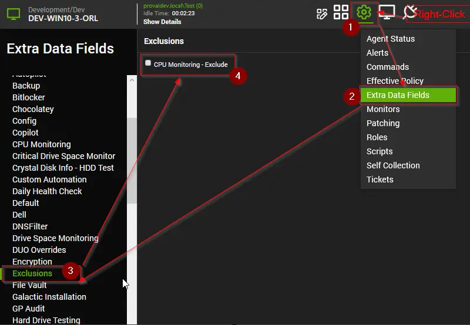  
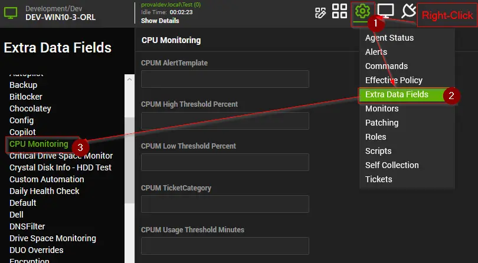

## Remote Monitor Example

**Name:** `ProVal - Production - CPU Threshold Violation Monitor`

**Ticket Subject:** `CPU Usage High on %COMPUTERNAME% at %LOCATIONNAME%`

**Alert Message on Failure:** `This is an automated update to inform you that the high CPU utilization issue reported earlier has now been resolved. The system has detected that the CPU usage has returned to normal and the performance has improved.`

**Alert Message on Success:** `The CPU usage on the machine %COMPUTERNAME% located at %CLIENTNAME%/%LOCATIONNAME% is currently reporting high CPU usage. Please investigate the issue and take appropriate actions to address the root cause. As per the severity of the issue, it is recommended to prioritize this ticket accordingly.`

`%RESULT%`

**Sample Ticket:** The ticket illustrated here was created by setting the upper threshold value to `2` and the lower threshold value to `1`. However, it's important to note that this example is purely for demonstration purposes. It does not advocate for or encourage the creation of CPU usage tickets for machines where the CPU usage exceeds `2%`.

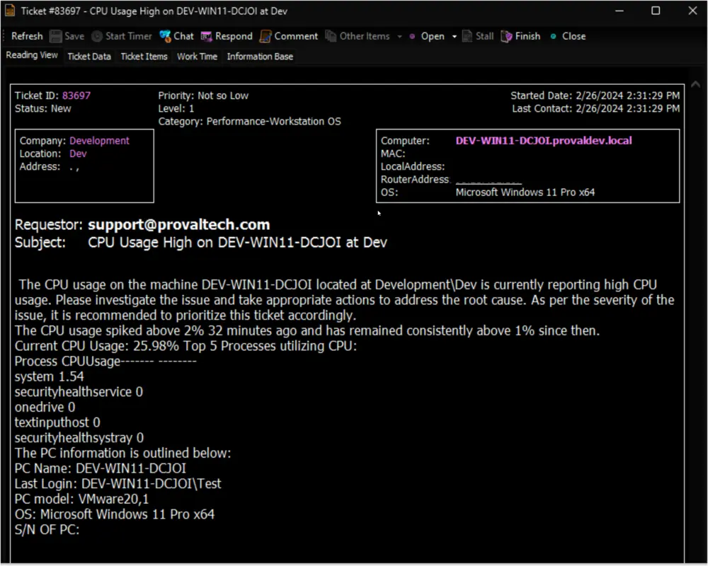  
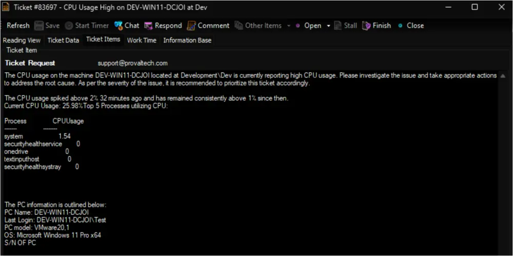

**Sample Remote Monitor:**

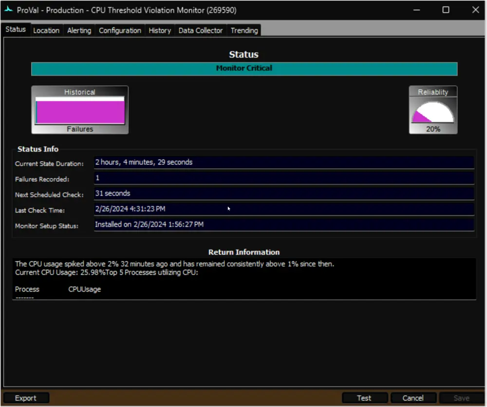  
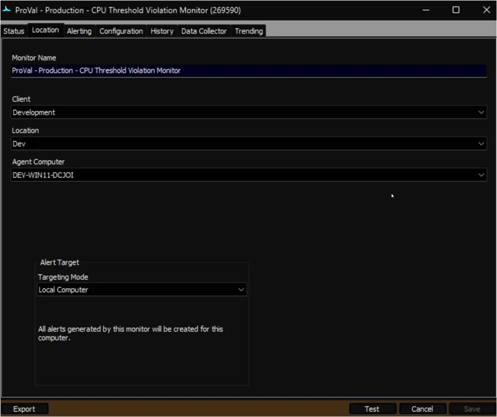  
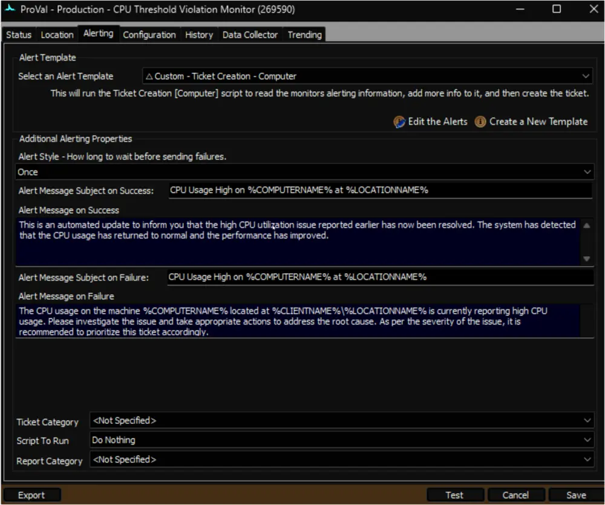  
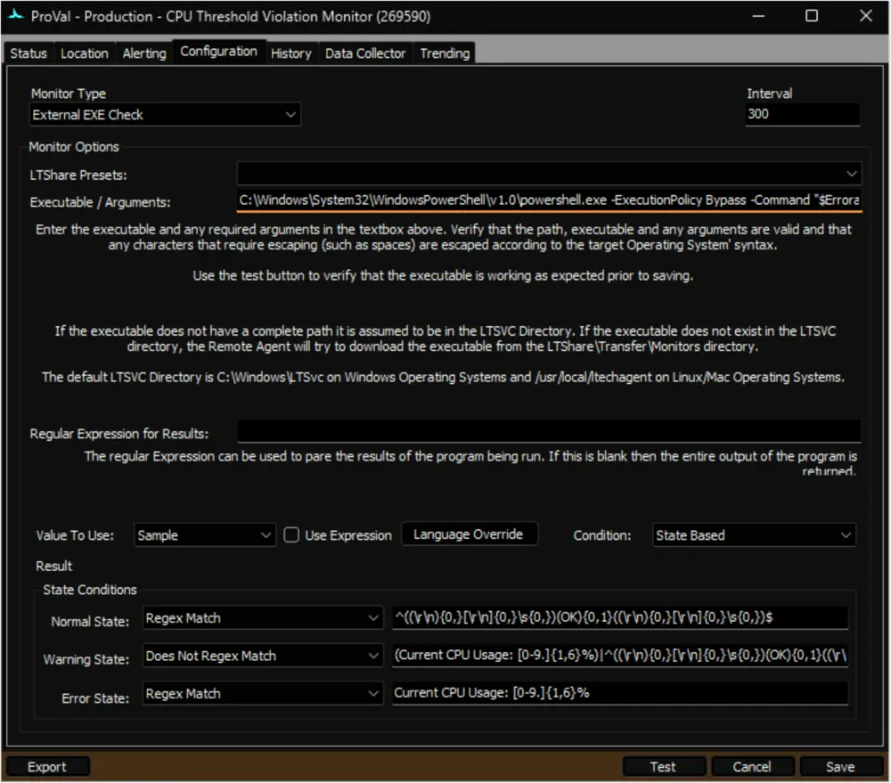  

## Output

- Remote Monitors

## Tips

- [Set Computer Level EDFs by Group ID](/docs/95e85dc0-6420-42fe-8d2a-aeb9dac683b0) script can be used to set overrides on multiple machines.