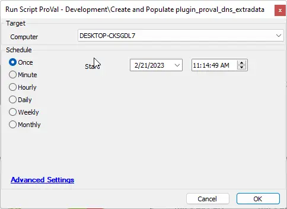

## Summary

This script will create the `plugin_proval_dns_extradata` table and populate it with the required data.

## Sample Run

## Dependencies

- [EPM - Windows Configuration - Script - PowerShell Environment Setup Verification](/docs/8ace140f-74d7-49cb-b9aa-90cf098629fc)
- [CWM - Automate - Script - OverFlowedVariable - SQL Insert - Execute](/docs/34cee8fe-1b6b-4558-a890-2face427ceb8)

## Variables

Document the various variables in the script. Delete any section that is not relevant to your script.

| Name               | Description                                                                                                                                       |
|--------------------|---------------------------------------------------------------------------------------------------------------------------------------------------|
| finishstatus       | The finish status of the [EPM - Windows Configuration - Script - PowerShell Environment Setup Verification](/docs/8ace140f-74d7-49cb-b9aa-90cf098629fc) script. |
| WorkingDirectory    | The directory to populate a .json file to be parsed and added to the table.                                                                    |
| JsonFileName       | The name of the JSON file to be created by the script.                                                                                          |
| psout              | The results of a PowerShell command.                                                                                                            |
| SQLStartStatement   | Required by [CWM - Automate - Script - OverFlowedVariable - SQL Insert - Execute](/docs/34cee8fe-1b6b-4558-a890-2face427ceb8)             |
| SQLTailString      | Required by [CWM - Automate - Script - OverFlowedVariable - SQL Insert - Execute](/docs/34cee8fe-1b6b-4558-a890-2face427ceb8)             |
| DataPointNames     | Required by [CWM - Automate - Script - OverFlowedVariable - SQL Insert - Execute](/docs/34cee8fe-1b6b-4558-a890-2face427ceb8)             |

#### Global Parameters

| Name         | Example                     | Required | Description               |
|--------------|-----------------------------|----------|---------------------------|
| TableName    | plugin_proval_dns_extradata | True     | The name of the table.    |
| ProjectName  | Get-DNSObjects             | True     | The name of the project.  |

## Process

1. Utilize the new [EPM - Windows Configuration - Script - PowerShell Environment Setup Verification](/docs/8ace140f-74d7-49cb-b9aa-90cf098629fc) script to determine if this script will operate as expected.
2. Check for a failure in the verification script; if it fails, log an error and exit with an error.
3. Create the table.
4. Run a PowerShell command to obtain the DNS objects and necessary data and save it to a .json file.
5. Use the overflowed variable script to populate the data into the table.

## Output

- Script log