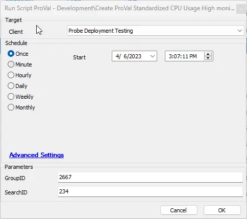
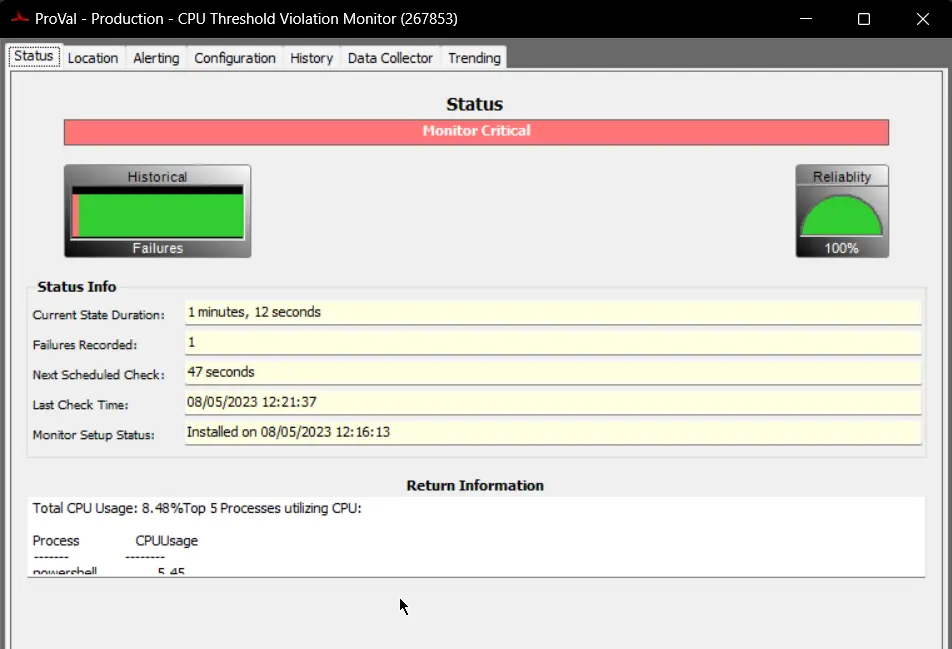
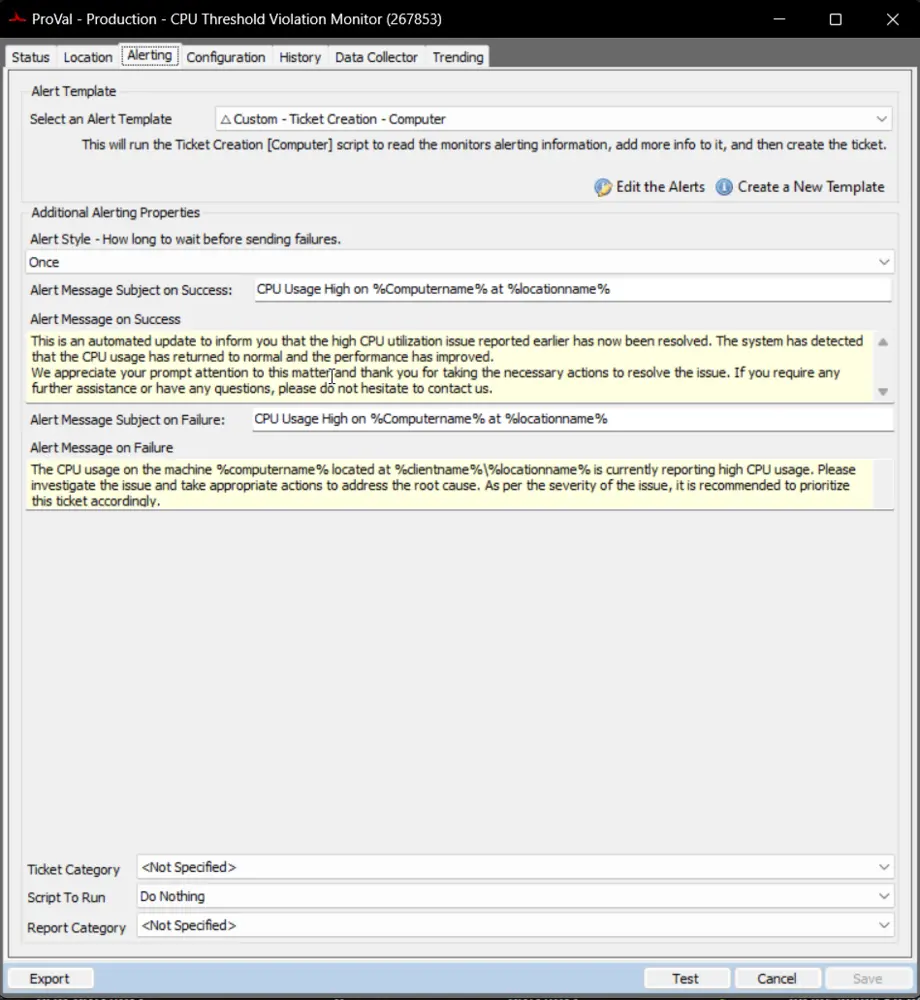
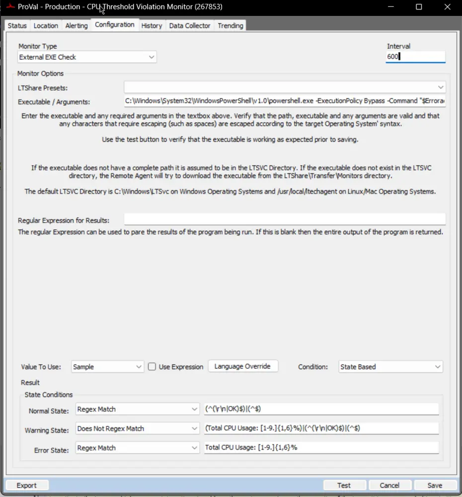

## Summary

Generates a Proval Standardized CPU Usage High remote monitoring system for a selected group.

## Sample Run

## Variables

Document the various variables in the script. Delete any section that is not relevant to your script.

| Name               | Description                                                                                      |
|--------------------|--------------------------------------------------------------------------------------------------|
| MonitorName        | ProVal - Production - CPU Threshold Violation Monitor                                            |
| AlertingInfo       | Formatted alerting information where % symbols are exchanged for ╜ symbols so variables do not get assigned to those values. |
| CheckAction        | 6 (External Exe Check)                                                                          |
| AlertAction        | 1 (Default Do Nothing)                                                                           |
| Interval           | 600 seconds                                                                                      |
| GUID               | Random GUID for the Group Monitor                                                                |
| ComparisonString    | State-based condition to use with the remote monitor                                             |
| ExecuteString      | Command to run from the remote monitor                                                           |

#### User Parameters

| Name      | Example | Required | Description                                         |
|-----------|---------|----------|-----------------------------------------------------|
| GroupID   | 12545   | True     | The group ID to assign the remote monitor.          |
| SearchID  | 1254    | False    | A limiting search for this remote monitor.          |

## Sample Monitor

**Status Tab:**  

**Alerting Tab:** By default, the script will set the `Default Do Nothing` template. It must be switched to `Custom - Ticket Creation - Computer` to use the monitor to its full potential.  

**Configuration Tab:**  
