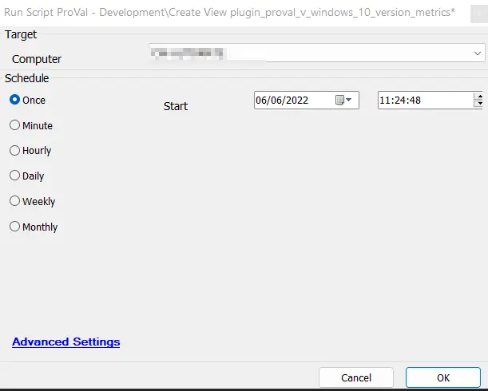

## Summary

The script will create the view [plugin_proval_v_windows_10_version_metrics](/docs/ea558c06-8fef-4c9f-87c7-42a3aa289dad), which is used by the dataview, "[Windows - Windows 10 Version Metrics + Filters + Client Filters (reference table)](/docs/13b8b937-0d9f-44b7-a7e5-5abf38ab9cda)."

## Sample Run

## Dependencies

- [Windows - Windows 10 Version Metrics + Filters + Client Filters (reference table)](/docs/13b8b937-0d9f-44b7-a7e5-5abf38ab9cda)
- [plugin_proval_v_windows_10_version_metrics](/docs/ea558c06-8fef-4c9f-87c7-42a3aa289dad)
- [CWM - Automate - Script - Update User Permissions for ProVal Custom Tables](/docs/7819fc75-aeae-457b-a451-59221396e900)

## Process

This section executes the SQL query to create the `plugin_proval_v_windows_10_version_metrics` view.