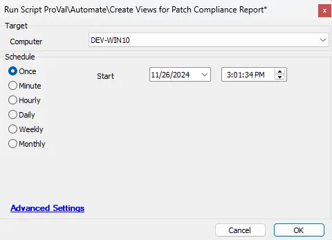

## Summary

This script is designed to initialize the database environment by creating the necessary SQL views required for the "Patch Compliance - CU" report set. It constructs four distinct views that process raw inventory and patch data into calculated compliance scores and statistical summaries.

The script performs the following actions:

1. **Creates the Master Detail View ([plugin_proval_computerpatchcompliance](/docs/f50c0f90-b8e1-4db9-bbb2-88887d5a21af)):** This view serves as the foundation for the reports. It calculates the "freshness" of the installed Cumulative Update (CU) for every individual computer, determines if the OS is End-of-Life (EOL), and assigns a weighted compliance score.
2. **Creates the Client Aggregator View ([plugin_proval_clientpatchstats](/docs/c553d954-7ded-4f34-ab94-91179848a280)):** This view summarizes the detailed computer data up to the client level. It calculates the overall "CU Compliance" percentage and provides the counts for the "Environment Summary" section of the "All Machines" report.
3. **Creates the Server-Specific Aggregator ([plugin_proval_clientpatchstatsserver](/docs/9ead43e2-1786-475d-b65b-ee600dc12c72)):** This view filters the data to process statistics strictly for server operating systems, feeding the "CU Compliance and Audit - Servers" report.
4. **Creates the Workstation-Specific Aggregator ([plugin_proval_clientpatchstatsworkstation](/docs/56f4fea1-0a77-4014-9f2b-b587712ec308)):** This view filters the data to process statistics strictly for workstations, feeding the "CU Compliance and Audit - Workstations" report.
5. **Applies Permissions:** The script automatically grants the necessary `SELECT` permissions on these new views to active LabTech users, ensuring they can be accessed by the Report Designer.

> **Note:** This is a **one-time use script**, used solely to install and create the required views. Once the script has been executed successfully and the views are confirmed to exist in the database, the script itself can be removed from the environment.

## Sample Run

## Dependencies

* [Solution - Latest Installed Cumulative Update](/docs/991e926f-dcd2-4be3-9f3a-ea7ee9842da2)
* [Solution - CU Compliance Reporting](/docs/6dd7be85-8983-413b-8f56-1426446f25da)

## Output

* Views
