## Summary

This document outlines the process for creating Remote Monitors for Critical Drive Space on Windows machines. The creation of these remote monitors is governed by system properties, as well as client-level and computer-level Extra Data Fields (EDFs). These elements are further detailed within this document.

**Note of Caution:** The remote monitors created by this script utilize PowerShell for monitoring. Therefore, its functionality is not guaranteed on any computer running a version of PowerShell older than 5. Please ensure your systems are updated to at least PowerShell version 5 for optimal performance.

## Update Notice: 07-June-2024

Renamed the Client and Computer Level EDF Section to `Critical Drive Space Monitor` from `Critical Drive Space Monitorin`. To implement the modification, execute or debug the script against a single client with the `Set_Environment` parameter set to `1`.  
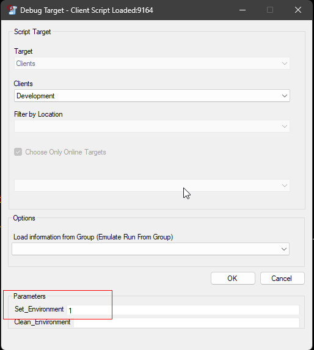  
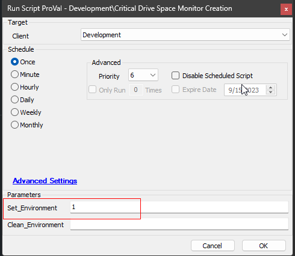

## Update Notice: 06-June-2024

The script has been updated to create a stack drive space monitor for the unsupported operating systems which includes the following:

- Windows Server 2012 R2
- Windows Server 2012
- Windows Server 2008 R2
- Windows Server 2008
- Windows Server 2003
- Windows 8.1
- Windows 8
- Windows 7
- Windows Vista
- Windows XP
- Any Windows Operating System older than Windows 10

**Sample Remote Monitor for the unsupported OS:**  
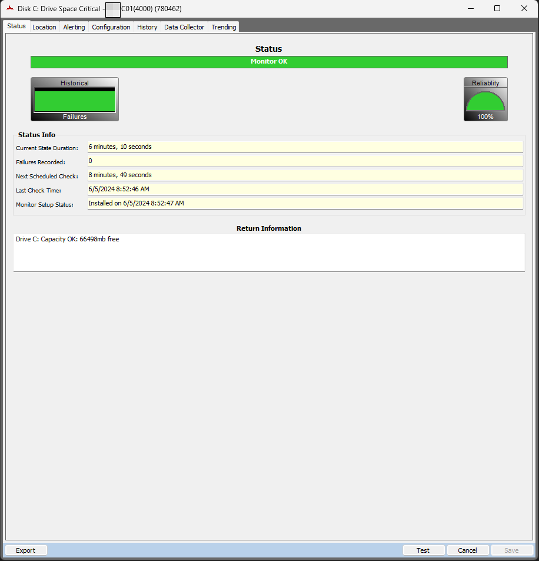  
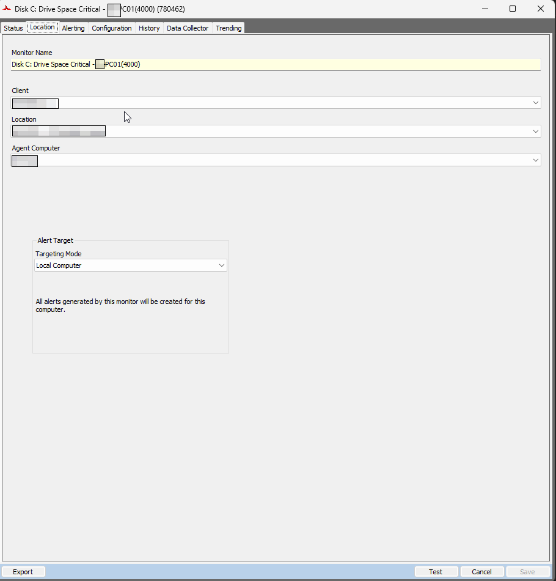  
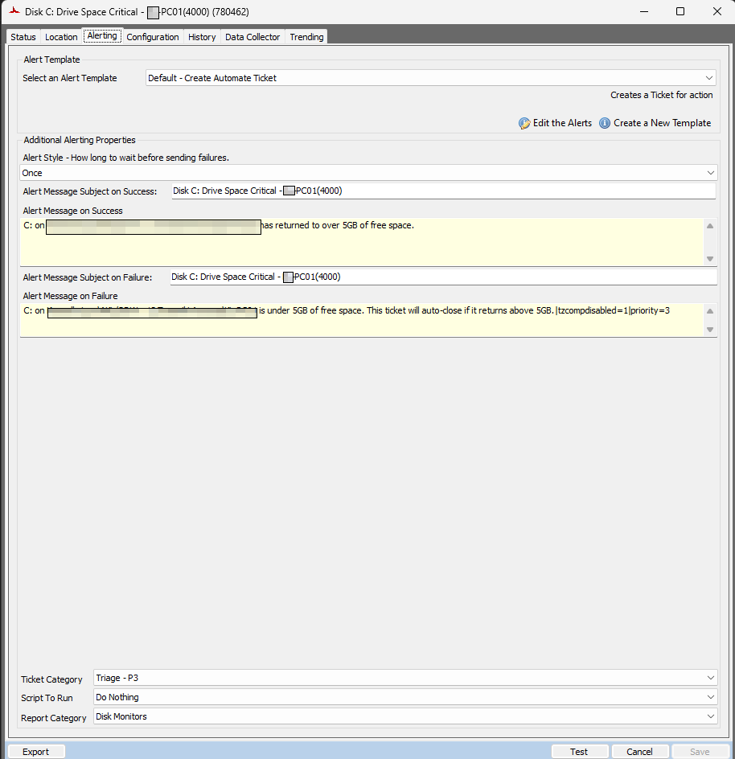  
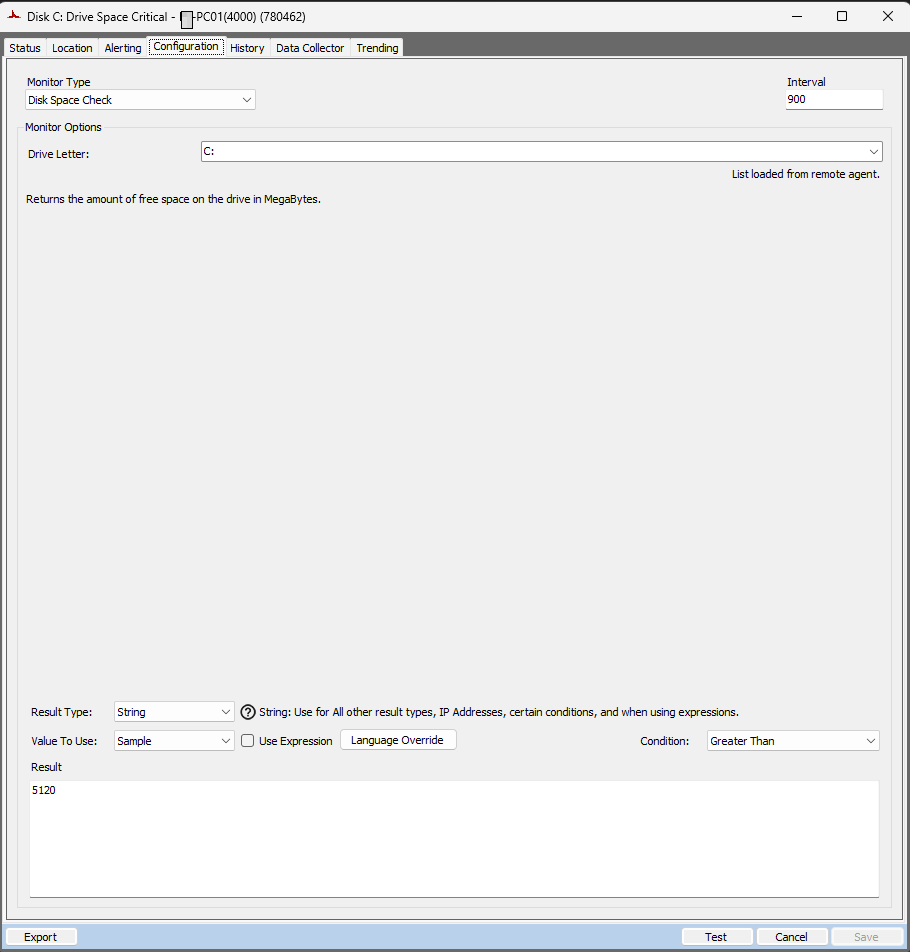  

## Implementation

1. **Remove Existing Monitors**: Eliminate any `Critical Drive Space Monitors` currently present in the environment.
2. **Modify Scheduled Scripts**: Halt the scheduled runs of all existing `Critical Drive Space Monitor` creation scripts.  
   **Note:** Check the Remove Existing Monitors and Modify Scheduled Scripts section of the document for comprehensive instructions on steps 1 and 2.
3. **Stale Monitors Verification**: Follow the instructions provided in steps 1 and 2 to remove the default critical drive space monitor and the monitor sets created by ProVal's legacy critical drive space monitor creation script. However, be aware that there may be other existing `Drive Space Critical` monitors with slightly different naming conventions or different logic from other sources.  
   To identify such monitor sets, execute the following query in a RAWSQL monitor set:  

   ```sql
   SELECT * FROM agents WHERE `Name` LIKE '%Drive Space Critical%' AND checkaction > 0
   ```  

   Retrieve this list of monitor sets and share it with the consultant, providing as much information as possible. It is advisable to proceed with further implementation steps only if the query results in an empty list.
4. **Import New Script**: Read this document carefully and import the script described in this document.
5. **Run/Debug the Script**: Execute or debug the script against a single client, with the `Set_Environment` parameter set to 1. This action will generate the necessary system properties and Extra Data Fields (EDFs) for managing the remote monitors.  
     
   
6. **Reload System Cache**: Refresh the system cache to ensure all changes are updated.  
      
7. **Configure System Properties and EDFs**: Input the required values in the system properties and EDFs to manage the remote monitors effectively.  
    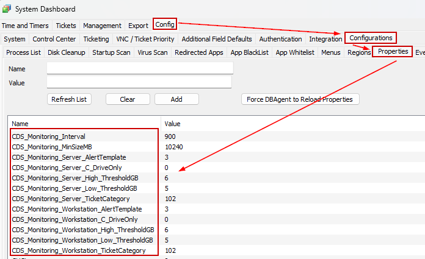  
    - The consultant should have provided you with any customizations that are required. Please read through the detailed System Properties and EDF explanations to understand how to configure any customizations
8. **Schedule the Script**: Schedule the script to run once per day, preferably around midnight, from the dashboard for optimal results.  
   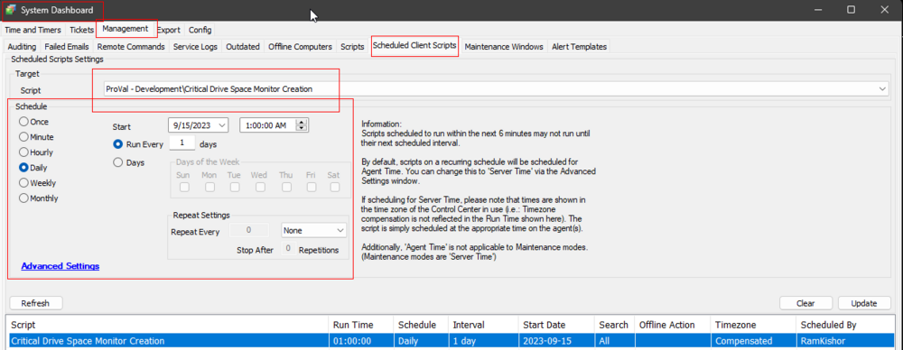

## User Parameters

| Name                           | Example | Required                      | Description                                                                                                                                                             |
|--------------------------------|---------|-------------------------------|-------------------------------------------------------------------------------------------------------------------------------------------------------------------------|
| Set_Environment                | 1       | True (for first run only)    | Set it to 1 during the first run of the script to generate the necessary system properties and EDFs for managing the generated remote monitors.                       |
| Clean_Environment              | 0       | False                         | This is a potentially destructive option. Setting this parameter to 1 while running the script will remove all the remote monitors, system properties, and EDFs generated by the script. **USE WITH CAUTION** |

## System Properties

| Name                                   | Example | Required | Description                                                                                                                                                                                                                                                                                                                                                                           |
|----------------------------------------|---------|----------|---------------------------------------------------------------------------------------------------------------------------------------------------------------------------------------------------------------------------------------------------------------------------------------------------------------------------------------------------------------------------------------|
| CDS_Monitoring_Interval                | 900     | True     | Controls the generated Remote Monitor run time interval. Default is 900 seconds. <br />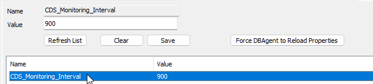 <br />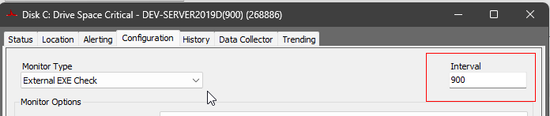 |
| CDS_Monitoring_MinSize                 | 25600   | True     | The minimum drive size, in megabytes (MB), required to create a remote monitor is specified by this property. The default value is set at 10240 MB. This means that the script will not create a remote monitor for any drive smaller than 10240 MB. <br />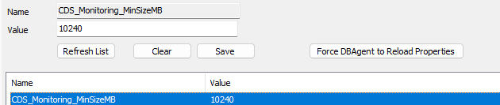                                                                                   |
| CSD_Monitoring_Server_AlertTemplate    | 3       | True     | ID of the alert template to apply to the remote monitors created for the servers. Default is 3, i.e., `Default - Create Automate Ticket` <br />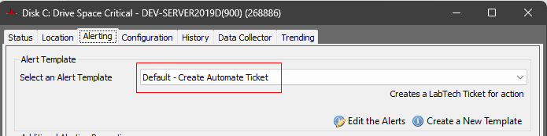 <br />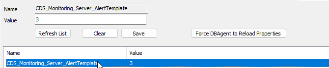 <br /><br />To find the ID of the Alert Templates: <br />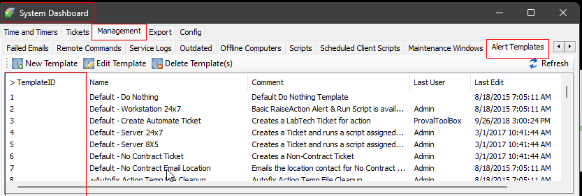 |
| CSD_Monitoring_Workstation_AlertTemplate| 3       | True     | ID of the alert template to apply to the remote monitors created for the workstations. Default is 3, i.e., `Default - Create Automate Ticket` <br />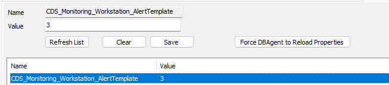                                                                                                                                                                                                                     |
| CSD_Monitoring_Server_TicketCategory    | 102     | True     | ID of the ticket category to apply to the remote monitors created for the servers. Default is 102, i.e., `Disk Drive` <br />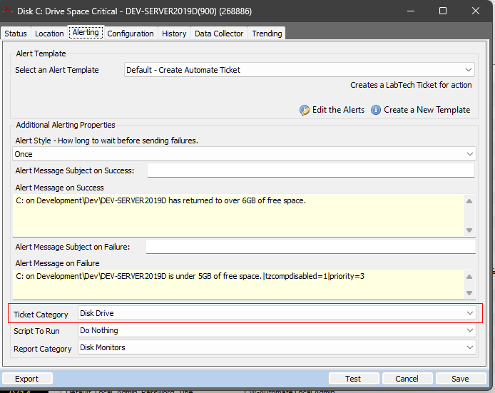 <br />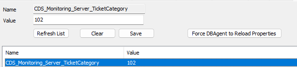 <br /><br />To find the ID of the Ticket Categories: <br />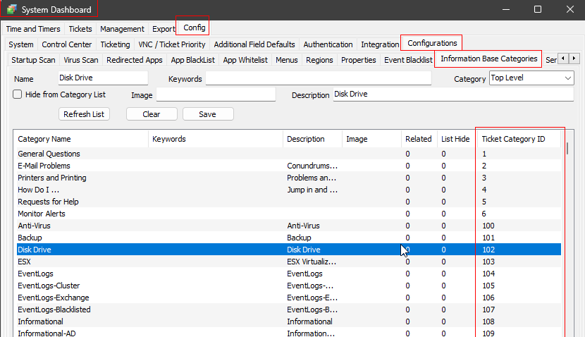 **Ticket Categories are used to control the CW Manage service board of the tickets generated by Automate.** |
| CSD_Monitoring_Workstation_TicketCategory| 102    | True     | ID of the ticket category to apply to the remote monitors created for the workstations. Default is 102, i.e., `Disk Drive` <br />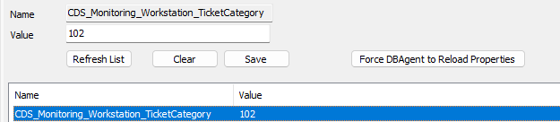                                                                                                                                                                                                                     |
| CDS_Monitoring_Server_C_DriveOnly      | 0       | False    | If this property is set to 1, for the servers; the script will create remote monitors for the C: Drive only. By default, this property is set to 0, which means that remote monitors will be created for all applicable drives. <br />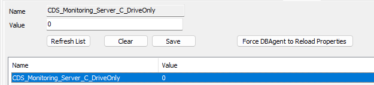                                                                                     |
| CDS_Monitoring_Workstation_C_DriveOnly  | 0       | False    | If this property is set to 1, for the workstations; the script will create remote monitors for the C: Drive only. By default, this property is set to 0, which means that remote monitors will be created for all applicable drives. <br />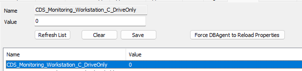                                                                                     |
| CDS_Monitoring_Server_Low_ThresholdGB   | 5       | True     | This property sets the Lower Threshold value in gigabytes (GB) for the critical drive space remote monitors on the servers. These monitors will trigger an alert when the available space on the respective drive falls below this threshold. The default value is set at 5 GB. <br />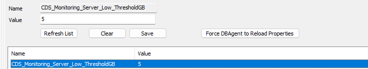 |
| CDS_Monitoring_Workstation_Low_ThresholdGB| 5      | True     | This property sets the Lower Threshold value in gigabytes (GB) for the critical drive space remote monitors on the workstations. These monitors will trigger an alert when the available space on the respective drive falls below this threshold. The default value is set at 5 GB. <br />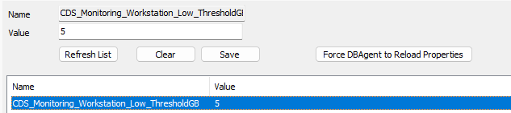 |
| CDS_Monitoring_Server_High_ThresholdGB  | 6       | True     | This property establishes the Upper Threshold value in gigabytes (GB) for the critical drive space remote monitors on servers. The ticket generated by these monitors will be closed when the free drive space exceeds this upper threshold. The default value is set at 6 GB. In other words, by default, the monitor set will generate a ticket if the free drive space falls below 5 GB and will only close that ticket when the free drive space exceeds 6 GB. <br />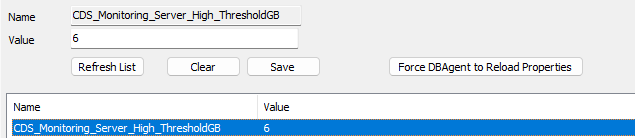 |
| CDS_Monitoring_Workstation_High_ThresholdGB| 6     | True     | This property establishes the Upper Threshold value in gigabytes (GB) for the critical drive space remote monitors on Workstations. The ticket generated by these monitors will be closed when the free drive space exceeds this upper threshold. The default value is set at 6 GB. In other words, by default, the monitor set will generate a ticket if the drive space falls below 5 GB and will only close that ticket when the drive space exceeds 6 GB. <br />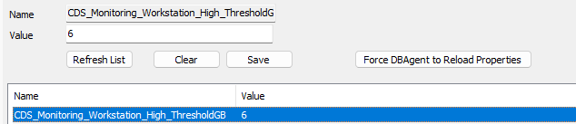 |

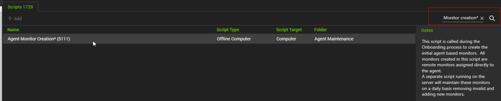

## Client-Level EDFs

| Name                          | Example | Type       | Description                                                                                                                                                                                                                                                                                                                                                                           |
|-------------------------------|---------|------------|---------------------------------------------------------------------------------------------------------------------------------------------------------------------------------------------------------------------------------------------------------------------------------------------------------------------------------------------------------------------------------------|
| Exclude From Monitoring        | 1/0     | Check Box  | Selecting this Extra Data Field (EDF) will exclude the entire client from critical drive space monitoring. As a result, the script will not create any remote monitors for the machines under this client. Furthermore, upon marking this EDF, the script will also remove any previously created remote monitors for this client. This allows for flexible and customizable monitoring based on individual client needs.|
| Exclude Servers from Monitoring | 1/0     | Check Box  | Selecting this Extra Data Field (EDF) will exclude all the servers of the client from critical drive space monitoring. As a result, the script will not create any remote monitors for the servers under this client. Furthermore, upon marking this EDF, the script will also remove any previously created remote monitors for the servers of this client. |
| Exclude Workstations from Monitoring | 1/0 | Check Box  | Selecting this Extra Data Field (EDF) will exclude all the workstations of the client from critical drive space monitoring. As a result, the script will not create any remote monitors for the workstations under this client. Furthermore, upon marking this EDF, the script will also remove any previously created remote monitors for the workstations of this client.  |
| Servers C Drive only          | 1/0     | Check Box  | Upon marking this EDF, for the client's servers; the script will create remote monitors for the C: Drive only. This EDF has the same functionality as the system property `CDS_Monitoring_Server_C_DriveOnly` but for the client's servers only. |
| Workstations C Drive only     | 1/0     | Check Box  | Upon marking this EDF, for the client's workstations; the script will create remote monitors for the C: Drive only. This EDF has the same functionality as the system property `CDS_Monitoring_Workstation_C_DriveOnly` but for the client's workstations only. |
| Minimum Drive Size MB         | 20840   | Text       | This Extra Data Field (EDF) can be utilized to override the minimum drive size at the client-level, as determined by the `CDS_Monitoring_MinSize` system property, for critical drive space monitoring. For instance, if this EDF is set to 20840, the script will only create remote monitors for drives larger than 20840 MB for the client's computers. This allows for more granular control over which drives are monitored based on their size. |
| Server Alert Template          | 1       | Text       | This Extra Data Field (EDF) specifies the ID of the alert templates to be applied to the remote monitors created for this client’s servers. By default, the script will use the value set in the `CSD_Monitoring_Server_AlertTemplate` system property, unless a value is set in this EDF. This EDF can also be used to temporarily disable alerting for a client’s servers. If it is set to 1, it will update the alert template of the critical drive space remote monitors for the client’s servers to `Default - Do Nothing`. This effectively suspends alert generation for these monitors. |
| Workstation Alert Template      | 1       | Text       | This Extra Data Field (EDF) specifies the ID of the alert templates to be applied to the remote monitors created for this client’s workstations. By default, the script will use the value set in the `CSD_Monitoring_Workstation_AlertTemplate` system property, unless a value is set in this EDF. This EDF can also be used to temporarily disable alerting for a client’s workstations. If it is set to 1, it will update the alert template of the critical drive space remote monitors for the client’s workstations to `Default - Do Nothing`. This effectively suspends alert generation for these monitors. |
| Server Ticket Category          | 102     | Text       | This Extra Data Field (EDF) specifies the ID of the ticket category to be applied to the remote monitors created for this client’s servers. By default, the script will use the value set in the `CSD_Monitoring_Server_TicketCategory` system property, unless a value is set in this EDF. |
| Workstation Ticket Category      | 102     | Text       | This Extra Data Field (EDF) specifies the ID of the ticket category to be applied to the remote monitors created for this client’s workstations. By default, the script will use the value set in the `CSD_Monitoring_Workstation_TicketCategory` system property, unless a value is set in this EDF. |
| Servers Lower Threshold GB       | 10      | Text       | This Extra Data Field (EDF) allows for a client-level override of the lower threshold (in GB) at which the servers remote monitor will generate a ticket. If not specified in this EDF, the script will default to using the value stored in the `CDS_Monitoring_Server_Low_ThresholdGB` system property. This provides flexibility in setting the alert threshold based on individual client requirements. |
| Workstations Lower Threshold GB   | 2       | Text       | This Extra Data Field (EDF) allows for a client-level override of the lower threshold (in GB) at which the workstations remote monitor will generate a ticket. If not specified in this EDF, the script will default to using the value stored in the `CDS_Monitoring_Workstation_Low_ThresholdGB` system property. This provides flexibility in setting the alert threshold based on individual client requirements. |
| Servers Upper Threshold GB        | 12      | Text       | This Extra Data Field (EDF) allows for a client-level override of the Higher/Upper threshold (in GB) at which the servers remote monitor will close the generated ticket. If not specified in this EDF, the script will default to using the value stored in the `CDS_Monitoring_Server_High_ThresholdGB` system property. This provides flexibility in setting the alert threshold based on individual client requirements. |
| Workstations Upper Threshold GB    | 3       | Text       | This Extra Data Field (EDF) allows for a client-level override of the Higher/Upper threshold (in GB) at which the workstations remote monitor will close the generated ticket. If not specified in this EDF, the script will default to using the value stored in the `CDS_Monitoring_Workstation_High_ThresholdGB` system property. This provides flexibility in setting the alert threshold based on individual client requirements. |

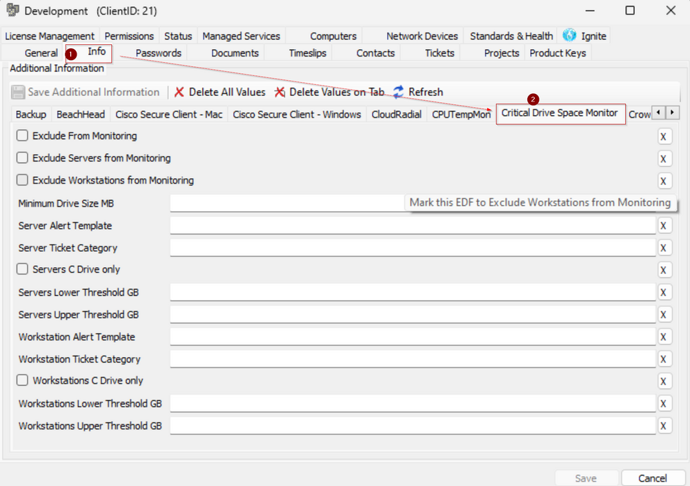

**These Extra Data Fields are located in the `Critical Drive Space Monitoring` section.**

## Computer-Level EDFs

| Name                          | Example | Type       | Description                                                                                                                                                                                                                                                                                                                                                                           |
|-------------------------------|---------|------------|---------------------------------------------------------------------------------------------------------------------------------------------------------------------------------------------------------------------------------------------------------------------------------------------------------------------------------------------------------------------------------------|
| Exclude From Monitoring        | 1/0     | Check Box  | Selecting this Extra Data Field (EDF) will exclude the computer from critical drive space monitoring. As a result, the script will not create any remote monitors for this machine. Furthermore, upon marking this EDF, the script will also remove any previously created remote monitors for this machine. This allows for flexible and customizable monitoring based on individual computers. |
| Monitor C Drive Only          | 1/0     | Check Box  | When this Extra Data Field (EDF) is selected, the script will create a critical drive space monitor solely for the C: Drive of the machine. Additionally, it will remove any existing monitors for other drives, if any were previously created. This allows for focused monitoring of the primary drive. |
| Drive Letters To Exclude      | FGH     | Text       | This Extra Data Field (EDF) allows you to exclude specific drive letters from the critical drive space monitoring at the computer level. The script will not create any remote monitors for the drives corresponding to the letters stored in this EDF. Furthermore, it will remove any existing monitors for these excluded drives, if any were previously created. <br />For example, if you set this EDF to `EFGH`, the script will exclude the `E`, `F`, `G`, and `H` drives of the computer from critical drive space monitoring. This provides flexibility in selecting which drives are monitored. |
| Lower Threshold GB            | 3       | Text       | This Extra Data Field (EDF) allows for a computer-level override of the lower threshold (in GB) at which the servers remote monitor will generate a ticket. |
| Upper Threshold GB            | 5       | Text       | This Extra Data Field (EDF) allows for a computer-level override of the Upper/Higher threshold (in GB) at which the servers remote monitor will close the generated ticket. |

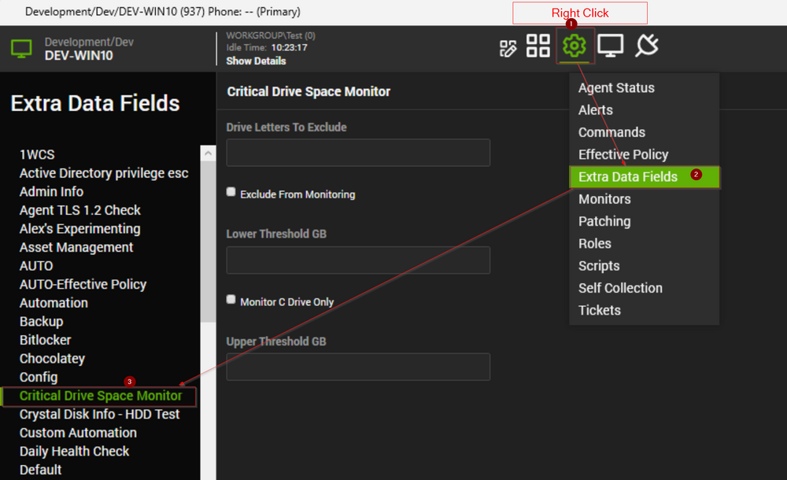

**These Extra Data Fields are located in the `Critical Drive Space Monitoring` section.**

## Location-Level EDF

| Name                          | Example | Type       | Description                                                                                                                                                                                                                                                                                                                                                                           |
|-------------------------------|---------|------------|---------------------------------------------------------------------------------------------------------------------------------------------------------------------------------------------------------------------------------------------------------------------------------------------------------------------------------------------------------------------------------------|
| CDS Monitoring Exclude | 1/0 | Check Box | Selecting this Extra Data Field (EDF) will exclude the location from critical drive space monitoring. As a result, the script will not create any remote monitors for any machine in this location. Furthermore, upon marking this EDF, the script will also remove any previously created remote monitors for this location's machines. |

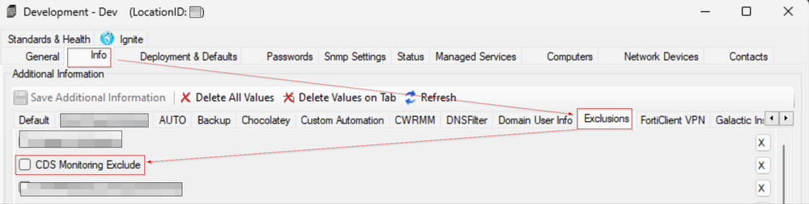

## Remote Monitor Example

**Name:** `Disk <Drive Letter>: Drive Space Critical - <Computer Name>(<ComputerID>)`  

**Ticket Subject:** `Disk <Drive Letter>: Drive Space Critical - <Computer Name>(<ComputerID>)`  

**Alert Message on Failure:** `<Drive Letter>: on <Client Name>\<Location Name>\<Computer Name> is under <Lower Threshold>GB of free space. This ticket will auto-close if it returns above <Higher Threshold>GB`  

**Alert Message on Success:** `<Drive Letter>: on <Client Name>\<Location Name>\<Computer Name> has returned to over <Higher Threshold>GB of free space.`  

**Sample Ticket:**  
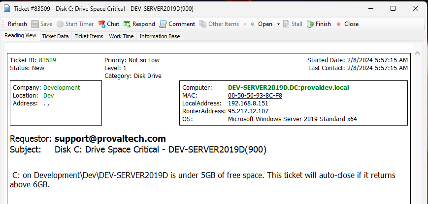  

**Sample Remote Monitor:**  
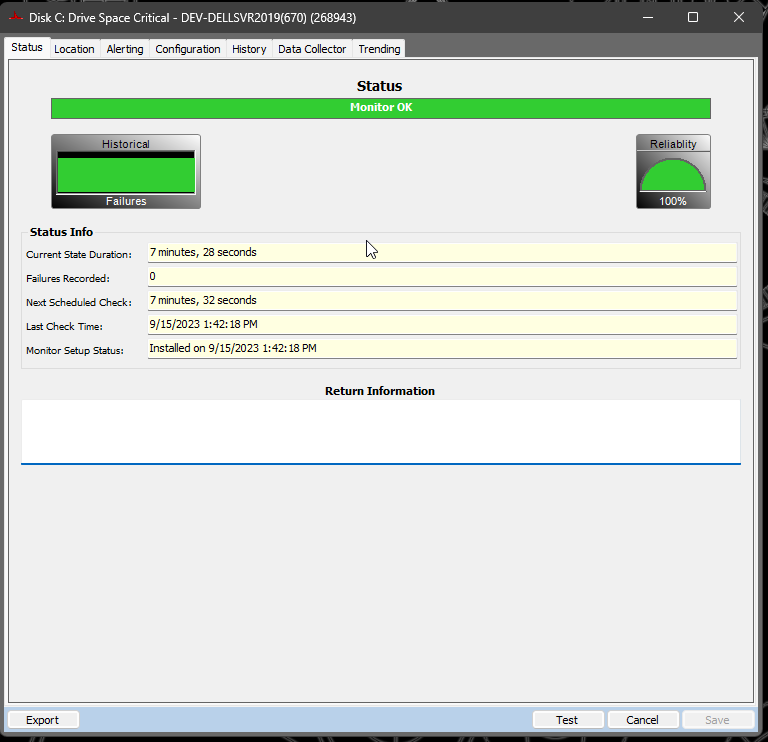  
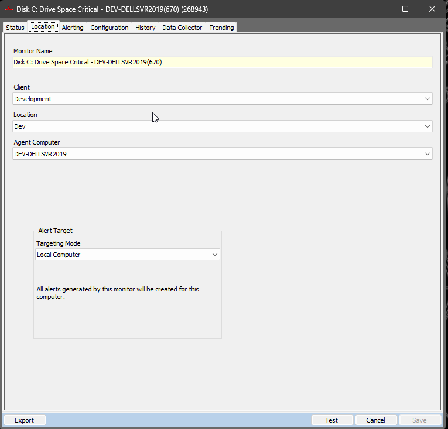  
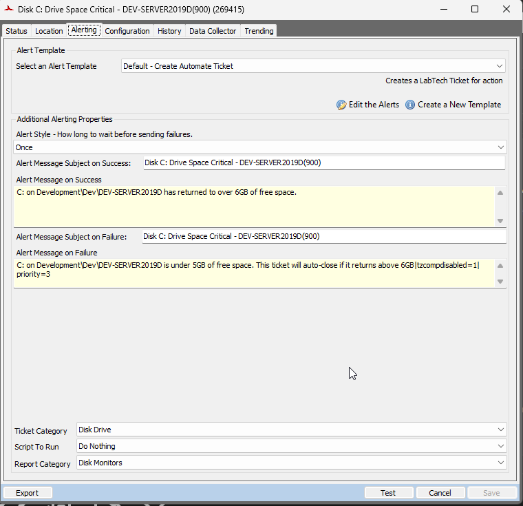  
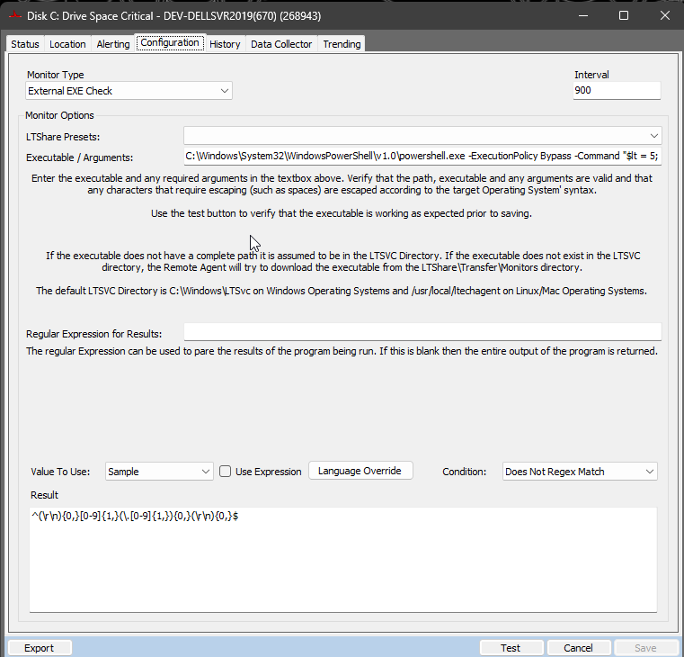  

## Output

- Remote Monitors

## Remove Existing Monitors

1. **Launch RAWSQL Monitor**  
    Launch a fresh RAWSQL monitor, wherein a RAWSQL monitor set is an internal monitor featuring the string 'RAWSQL' in both the 'Table to Check' and 'Field to Check' fields.  
    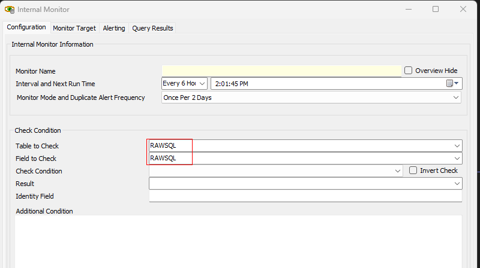

2. **Build and View Query**  
    Run the provided SQL query using the RAWSQL monitor. Paste the query into the `Additional Condition` field and click the `Build and View Query` button to execute it.  

   ```sql
   SELECT * From agents where checkaction = 6 and `Name` REGEXP '^Disk - [A-z]: Drive Space Critical'
   ```  

   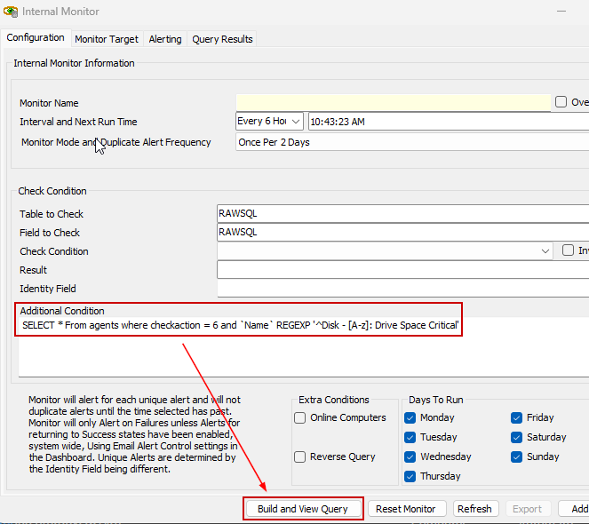

3. **Build and View Query**  
    Verify the query results to confirm that it exclusively returns monitor sets labeled as 'Drive Space Critical' remote monitors.  
   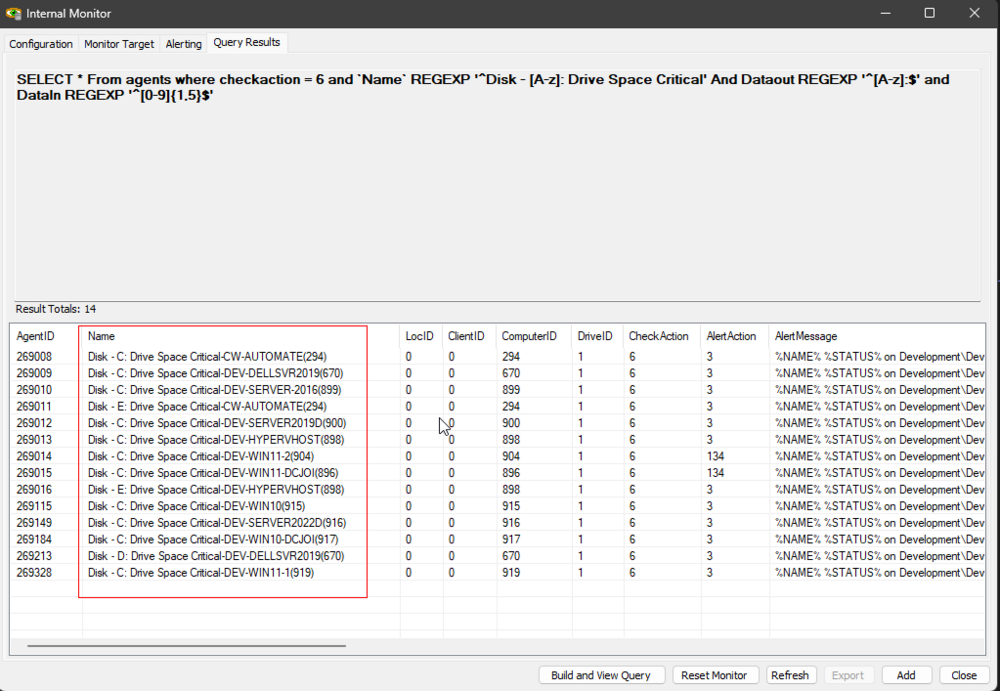

4. If unexpected results are being returned, revise the query to exclude those specific outcomes.
5. **Build and View Query**  
    Execute the delete query in the same fashion as the SELECT query to eliminate the specified monitor sets. Adjust the delete query accordingly if you made updates to the SELECT query to exclude certain results.  

   ```sql
   DELETE From agents where checkaction = 6 and `Name` REGEXP '^Disk - [A-z]: Drive Space Critical'
   ```  

   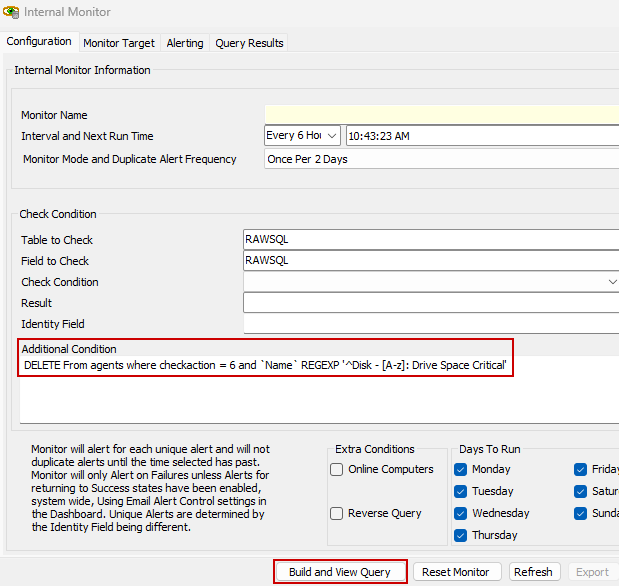

6. **Validation for Deleted Monitors Success**
    Please be aware that executing this query will not yield any results. You can confirm its effectiveness by rerunning the SELECT query. If the SELECT query returns nothing, it indicates that the existing remote monitors have been successfully removed.  
   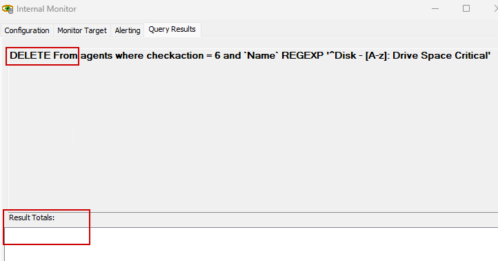  
   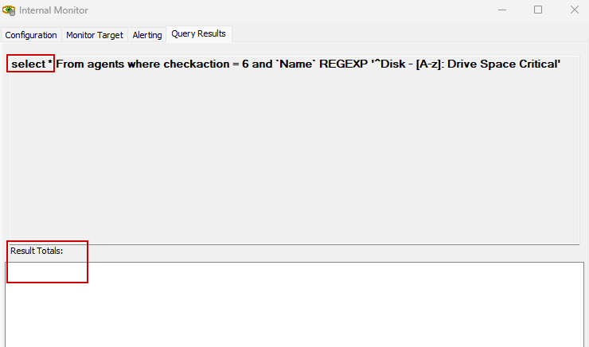

## Modify Scripts Schedule

1. With the monitor sets successfully removed, proceed to adjust the scheduled script and its associated schedules responsible for creating these monitor sets. Keep the `RAWSQL` monitor open, as it will be utilized once more in the process.

2. **View Script**  
    Navigate to the scripts section and search for the script labeled `Agent Maintenance - Contract*`.  
   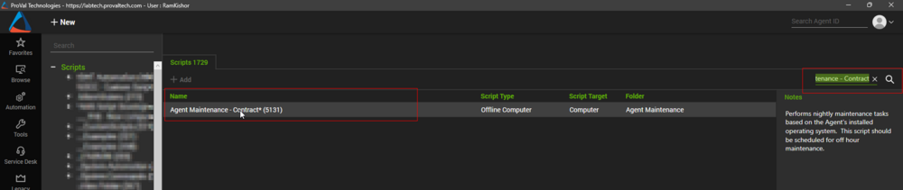

3. Access the script by double-clicking on it.  
   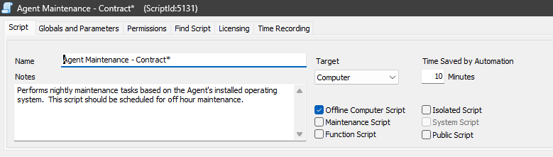

4. Navigate to the 'Find Script' section within the script and respond affirmatively by clicking 'Yes' when prompted.  
    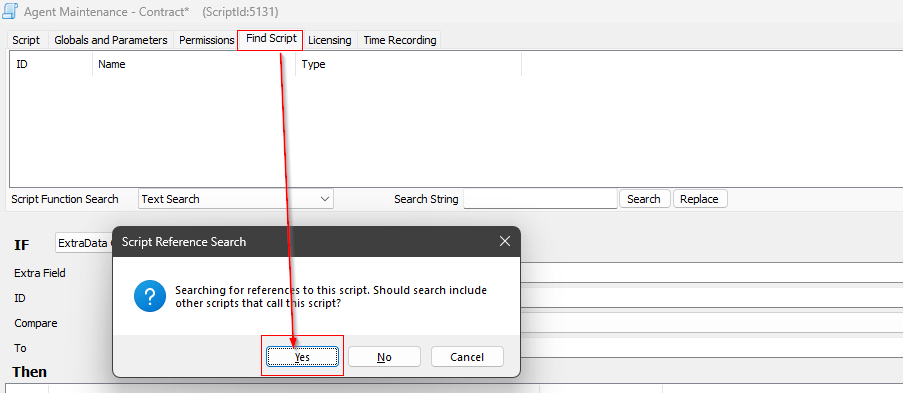

5. **Find Group List**  
    Make a note of the 'Groups' listed in the 'Find Script' section. These groups indicate where the script is currently scheduled. To facilitate future updates to these schedules, it's advisable to take note of these groups, and you may find it helpful to capture a screenshot for reference.  
    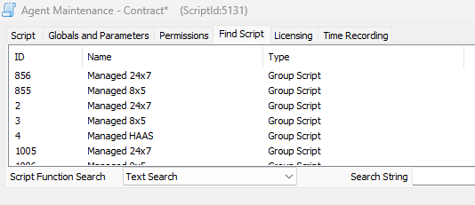  
    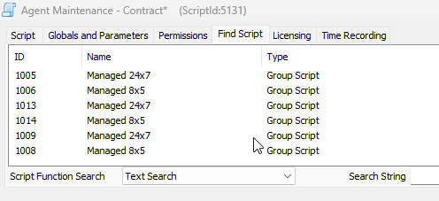

6. **Note Script ID**
    Note down the script ID as well; in my environment, it is identified as `5131`. This information will be useful for subsequent modifications.  
    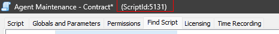

7. Close the script.

8. **Duplicate the script**
    Create a duplicate of the script by right-clicking on the script's name and selecting the 'Duplicate' option.  
    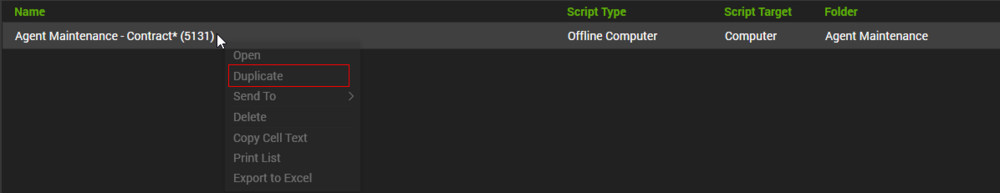

9. **Rename the Script**  
    Provide a meaningful name for the duplicated script, such as `Agent Maintenance - Contract [Modified]*`, and then click the 'Save' button to confirm.  
    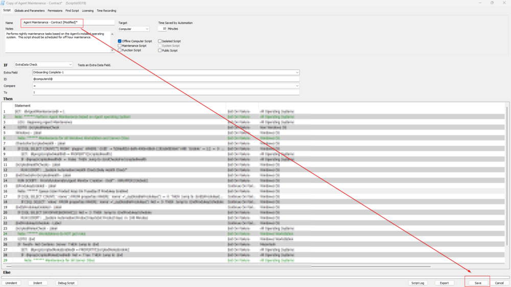

10. Close the duplicated script, modifications to this script will be addressed in subsequent steps.

11. Look for the script labeled `Agent Monitor Creation*`.  
    

12. Duplicate the `Agent Monitor Creation*` script.  
    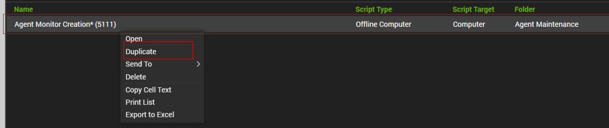

13. **Rename the Duplicate Script**  
    Provide a new name for the duplicated script; for instance, you can name it `Agent Monitor Creation - [Modified]*`.  
    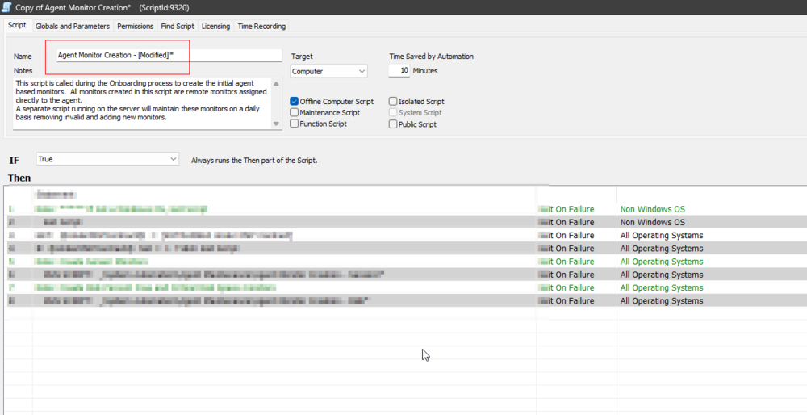

14. **Modify the Script**  
    Eliminate Step `7` and Step `8` from the 'Then' section of the duplicated script. You can do this by right-clicking on the respective steps and selecting the 'Remove' option. Keep in mind that this script may execute either `Agent Monitor Creation - Disk` or `Agent Monitor Creation - Disk* - WRAPPER`.  
    Before removing the steps:  
    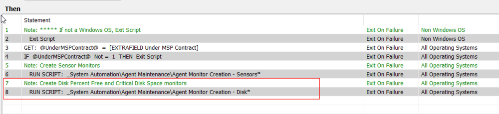  
    OR  
    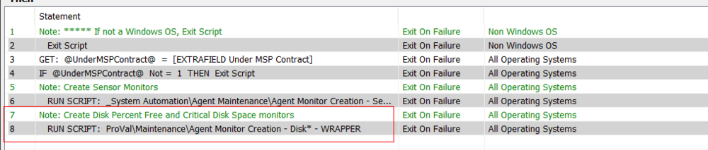  
    After removing the steps:  
    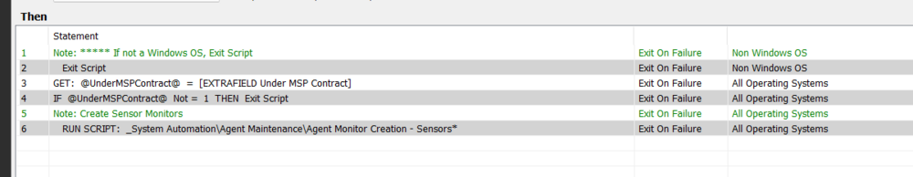  
    The objective is to remove the script responsible for creating the 'Drive Space Critical' monitor set from the duplicated script.

15. **Save the Changes**  
    Click the 'Save' button to save the changes you made to the duplicated script.  
    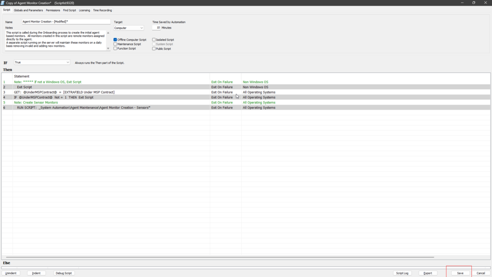

16. Close the modified script.

17. **Reload System Cache**  
    Refresh the system cache to ensure all changes are updated.
    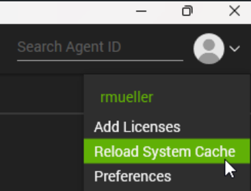

18. Open the script saved in Step 15, named `Agent Maintenance - Contract [Modified]*`.

19. **Adjust the Script Run**  
    Around Step 14 in the 'Then' section of this script, it's likely executing the `Agent Monitor Creation*` script.  
    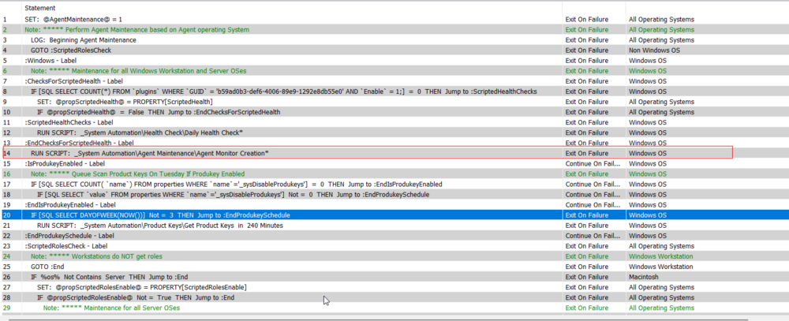
    Open the step that runs the `Agent Monitor Creation*` script by double-clicking on it. In my case, it is Step 14.  
    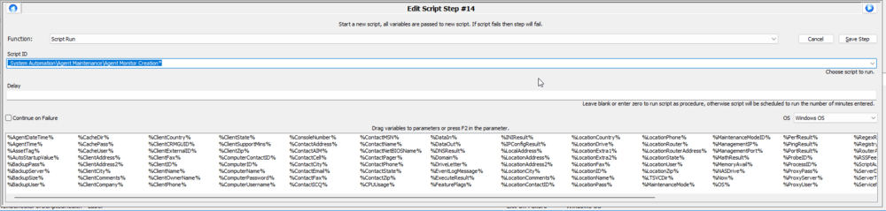
    From the drop-down menu, choose the script saved in Step 21, which is `Agent Monitor Creation - [Modified]*`.  
    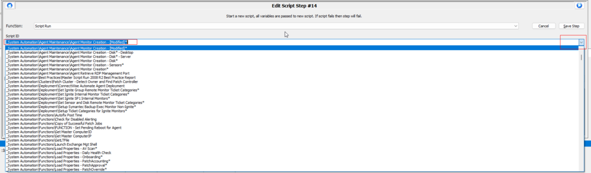
    Click the 'Save Step' button to save the modifications made to the step.  
    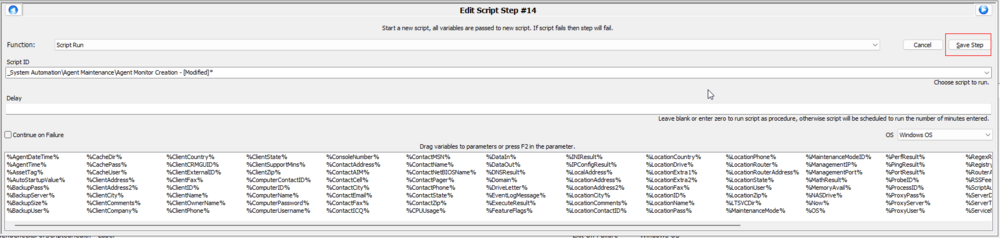

20. Click the 'Save' button to save the changes made to the modified script (`Agent Maintenance - Contract [Modified]*`).  
    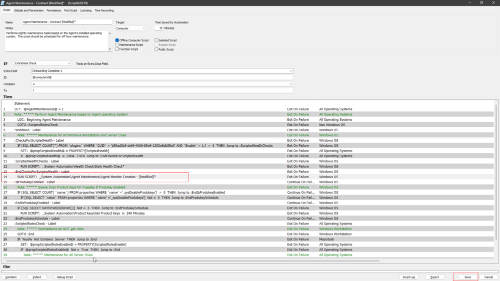

21. **Note Script ID**  
    Take note of the ID of this script; in my environment, it is identified as `9319`. Ensure to keep this ID. This information will be useful for subsequent modifications.  
    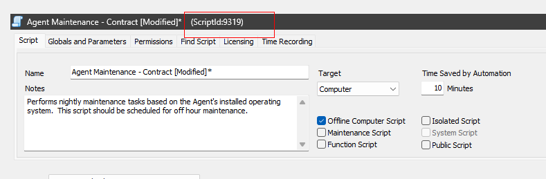

22. **RAWSQL Monitor**
    Return to the RAWSQL monitor.
    Execute the following SQL query to obtain the complete name/path of the groups where the original script is scheduled:  

    ```sql
    SELECT * From mastergroups where groupid in (select distinct groupid from groupscripts where scriptid = 5131)
    ```  

    **Note:** Replace `5131` with the actual ID of your original script, as it may differ.  
    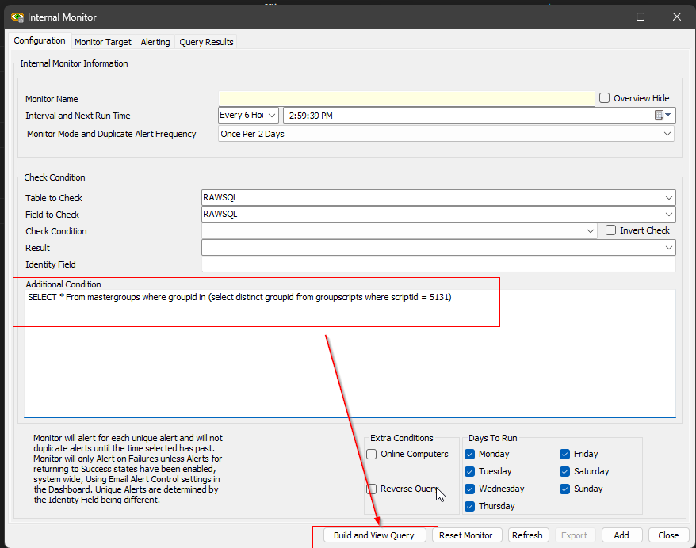

23. Make a note of the results, and it's recommended to take a screenshot for reference.  
    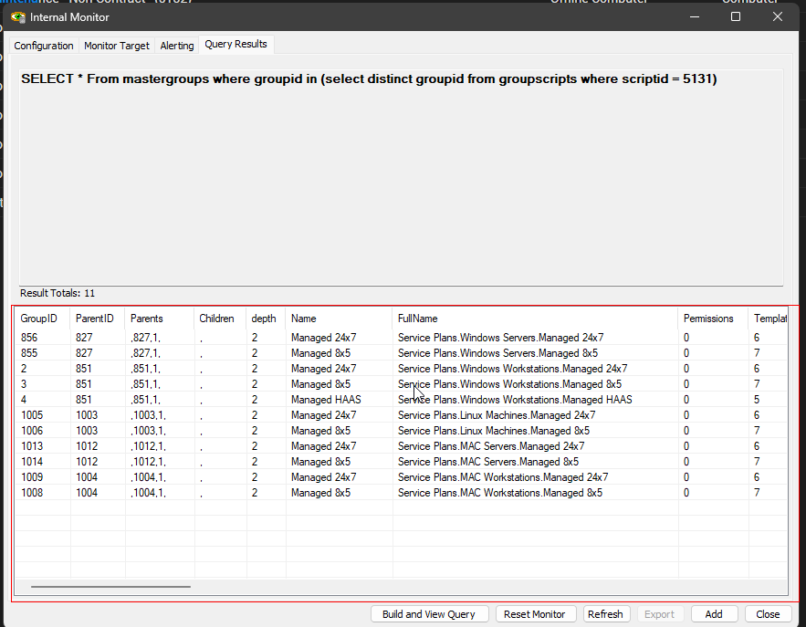

24. Execute the following SQL query to replace the schedule of the original script (`Agent Maintenance - Contract*`) with the duplicate script (`Agent Maintenance - Contract [Modified]*`):  

    ```sql
    SET @originalscriptid= 5131 ;
    SET @duplicatescriptid= 9319 ;
    UPDATE groupscripts SET scriptid = @duplicatescriptid WHERE scriptid = @originalscriptid ;
    ```  

    **Note:** Replace `5131` with the actual ID of your original script and `9319` with the actual ID of your duplicate script, as they may differ.  
    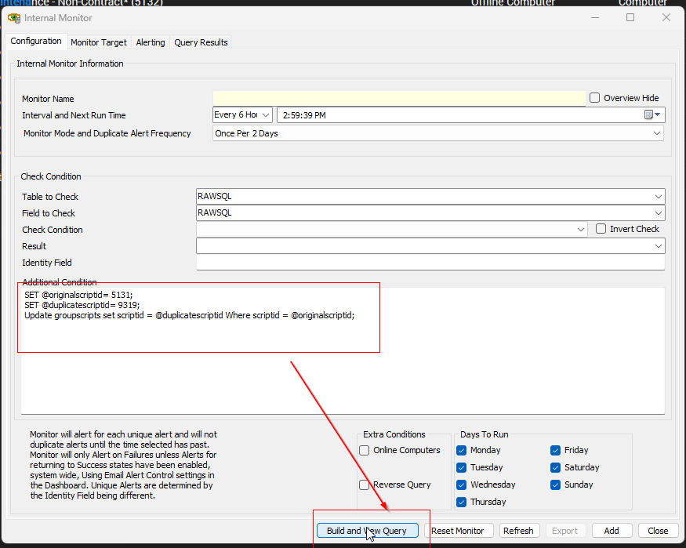  
    If the query executes successfully without returning any errors or results, it indicates that the update was applied as expected. The schedules for the original script (`Agent Maintenance - Contract*`) should now be associated with the duplicate script (`Agent Maintenance - Contract [Modified]*`).  
    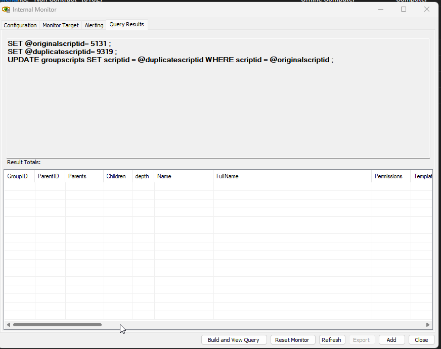

25. Open the `Server Status` tool by navigating to `Help` > `Server Status`.  
    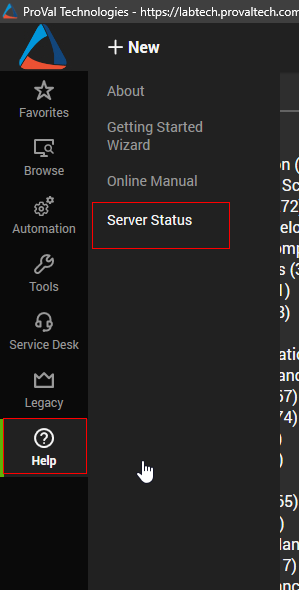

26. Click the 'Do Group Refresh' button to refresh and apply the changes made.  
    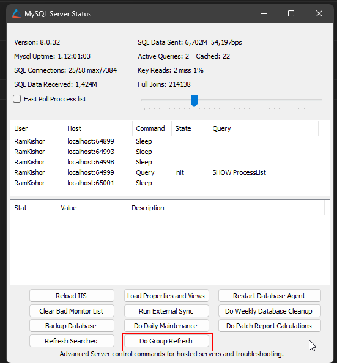

27. Click 'OK' to the popup message and wait for a minute to allow the changes to take effect.  
    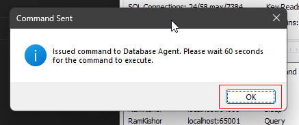

28. **Reload System Cache**  
    Refresh the system cache to ensure all changes are updated.
    

29. Navigate to the `Groups` section from the `Browse` tab.  
    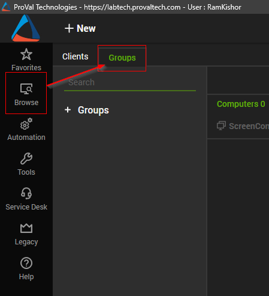

30. Search for the groups in the `Groups` section using the information from the screenshot stored in previous steps.  
    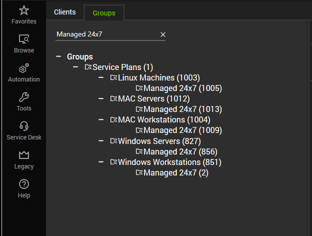

31. Open one of the groups.  
    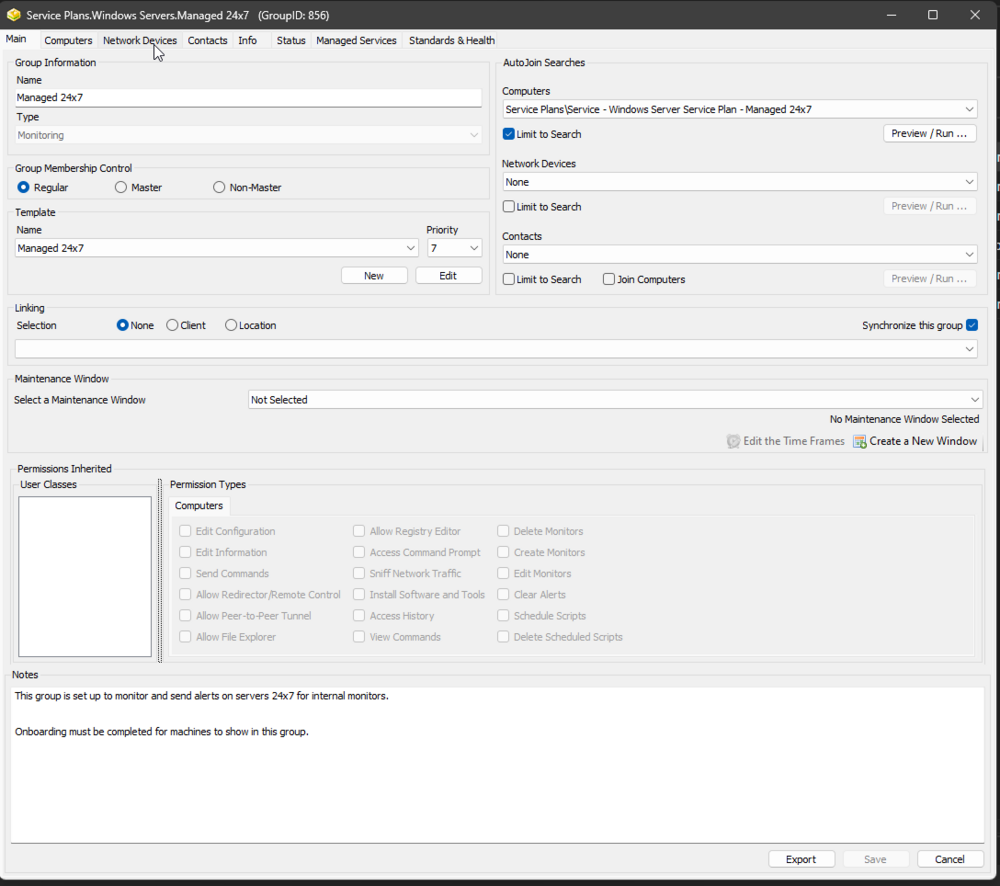

32. Navigate to the 'Scheduled Scripts' section from the 'Computers' tab and verify that the duplicated script (`Agent Maintenance - Contract [Modified]*`) is appearing here.  
    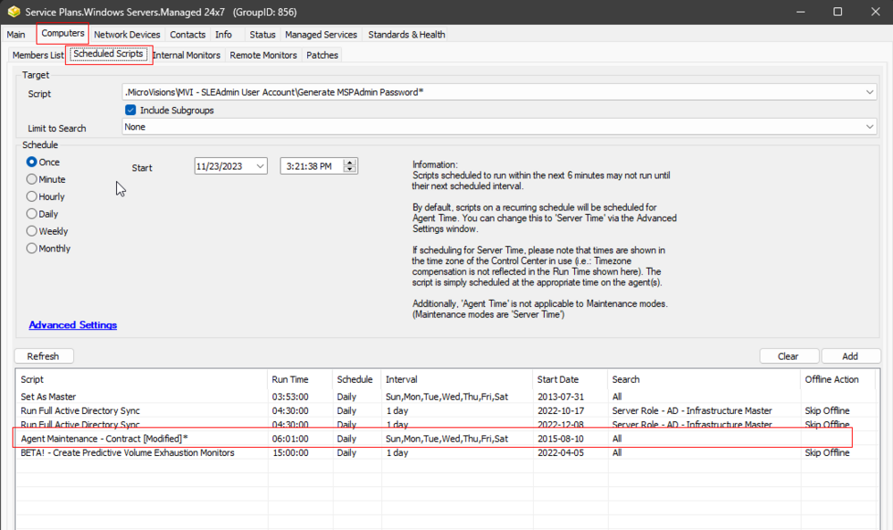

33. For each group identified in the screenshot from Step 33, navigate to the 'Scheduled Scripts' section from the 'Computers' tab and verify that the duplicated script (`Agent Maintenance - Contract [Modified]*`) is appearing. Repeat this process for all relevant groups.

## Tips

- [Set Computer Level EDFs by Group ID](/docs/95e85dc0-6420-42fe-8d2a-aeb9dac683b0) script can be used to set overrides on multiple machines.
