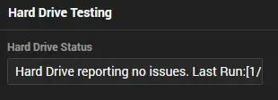
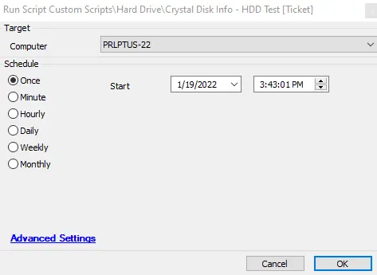

## Summary

This script utilizes the Crystal Disk Info hard drive testing program to automatically determine hard drive health on any computer it is run on. Under the Hard Drive Testing folder in Extra Data Fields, the Hard Drive Status field is updated when this script runs. This text field is not editable and can contain one of the following results that are searchable through the system:

- Hard Drive reporting no issues. Last Run: [\<Date/Time>]
- Hard Drive reporting predictive failure. Last Run: [\<Date/Time>]
- Hard Drive reporting Bad. Imminent failure possible. Last Run: [\<Date/Time>]

## Sample Run

## Dependencies

This script is dependent on the following items:

- EDF: Hard Drive Status (Located under the Hard Drive Testing folder)
  - This gets imported with the script.
- The global variables need to be edited if you would like tickets to be generated upon failing hard drive detection.

## Variables

Document the various variables in the script. Delete any section that is not relevant to your script.

| Name            | Description                                                         |
|-----------------|---------------------------------------------------------------------|
| @FileName@      | This indicates what version of Crystal Disk Info will be downloaded  |
| @DownloadLink@  | This tells the script where to download the zip file containing Crystal Disk Info. |

#### Global Parameters

| Name                    | Example                     | Required                       | Description                                                           |
|-------------------------|-----------------------------|--------------------------------|-----------------------------------------------------------------------|
| TicketsEnabled          | False                       | False                          | This determines if tickets will be generated for computers with bad hard drives. |
| TicketCreateSubject     | \<Subject for Ticket>       | True if TicketsEnabled is True | This indicates what the subject of the ticket should be.             |
| TicketBody              | \<Body of Ticket>           | True if TicketsEnabled is True | This indicates what the body of the ticket should be. The script will add computer information below this info. |
| TicketCreationCategory   | 143                         | True if TicketsEnabled is True | This should represent the ticket category if TicketsEnabled is set to True. |
| TicketComment           | \<Comment of Ticket>        | True if TicketsEnabled is True | If the script runs with an open ticket in Automate, what should the script comment to the ticket. |

## Process

1. Download Crystal Disk Info to `C:/Windows/LTSvc/CrystalDiskInfo` and unzip the download.
2. Set Non-SSD thresholds to 50 if there are any present Non-SSD drives on the machine.
3. Run the tool silently.
4. Parse the `DiskInfo.txt` log and look for keywords (such as Caution or Bad).
5. If the result is Bad or Caution:
   - Update the Hard Drive Status EDF with this information.
   - Create a ticket if the Global Parameter is set in the script.
6. If the result is Good:
   - Update the Hard Drive Status indicating the hard drive is in good shape.
7. Upload the log to the Automate server:
   - Accessible through the Computer Management screen:
     - Agent Status --> Uploaded files.

## Output

The status information gets updated in the following places:

- Script Log
- Hard Drive Status EDF
