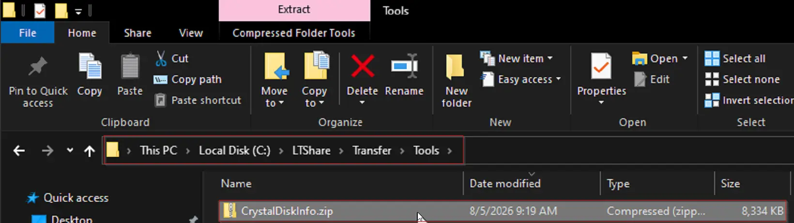
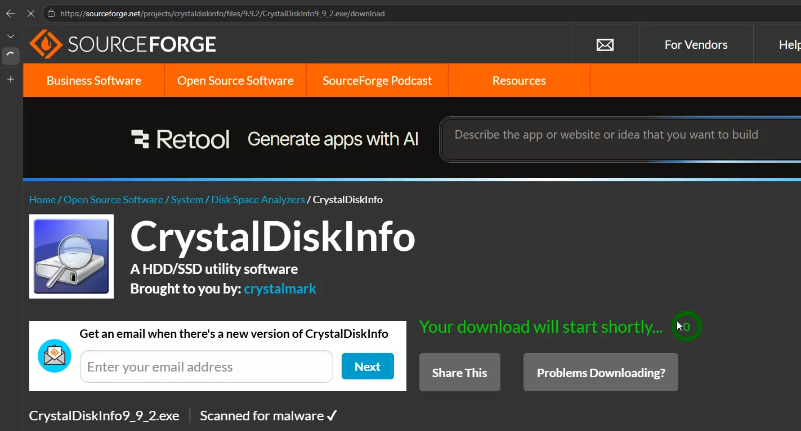
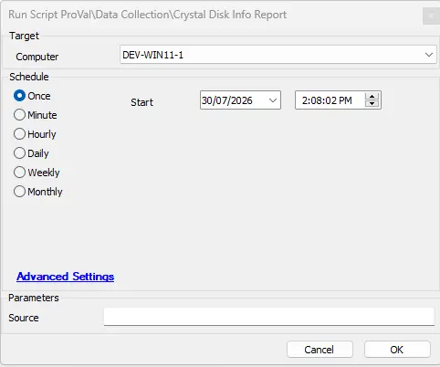
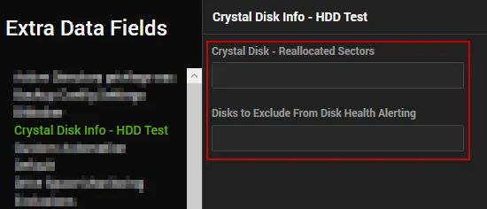
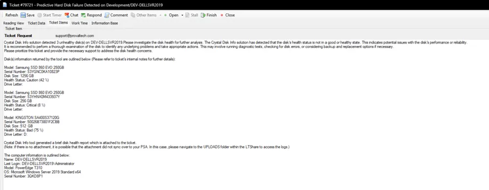
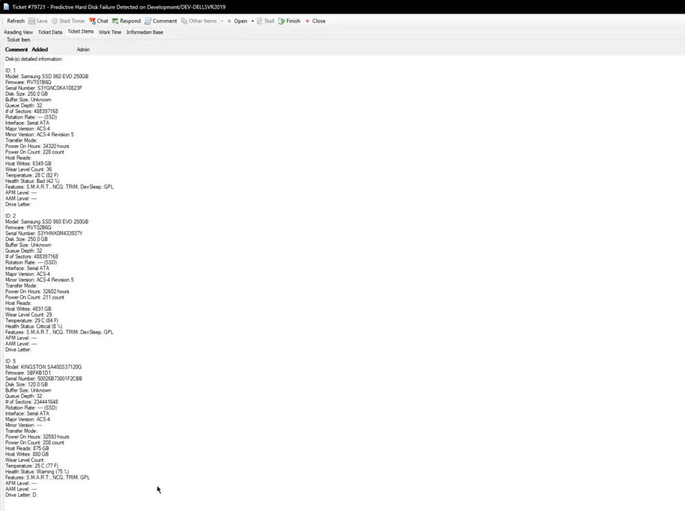
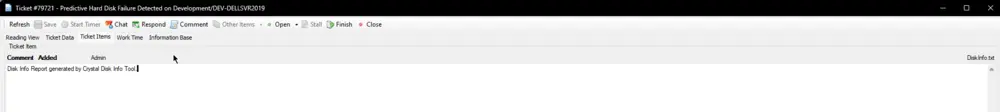
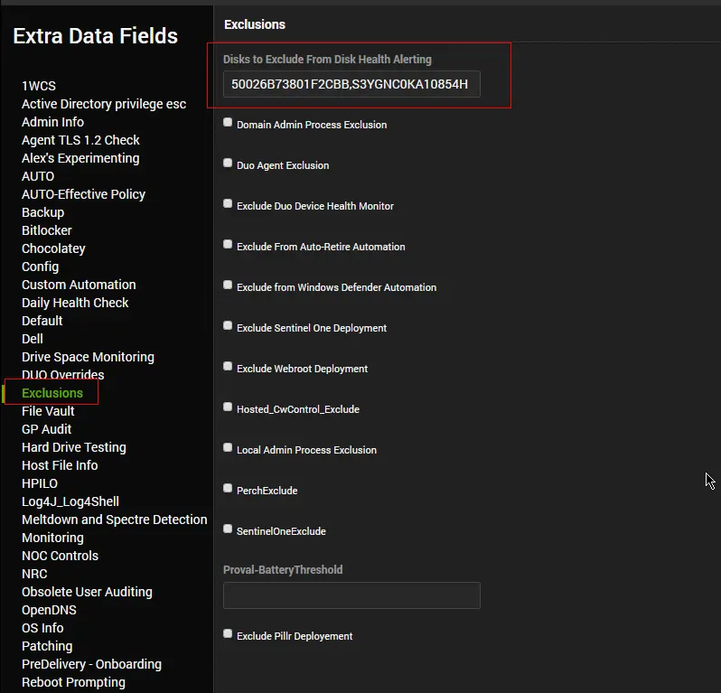

## Summary

The script runs the [Crystal Disk Info tool](https://crystalmark.info/en/software/crystaldiskinfo/) on physical machines, stores the basic disk information returned by the tool in a [custom table](/docs/89182385-f98c-4e8b-ab62-1df0c73bbb1c), and creates a ticket if the [Health Status](https://crystalmark.info/en/software/crystaldiskinfo/crystaldiskinfo-health-status/) returned by the tool does not contain `Good`. Additionally, it attempts to attach the `DiskInfo.txt` report generated by the tool to the ticket.

It is an Automate implementation of the agnostic script [Agnostic - Get-CrystalDiskInfo](/docs/b08e9cd3-931f-4c70-a084-6193fe3702fb).

**Note:** The script will not work for virtual machines as the tool only supports physical hard disks.

## Tool Acquisition

The script requires the CrystalDiskInfo Standard Edition ZIP to run. You have three options for providing this file to your agents, listed in order of recommendation:

### Option 1: Host on Automate LTShare / WebDAV (Recommended)

For the fastest and most reliable deployment, host the ZIP file on your Automate server (WebDAV for hosted partners). This ensures agents download the tool locally without hitting external firewalls.

1. Download the latest stable Standard Edition ZIP from the [CrystalDiskInfo Official Download](https://crystalmark.info/en/download/#CrystalDiskInfo) page.
2. Unblock the file
3. Place the file in your LTShare (or WebDAV for hosted partners) at `LTShare/Transfer/Tools` and name it `crystaldiskinfo.zip`.
4. If the `Tools` directory does not exist, create it.



The script automatically constructs the download URL using your environment's redirection hostname (e.g., `https://%redirhostname%/labtech/transfer/tools/crystaldiskinfo.zip`).

### Option 2: Use a Custom Source

If you prefer to host the file on your own internal web server, cloud storage, or a network UNC share, you can pass that location using the **`Source`** User Parameter when executing the script.

- **Examples:** `https://internal.company.com/tools/crystaldiskinfo.zip` or `\\fileserver\share\crystaldiskinfo.zip`.
- The script will test and use this location, bypassing the LTShare and default internet checks.

### Option 3: Automatic Internet Fallback

If you do not host the file on your LTShare and do not provide a `Source` parameter, the script will automatically resolve and download the latest available version from the internet (via SourceForge).

- **Note:** The default download host is located in India, and some regional firewalls or geo-blocking rules may prevent agents from reaching it. If the download fails, the script will exit with an error. We highly recommend Option 1 or 2 for production environments.



## Sample Run



The primary usage of the script is to be executed by the [Internal Monitor - Execute Script - Crystal Disk Info Report](/docs/860cd3d8-4833-4c29-b87d-ac997816994e) monitor set.

## Dependencies

- [Agnostic - Get-CrystalDiskInfo](/docs/b08e9cd3-931f-4c70-a084-6193fe3702fb)
- [Script - OverFlowedVariable - SQL Insert - Execute](/docs/34cee8fe-1b6b-4558-a890-2face427ceb8)
- [Crystal Disk Info - Ticket Troubleshooting Guide](/docs/1462c9f3-6c6d-4703-a2f5-07a1e1d62fd9)
- [Solution - Crystal Disk Info](/docs/0df580b1-4b36-4988-b192-574a001a7323)

## Global Parameters

| Name                          | Default | Required | Description |
|-------------------------------|---------|----------| ----------- |
| `ServerTicketCreationCategory` | `0` | `False` | Setting a predefined ticket creation category will set a specified ticket creation category for server-type devices. Setting the ticket category in the script will override the ticket category set either at group or computer levels. The ticket category settings are defined properly in the [monitor set's](/docs/860cd3d8-4833-4c29-b87d-ac997816994e) document. 0 in the value represents that this global property is not in use. |
| `WorkstationTicketCreationCategory` | `0` | `False` | Setting a predefined ticket creation category will set a specified ticket creation category for workstation-type devices. Setting the ticket category in the script will override the ticket category set either at group or computer levels. The ticket category settings are defined properly in the [monitor set's](/docs/860cd3d8-4833-4c29-b87d-ac997816994e) document. 0 in the value represents that this global property is not in use. |
| `ReallocatedSector` | `50` | True | Set the threshold for the number of reallocated sectors to mark an HDD as `caution` (not applicable to SSDs). |

## User Parameters

| Name                   | Example | Required                          | Description                                                                                                                                                                                                                      |
|------------------------|---------|-----------------------------------|----------------------------------------------------------------------------------------------------------------------------------------------------------------------------------------------------------------------------------|
| Source          | `\\fileserver\share\CrystalDiskInfo.zip`       | False  | Optional custom location of the CrystalDiskInfo ZIP file. Accepts a local path, a UNC path, or a custom URL. If provided and valid, this overrides the default LTShare download URL. Falls back to LTShare or default internet source if omitted or failed. |

## Extra Data Fields

| Name                                             | Level    | Type  | Example                                         | Description                                                                                                                                                                                                                     |
|--------------------------------------------------|----------|-------|-------------------------------------------------|---------------------------------------------------------------------------------------------------------------------------------------------------------------------------------------------------------------------------------|
| Disks to Exclude From Disk Health Alerting       | Computer | Text  | 50026B73801F2CBB,50026B73801F2CBC               | Comma-separated list of the Serial Numbers of the Disk(s) to exclude from alerting.                                                                                                                                           |
| Crystal Disk - Reallocated Sectors               | Computer | Text  | 70                                              | Threshold for the number of reallocated sectors to mark an HDD as `caution` (not applicable to SSDs). This EDF can be used to overwrite the value stored in the Global Variable `ReallocatedSector`. The default threshold is 50. |



## System Properties

| Name                             | Default | Required | Description                                                                                 |
|----------------------------------|---------|----------|---------------------------------------------------------------------------------------------|
| Crystal_Disk_Info_Disable_Tickets| 0       | False    | 0 or 1 to toggle the ticket creation function of the script.                              |
| Crystal_Disk_Info_Disable_Caution_Tickets| 0 | False | 0 or 1 to toggle ticket creation for disks with the `Caution` Health Status.              |

**Running the script against any online physical Windows computer will create the system properties.**

## Output

- Script Log
- Data view
- Ticket

## Ticketing

**Subject:** `Predictive Hard Disk Failure Detected on \\<ClientName>/\\<ComputerName>`

**Ticket Body:**

```text
Crystal Disk Info solution detected <Number of Unhealthy Disks> unhealthy disk(s) on <ComputerName>. Please investigate the disk health for further analysis. The Crystal Disk Info solution has detected that the disk's health status is not in a good or healthy state. This indicates potential issues with the disk's performance or reliability.
It is recommended to perform a thorough examination of the disk to identify any underlying problems and take appropriate actions. This may involve running diagnostic tests, checking for disk errors, or considering backup and replacement options if necessary.
Please prioritize this ticket and provide the necessary support to address the disk health concerns.
```

```text
Disk(s) information returned by the tool are outlined below (Please refer to the ticket's internal notes for further details):
Model: <Disk 1 Model>
Serial Number: <Disk 1 Serial Number>
Disk Size: <Disk 1 Size>
Health Status: <Disk 1 Health Status>
Drive Letter: <Disk 1 Drive Letter(s)>

Model: <Disk 2 Model>
Serial Number: <Disk 2 Serial Number>
Disk Size: <Disk 2 Size>
Health Status: <Disk 2 Health Status>
Drive Letter: <Disk 2 Drive Letter(s)>

Model: <Disk n Model>
Serial Number: <Disk n Serial Number>
Disk Size: <Disk 3 Size>
Health Status: <Disk n Health Status>
Drive Letter: <Disk n Drive Letter(s)>

<File Upload Comment>
```

The computer information is outlined below:

```text
Name: <Computer Name>
Last Login: <Logged In User>
Model: <Computer Model>
OS: <Operating System>
Serial Number: <Serial Number>
```

Refer to the troubleshooting guide at [Crystal Disk Info - Ticket Troubleshooting Guide](/docs/1462c9f3-6c6d-4703-a2f5-07a1e1d62fd9).  
If you're logged into an ITGlue portal, open the URL in a Private Window.

**\<File Upload Comment>** can vary depending on the existence of the disk health report **`DiskInfo.txt`**

If the script fails to find the file:  

```text
PowerShell Script failed to generate the Crystal Disk Info report.  
The result returned by the script can be checked from the internal notes in the ticket.
```

Comment to add to the internal notes if the script fails to find the file:  

```text
PowerShell Script failed to generate the Crystal Disk Info report.  
The result returned by the script is:  
<PsOut>
```

If the script finds and uploads the file:  

```text
Crystal Disk Info tool generated a brief disk health report which is attached to the ticket.  
(Note: if there is no attachment, it is possible that the attachment did not sync over to your PSA. In this case, please navigate to the UPLOADS folder within the LTShare to access the logs.)
```

The following information for each drive not showing **Good** status will be added to the ticket's internal note/comment:  

```text
ID: <DiskID>
Model: <Disk Model>
Firmware: <Disk Firmware>
Serial Number: <Disk Serial Number>
Disk Size: <Disk Size>
Buffer Size: <Buffer Size>
Queue Depth: <Queue Depth>
# of Sectors: <Number of Sectors>
Rotation Rate: <Rotation Rate>
Interface: <Interface>
Major Version: <Major version>
Minor Version: <Minor Version>
Transfer Mode: <Transfer Mode>
Power On Hours: <Power On Hours>
Power On Count: <Power On Count>
Host Reads: <Host Reads>
Host Writes: <Host Writes>
Wear Level Count: <Wear Level Count>
Temperature: <Disk Temperature>
Health Status: <Health Status>
Features: <Disk Features>
APM Level: <Disk APM Level>
AAM Level: <Disk AAM Level>
Drive Letter: <Drive Letter(s)>
```

Additional internal notes:  

```text
To exclude this disk from disk health alerting: Open the computer in Automate, navigate to Extra Data Fields, and under the "Exclusions" tab, find the "Disks to Exclude From Disk Health Alerting" field. Add the serial number for this disk to this field: \{Drive Serial Number}. Click Save. You can add additional disk serial numbers separated by comma for a single computer to exclude multiple drives from disk health alerting.
```

**Sample Ticket:**

**Ticket Summary and Subject:**  


**Internal Notes/Comment:**  


Attached **`DiskInfo.txt`** File:  


## Excluding Disk(s) from Alerting

- Gather the serial number(s) of the disk(s) to exclude from the generated ticket.  
- Add the serial number to the computer-level EDF `Disks to Exclude From Disk Health Alerting`. Multiple serial numbers can be separated by a comma. Do not add a space after the comma.  

e.g.,  


## Changelog

### 2026-08-05

- Added: Support for hosting the CrystalDiskInfo ZIP on the Automate LTShare/WebDAV Transfer directory for faster, firewall-friendly deployments.
- Added: Deep S.M.A.R.T. attribute parsing for both SATA and NVMe drives in the underlying agnostic script.
- Added: `Problematic` boolean flag to instantly identify physical drive degradation, bypassing misleading vendor health scores.
- Moved: `Source` parameter from Global Parameters to User Parameters for easier per-execution overrides.
- Updated: Tool acquisition logic. The script now gracefully falls back to downloading the latest version from the internet if the file is not hosted on LTShare and no custom `Source` is provided.

### 2026-07-29

- Added: `-Source` parameter to allow specifying a custom URL, local file path, or UNC share for the CrystalDiskInfo ZIP file.

### 2026-05-27

- Signed the Powershell script

### 2025-04-10

- Initial version of the document
