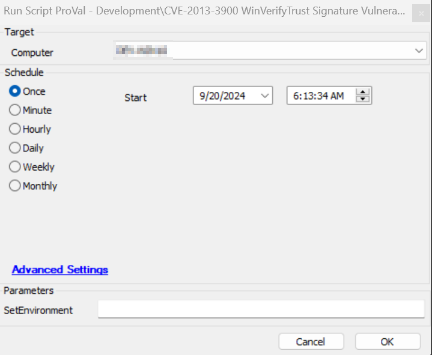
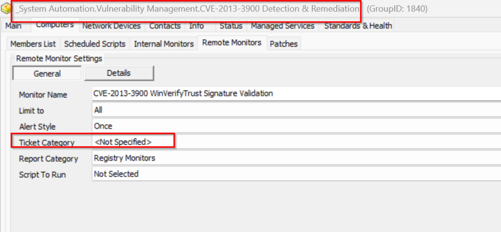

## Summary

This script was created to run the detection and remediation for CVE-2013-3900 WinVerifyTrust Signature Vulnerability based on the EDFs option selected on the agent.

## Sample Run

It is required to execute this script after importing with the setting `SetEnvironment = 1`.

## Variables

| Name                   | Description                                                                                                                                                                                                                                                                                                                                                                                        |
| ---------------------- | -------------------------------------------------------------------------------------------------------------------------------------------------------------------------------------------------------------------------------------------------------------------------------------------------------------------------------------------------------------------------------------------------- |
| DetectionOnly          | This collects client-EDF 'CVE Vulnerability Detection Only' data for the agent where the script is deployed. If it is 1, then the CVE-2013-3900-only detection will run and register to the dataview without remediation.                                                                                                                                                                          |
| Detection-Remediation  | This collects data from client-EDF 'CVE-2013-3900 Vul Detection and Remediation' for the agent where the script is deployed. If it is 1, then the CVE-2013-3900 vulnerability will be detected. If found vulnerable, it will attempt to remediate it and log the result to the dataview [CWA Dataview - CVE-2013-3900 WinVerifyTrust Signature Audit](/docs/41996204-9673-4a7d-9334-262cdaf82110). |
| RemediationStatusCheck | This contains a report on whether the remediation was successful or not.                                                                                                                                                                                                                                                                                                                           |
| psout                  | It contains the complete output of the PowerShell execution for the CVE detection/remediation action.                                                                                                                                                                                                                                                                                              |
| TicketCreation         | It contains the ticket category ID applied on the monitor CWA Remote Monitor - CVE-2013-3900 WinVerifyTrust Signature Validation. A ticket will only be created if the category is set.                                                                                                                                                                                                            |

### EDFs

| Name                                                | Level    | Type | Example                | Description                                                                                                                                                                                       |
| --------------------------------------------------- | -------- | ---- | ---------------------- | ------------------------------------------------------------------------------------------------------------------------------------------------------------------------------------------------- |
| CVE-2013-3900 Status                                | Computer | Text | Remediation Successful | This stores the status of CVE-2013-3900 after script execution.                                                                                                                                   |
| CVE-2013-3900 Logging                               | Computer | Text | @psout@                | This stores the script's PowerShell execution output for logging.                                                                                                                                 |
| CVE-2013-3900 Detection Date                        | Computer | Text | 2024-05-01 00:00:00    | This stores the date and time when the last CVE-2013-3900 status was detected via the script.                                                                                                     |
| CVE-2013-3900 Vulnerability                         | Computer | Text | Not Vulnerable         | This indicates whether the device is vulnerable or not based on the script output detection.                                                                                                      |
| CVE-2013-3900 Vul Detection and Remediation         | Client   | Flag | 1                      | If this client EDF is checked, then the CVE-2013-3900 detection and remediation will be performed by the script as the client will be added to the group "CVE-2013-3900 Detection & Remediation". |
| CVE Vulnerability Detection Only                    | Client   | Flag | 1                      | If this client EDF is checked, then the CVE-2013-3900 detection only will be performed by the script as the agents will be added to the group "CVE Vulnerability Detection Only".                 |
| CVE-2013-3900 Vul Detection and Remediation Exclude | Location | Flag | 0                      | If this location EDF is checked, then the CVE-2013-3900 detection and remediation will be excluded from all agents of the location.                                                               |
| CVE-2013-3900 Vul Detection and Remediation Exclude | Computer | Flag | 0                      | If this EDF is checked, then the CVE-2013-3900 detection and remediation will be excluded from the agent.                                                                                         |
| CVE-2013-3900 Vul Detection and Remediation         | Computer | Flag | 1                      | If this EDF is checked, then the agent will be added to the group "CVE-2013-3900 Detection & Remediation".                                                                                        |

## Output

- Script log
- Dataview

## Ticketing

1. **How to Enable Ticket:**
   - Navigate to the group "CVE-2013-3900 Detection & Remediation" > Open group > Go to Computers > Remote Monitors.
   - Select the remote monitor CVE-2013-3900 WinVerifyTrust Signature Validation and check the ticket category.

   

   - If this ticket category is set, then only the script will be able to create a ticket for the remediation step.

   **Failure:**
   - **Subject:** CVE-2013-3900 WinVerifyTrust Signature Vulnerability is Detected on %ComputerName%
   - **Body:** @TicketComment@ The remediation was attempted for the vulnerability fix on the computer name %computername% but it failed. Refer to the logs: @psout@

   **Success:**
   - **Body:** The computer: %computername% is already safe from the vulnerability. Refer to the logs: @psout@ OR The vulnerability has been remediated successfully. Refer to the log information below: @psout@

