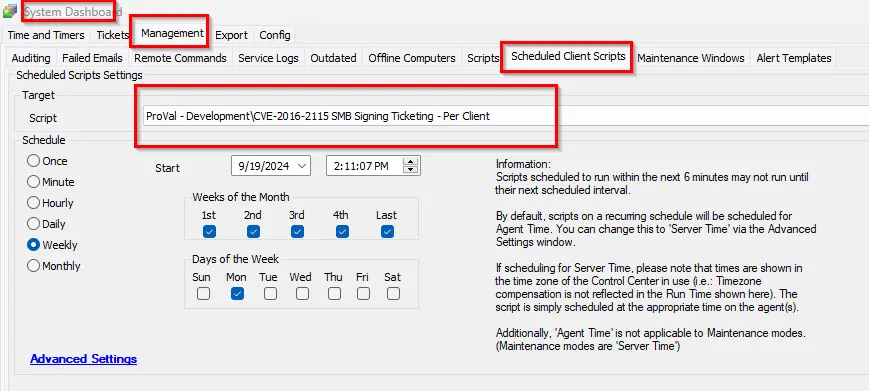

## Summary

This client script creates a ticket for each client with the computer count where remediation is required.

## Sample Run

## Dependencies

[CWA Script - CVE-2016-2115 - SMB Signing](/docs/b0bd8d59-9491-4669-8226-fd7df87c722d)

## Variables

| Name                     | Description                                                                                                                                                                     |
|--------------------------|---------------------------------------------------------------------------------------------------------------------------------------------------------------------------------|
| @VulnerableagentCount@   | This stores the count of computers where remediation is required, marked by the script [CWA Script - CVE-2016-2115 - SMB Signing](/docs/b0bd8d59-9491-4669-8226-fd7df87c722d). |
| TicID                    | It stores the ticket ID if there is any existing open ticket detected, so that commenting can be done on the same ticket.                                                      |

## Output

- Ticket

## Ticketing

1. Ticketing:
   
   **Subject**:  
   CVE-2016-2115 SMB Signing enabling detected on the client: @sqlname@.  
   Here, @sqlname@ is the name of the client.  
   
   **Body**:  
   The CVE-2016-2115 SMB Signing was disabled on the @VulnerableagentCount@ computer of the client "@sqlname@".  
   Please review the dataview for the computer list.  
   
   OR  
   
   The CVE-2016-2115 SMB Signing was disabled on @VulnerableagentCount@ computers of the client "@sqlname@".  
   Please review the dataview for the computer list.  

