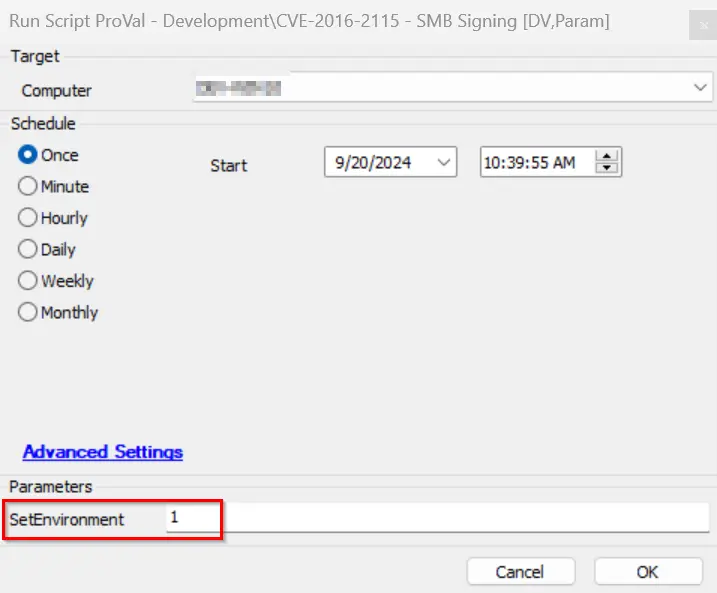

## Summary

This script is created to run the detection/remediation for CVE-2016-2115 - SMB Signing Disable check and enable it if the remediation option is selected via EDF.

## Sample Run

It is required to execute this script after importing with the setting `SetEnvironment = 1`.

## Dependencies

CWA Remote Monitor - SMB Signing Detection

## Variables

| Name                        | Description                                                                                                                                                                                                                                           |
|-----------------------------|-------------------------------------------------------------------------------------------------------------------------------------------------------------------------------------------------------------------------------------------------------|
| DetectionOnly               | This collects data from client-EDF 'CVE Vulnerability Detection Only' for the agent where the script is deployed. If it is 1, then the CVE-2016-2115-only detection will run and register to the dataview without remediation.                       |
| Detection-Remediation       | This collects data from client-EDF 'CVE-2016-2115 Vul Detection and Remediation' for the agent where the script is deployed. If it is 1, then the SMB Signing will be detected; if found disabled, then it attempts to enable it and logs the result to the dataview. |
| SMBSignDetection            | This contains the SMB signing audit status of the agent.                                                                                                                                                                                          |
| psout                       | It contains the SMB signing remediation data.                                                                                                                                                                                                      |
| TicketCreation              | It contains the ticket category ID applied on the monitor CWA Remote Monitor - SMB Signing Detection. If the category is set, then only the ticket will be created.                             |

#### EDFs

| Name                                              | Level     | Type  | Example                      | Description                                                                                                         |
|---------------------------------------------------|-----------|-------|------------------------------|---------------------------------------------------------------------------------------------------------------------|
| CVE-2016-2115 Status                              | Computer  | Text  | Remediation Successful        | This stores the status of CVE-2016-2115 after script execution.                                                  |
| CVE-2016-2115 Logging                             | Computer  | Text  | @psout@                      | This stores the script PowerShell execution output for logging.                                                  |
| CVE-2016-2115 Detection Date                      | Computer  | Text  | 2024-05-01 00:00:00          | This stores the date and time when the last CVE-2016-2115 status was detected via the script.                     |
| CVE-2016-2115 Vulnerability                       | Computer  | Text  | Not Vulnerable               | This shows whether the device is vulnerable or not based on the script output detection.                          |
| CVE-2016-2115 Vul Detection and Remediation       | Client    | Flag  | 1                            | If this client EDF is checked, then the CVE-2016-2115 detection as well as remediation will be performed by the script. |
| CVE Vulnerability Detection Only                  | Client    | Flag  | 1                            | If this client EDF is checked, then the CVE-2016-2115 detection only will be performed by the script.              |
| CVE-2016-2115 Vul Detection and Remediation Exclude| Location  | Flag  | 0                            | If this location EDF is checked, then the CVE-2016-2115 detection & remediation will be excluded from all agents of the location. |
| CVE-2016-2115 Vul Detection and Remediation Exclude| Computer  | Flag  | 0                            | If this EDF is checked, then the CVE-2016-2115 detection & remediation will be excluded from the agent.            |
| CVE-2016-2115 Vul Detection and Remediation       | Computer  | Flag  | 1                            | If this EDF is checked, then the agent will be added to the group "CVE-2016-2115 SMB Signing Detection & Rem".     |

## Output

- Script log
- Dataview

## Ticketing

1. How to Enable Ticket:
   - Navigate to the group 'CVE-2016-2115 - SMB Signing' > Open group > Go to Computers > Remote Monitors.
   - Select the remote monitor CWA Remote Monitor - SMB Signing Detection and check the ticket category.
   
   - If this ticket category is set, then only the script will be able to create a ticket for the remediation step.
     
     **Failure:**
     - **Subject:**  
       CVE-2016-2115 SMB Signing enabling failed on %ComputerName%  
     - **Body:**  
       @TicketComment@  
       There are two possible failure comments:  
       The remediation PowerShell execution has failed. Refer to the below logs:  
       @psout@  
       OR  
       The remediation was attempted for the vulnerability fix on the computer name %computername% but it failed. Refer to the logs:  
       @psout@  
     
     **Success:**  
     - **Body:**  
       The vulnerability has been remediated successfully. Refer to the below log information:  
       @psout@  