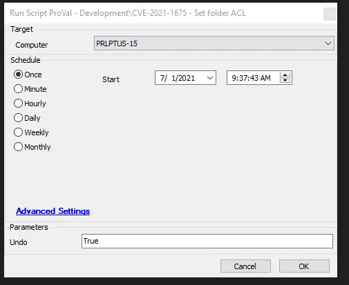

## Summary

This script sets the permissions for the user 'System' on the `C:/Windows/System32/Spool/Drivers` folder to DENY. This action aims to block any files from being placed in that folder, which is part of the execution of CVE-2021-1675 to inject a .dll into the drivers folder.

The script also enables the Microsoft-Windows-PrintService/Operational event logging for future monitoring options.

An attached ZIP file contains the monitor, script, and dataview.

**Time Saved by Automation:** 10 Minutes

## Sample Run

## Dependencies

N/A

#### User Parameters

| Name | Example | Required | Description |
|------|---------|----------|-------------|
| Undo | True | False | Setting Undo to True will remove the ACL settings on the 'drivers' folder. |

#### System Properties

N/A

#### Script States

| Name | Example | Description |
|------|---------|-------------|
| CVE_2021_1675_Status | DenySet, Failed, Restored, Attempted | Allows reporting to Dataview for CVE status on the agent. |

## Process

The script uses PowerShell to set a DENY for the user 'System' on the `C:/Windows/System32/Spool/Drivers` folder.

Setting the parameter to 'True' will undo the DENY for the user 'System'.

## Output

The location and method by which this script returns data include:

- Script log
- Script state
- Dataview
- Monitor - Proval - Production - CVE-2021-1675 - Not Attempted - This script can be used as an Autofix for this monitor and will run an initial deny attempt.
