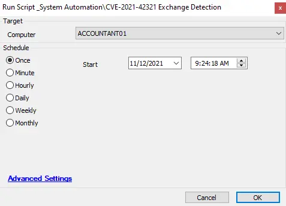

## Summary

This script detects whether the Exchange server has been impacted by CVE-2021-42321. If the vulnerability is detected, the script will generate a ticket.

## Sample Run

#### Global Parameters

| Name            | Example | Required | Description                                                                                      |
|-----------------|---------|----------|--------------------------------------------------------------------------------------------------|
| TicketCreation   | 1       | True     | 1 -- Will create a ticket if found vulnerable; 0 -- Will not create any ticket                 |

## Process

This script checks for the event generated for the CVE impact as per the article:  
[Released November 2021 Exchange Server Security Updates](https://techcommunity.microsoft.com/t5/exchange-team-blog/released-november-2021-exchange-server-security-updates/ba-p/2933169)

Please install the November 9, 2021, Exchange Security patches for mitigation of this vulnerability.

## Output

- Script log
- Ticket
