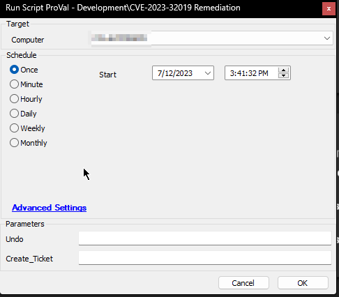
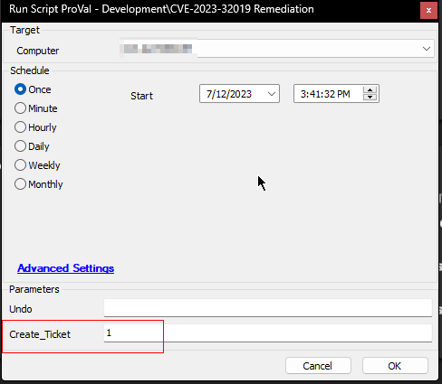
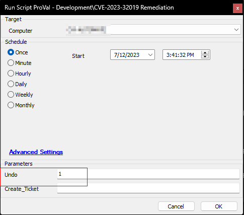

## Summary

The purpose of this script is to add the [registry keys recommended by Microsoft](https://support.microsoft.com/en-au/topic/kb5028407-how-to-manage-the-vulnerability-associated-with-cve-2023-32019-bd6ed35f-48b1-41f6-bd19-d2d97270f080) for [CVE-2023-32019 Remediation](https://msrc.microsoft.com/update-guide/vulnerability/CVE-2023-32019) to supported Windows computers. Additionally, it provides an option to undo the changes if necessary.

**Important Note:**  
It is strongly advised not to run the script on a large number of machines simultaneously. The addition of these registry keys may have undisclosed effects on the computer. To ensure stability, it is recommended to initially execute the script on a few test machines, carefully observe their behavior, and then proceed with running the script on the remaining systems.

**Supported Operating Systems:**
- Windows Server 2022
- Windows 11 versions 22H2 and 21H1
- Windows 10 versions 22H2, 21H2, 21H1, 20H2, 1809, and 1607

Please exercise caution and adhere to the recommended testing process before executing the script on a wider scale.

**Special Thanks:** [Kyle Bohlander, Software Product Engineer at NinjaOne](https://www.ninjaone.com/blog/how-to-enable-cve-2023-32019-fix-powershell/#:~:text=Kyle%20Bohlander%2C%20Software%20Product%20Engineer%20at%20NinjaOne)

## Sample Run

**General Execution:**  


**To Enable Ticketing on Failure:**  


**To Revert the Changes Made by the Script:**  


### User Parameters

| Name           | Example | Required | Description                                             |
|----------------|---------|----------|---------------------------------------------------------|
| Undo           | 0       | False    | 1 to revert the changes made by the script             |
| Create_Ticket  | 1       | False    | 1/0 to toggle between the ticket creation feature of the script. |

## Output

- Script Logs
- Ticket (If Enabled)

## Ticketing

**Subject:**  
`CVE-2023-32019 Remediation Failed on \\<Computer Name>`

**Ticket Body if a security application or AV program hinders the script execution:**  
```
The script's execution was hindered by an antivirus or security program. Please investigate.  
PowerShell Script Full Output: <Output of PowerShell Script>
```

**Ticket Body for script failure:**  
```
The script encountered an error when running the process.  
PowerShell Script Full Output: <Output of PowerShell Script>  
Error Content: <Content of the Error Log File>
```

