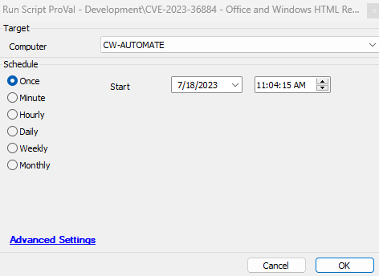

## Summary

This script performs the mitigation based on the article:  
[https://msrc.microsoft.com/update-guide/vulnerability/CVE-2023-36884](https://msrc.microsoft.com/update-guide/vulnerability/CVE-2023-36884).

- This script first checks whether the OS is Windows.
- If it is Windows, the script then validates whether Office is installed on the computer.
- If Office is installed, it checks if the Office version is lower than 2302.
- If so, it creates the registry key `HKLM:/SOFTWARE/Policies/Microsoft/Internet Explorer/Main/FeatureControl/FEATURE_BLOCK_CROSS_PROTOCOL_FILE_NAVIGATION` with the names `Excel.exe`, `Graph.exe`, `MSAccess.exe`, `MSPub.exe`, `Powerpnt.exe`, `Visio.exe`, `WinProj.exe`, `WinWord.exe`, and `Wordpad.exe` of DWord type and sets the Value to 1.

## Sample Run

## Script States

| Name                | Example            | Description                                                             |
|---------------------|--------------------|-------------------------------------------------------------------------|
| CVE-2023-36884      | Mitigation_Applied  | This script state stores the data on whether the mitigation was applied or not. |

## Output

- Script log

