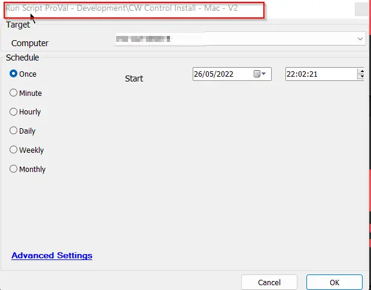

## Summary

The script will perform a fresh installation or a removal and reinstallation of the CW Control agent on a Mac device.

## Sample Run

## Variables

| Name           | Description                                                  |
|----------------|--------------------------------------------------------------|
| instanceid     | Instance ID of the integrated ScreenConnect.                 |
| Client         | Client name with all spaces replaced with %20.              |
| Location       | Location name with all spaces replaced with %20.            |
| macdownloadurl | Download URL generated from the database to download a pkg installer. |
| SessionGUID    | GUID of the installed instance.                              |

## Process

1. Finds the instance ID, which is used in the installation command.
2. Turns on FastTalk.
3. Generates the download URL.
4. Downloads the .pkg file and defines it as executable.
5. Removes older instances and their traces.
6. Executes the installation command.
7. Verifies the installation.
8. Updates the GUID in the `plugin_screenconnec_scinstalled` table.

## Output

- Script Logs
