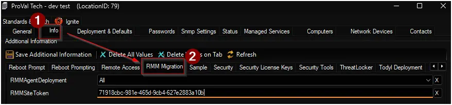

## Summary

This script is used by the ConnectWise Automate to deploy ConnectWise Asio Platform agents to Automate endpoints.

This can  be run outside of the migration, but requires the site RMM Migration EDFs populated by the migration exists and have the correct values.

## Sample Run

## Dependencies

- [Solution - CW RMM Migration](/docs/c8f1104e-7934-408f-a35d-9279a0d5f7e1)

## Location Level EDFs

| Name | Example | Section | Required | Type | Accepted Values | Description |
| ---- | ------- | ------- | -------- | ---- | --------------- | ----------- |
| RMMAgentDeployment | `All` | RMM Migration | True | Drop-down | <ul><li>Not Set</li><li>Workstations</li><li>Servers</li><li>All</li></ul> | Select the operating system to deploy CW RMM agent upon. |
| RMMSiteToken | `71918cbc-981e-465d-9cb4-627e2883a10b` | RMM Migration | True | Text | | CW RMM Agent token for the site. |

### Site Token

1. Navigate to `CLIENTS` ➞ `Companies`.
2. Select Company.
3. Goto `Agents` tab.
4. Select a site.
5. Copy Agent token.

## Properties

| Name | Example | Default | Valid Entries | Description |
| ---- | ------- | ------- | ------------- | ----------- |
| MigrationRegion | EU | NA | <ul><li>NA</li><li>EU</li><li>AU</li></ul> | Geographical region of CW RMM instance to migrate. |

## Output

- Script Logs
