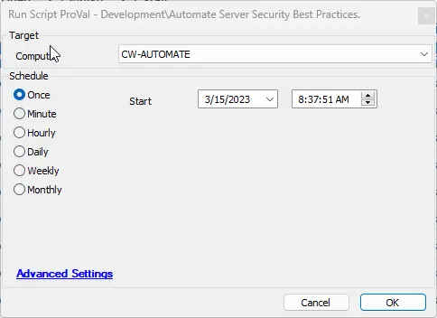
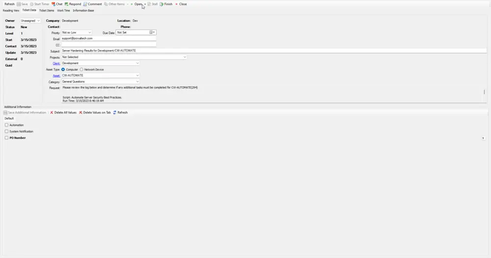
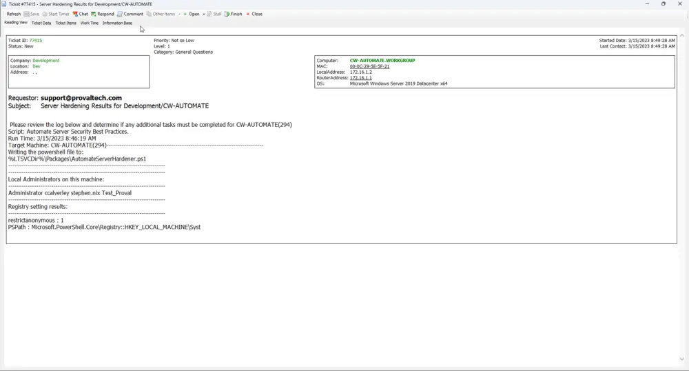

## Summary

This script will configure a ConnectWise Automate server with security settings outlined in the ConnectWise document [Automate_Comprehensive_Best_Practice_Guide.pdf (connectwise.com)](https://university.connectwise.com/content/userdocs/business_knowledge/Automate_Comprehensive_Best_Practice_Guide.pdf).

This script will not, by default, set firewall port settings unless the global parameter is set to 1; if this parameter is set to 0, the script will return suggested port changes to be made. The script checks for preset values before determining a necessary change or suggesting any changes to firewall rules or LTShare additions.

The main execution is all PowerShell; however, due to the inclusion of API integrations directly from the Automate server itself, this is better suited as an Automate script. Server hardening will not work prior to the installation of ConnectWise Automate.

## Sample Run



## Variables

Document the various variables in the script. Delete any section that is not relevant to your script.

| Name              | Description                                                                                          |
|-------------------|------------------------------------------------------------------------------------------------------|
| TickID            | Holds any current open ticket ID for this script on the target machine.                            |
| ExecuteCommand     | The desired execute command for the PowerShell script; changes based on the global parameter setting. |
| Cperuser          | Holds all users having permissions to take control of the target machines.                          |
| TicketBody        | Holds the current body message for any ticket to be created.                                        |
| TicketFinishBody  | Holds the verbiage for finishing any currently open ticket.                                         |

#### Global Parameters

| Name                       | Example                  | Required | Description                                                                                                         |
|----------------------------|--------------------------|----------|---------------------------------------------------------------------------------------------------------------------|
| SetPortRules               | 0 or 1                   | True     | 0 will disable the setting of suggested net firewall ports; 1 will enable the setting of suggested net firewall ports. |
| ProjectName                | AutomateServerHardener   | True     | Designates the filename to create when writing the PowerShell to the target.                                       |
| TicketCreateSubject        | Server Hardening Results for %ClientName%/%ComputerName% | True     | Designates the subject line of a created ticket for this script.                                                  |
| TicketCreationCategory      | 1                        | True     | Designates the ticket creation category to use when creating a ticket from this script.                           |
| TicketFinishUserName       | Admin                    | True     | Designates the username to associate with the finishing/commenting of tickets created by this script.            |
| DoNotCommentOpenTicket     | 0 or 1                   | True     | 0 will allow for commenting on an already open ticket for this script on the target; 1 will disable commenting on an already open ticket for this script on the target. |

## Output

- Script log
- Ticket

## Script Log Example

```
Script: Automate Server Security Best Practices.
Run Time: 3/15/2023 8:46:19 AM
Target Machine: CW-AUTOMATE(294)
-------------------------------------------------------------------------

Writing the PowerShell file to:
%LTSVCDir%\\Packages\\AutomateServerHardener.ps1

-------------------------------------------------------------------------

-------------------------------------------------------------------------

Local Administrators on this machine:
-------------------------------------------------------------------------

Administrator ccalverley stephen.nix Test_Proval

-------------------------------------------------------------------------

Registry setting results:
-------------------------------------------------------------------------

restrictanonymous : 1
PSPath            : Microsoft.PowerShell.Core\\Registry::HKEY_LOCAL_MACHINE\\System\\CurrentControlSet\\Control\\Lsa
PSParentPath      : Microsoft.PowerShell.Core\\Registry::HKEY_LOCAL_MACHINE\\System\\CurrentControlSet\\Control
PSChildName       : Lsa
PSDrive           : HKLM
PSProvider        : Microsoft.PowerShell.Core\\Registry

restrictanonymoussam : 1
PSPath               : Microsoft.PowerShell.Core\\Registry::HKEY_LOCAL_MACHINE\\System\\CurrentControlSet\\Control\\Lsa
PSParentPath         : Microsoft.PowerShell.Core\\Registry::HKEY_LOCAL_MACHINE\\System\\CurrentControlSet\\Control
PSChildName          : Lsa
PSDrive              : HKLM
PSProvider           : Microsoft.PowerShell.Core\\Registry

NoAutoplatfornonVolume : 1
PSPath                : Microsoft.PowerShell.Core\\Registry::HKEY_LOCAL_MACHINE\\Software\\Policies\\Microsoft\\Windows\\Explorer
PSParentPath          : Microsoft.PowerShell.Core\\Registry::HKEY_LOCAL_MACHINE\\Software\\Policies\\Microsoft\\Windows
PSChildName           : Explorer
PSDrive               : HKLM
PSProvider            : Microsoft.PowerShell.Core\\Registry

NoAutorun          : 1
PSPath            : Microsoft.PowerShell.Core\\Registry::HKEY_LOCAL_MACHINE\\Software\\Microsoft\\Windows\\CurrentVersion\\Policies\\Explorer
PSParentPath      : Microsoft.PowerShell.Core\\Registry::HKEY_LOCAL_MACHINE\\Software\\Microsoft\\Windows\\CurrentVersion\\Policies
PSChildName       : Explorer
PSDrive           : HKLM
PSProvider        : Microsoft.PowerShell.Core\\Registry

NoDriveTypeAutoRun : 255
PSPath              : Microsoft.PowerShell.Core\\Registry::HKEY_LOCAL_MACHINE\\Software\\Microsoft\\Windows\\CurrentVersion\\Policies\\Explorer
PSParentPath        : Microsoft.PowerShell.Core\\Registry::HKEY_LOCAL_MACHINE\\Software\\Microsoft\\Windows\\CurrentVersion\\Policies
PSChildName         : Explorer
PSDrive             : HKLM
PSProvider          : Microsoft.PowerShell.Core\\Registry

AlwaysInstallElevated : 1
PSPath                : Microsoft.PowerShell.Core\\Registry::HKEY_LOCAL_MACHINE\\Software\\Policies\\Microsoft\\Windows\\Installer
PSParentPath          : Microsoft.PowerShell.Core\\Registry::HKEY_LOCAL_MACHINE\\Software\\Policies\\Microsoft\\Windows
PSChildName           : Installer
PSDrive               : HKLM
PSProvider            : Microsoft.PowerShell.Core\\Registry

DisabledByDefault : 1
PSPath              : Microsoft.PowerShell.Core\\Registry::HKEY_LOCAL_MACHINE\\SYSTEM\\CurrentControlSet\\Control\\SecurityProviders\\SCHANNEL\\Protocols\\TLS 1.0\\Server
PSParentPath        : Microsoft.PowerShell.Core\\Registry::HKEY_LOCAL_MACHINE\\SYSTEM\\CurrentControlSet\\Control\\SecurityProviders\\SCHANNEL\\Protocols\\TLS 1.0
PSChildName         : Server
PSDrive             : HKLM
PSProvider          : Microsoft.PowerShell.Core\\Registry

DisabledByDefault : 1
PSPath              : Microsoft.PowerShell.Core\\Registry::HKEY_LOCAL_MACHINE\\SYSTEM\\CurrentControlSet\\Control\\SecurityProviders\\SCHANNEL\\Protocols\\TLS 1.1\\Server
PSParentPath        : Microsoft.PowerShell.Core\\Registry::HKEY_LOCAL_MACHINE\\SYSTEM\\CurrentControlSet\\Control\\SecurityProviders\\SCHANNEL\\Protocols\\TLS 1.1
PSChildName         : Server
PSDrive             : HKLM
PSProvider          : Microsoft.PowerShell.Core\\Registry

-------------------------------------------------------------------------

Permissions check results:
-------------------------------------------------------------------------

There are no users acting as a part of the Operating System.

-------------------------------------------------------------------------

Port Setting results:
-------------------------------------------------------------------------

You should consider setting the following firewall rules:

Number Protocol DisplayName Action
------ -------- ----------- ------
  3389 TCP      OLDCWARDP   Block 
  3389 UDP      OLDCWARDP   Block 

-------------------------------------------------------------------------

SMB Share results:
-------------------------------------------------------------------------

AccountName               AccessRight
-----------               -----------
Everyone                    Read
IIS APPPOOL\\LabTech       Change
IIS APPPOOL\\LabTech WebCC Change
IIS APPPOOL\\CwaRestApi    Change
NT AUTHORITY\\SYSTEM        Full

-------------------------------------------------------------------------

IIS Hardening results:
-------------------------------------------------------------------------

Applied configuration changes to section "system.webServer/security/requestFiltering" for "MACHINE/WEBROOT/APPHOST/Default Web Site" at configuration commit path "MACHINE/WEBROOT/APPHOST/Default Web Site"

-------------------------------------------------------------------------

Here are the names of the users having permissions to take control of the machines. (Names of the superadmins might not be listed).
-------------------------------------------------------------------------
UmerTuri,snix,KunalMudgal,ITGlue API,AniketSingh,ITGlue API,SawarArora
```

## Ticket Example



Full output of request
```
Please review the log below and determine if any additional tasks must be completed for CW-AUTOMATE(294)

Script: Automate Server Security Best Practices.
Run Time: 3/15/2023 8:46:19 AM
Target Machine: CW-AUTOMATE(294)
-------------------------------------------------------------------------

Writing the PowerShell file to:
%LTSVCDir%\\Packages\\AutomateServerHardener.ps1

-------------------------------------------------------------------------

-------------------------------------------------------------------------

Local Administrators on this machine:
-------------------------------------------------------------------------

Administrator ccalverley stephen.nix Test_Proval

-------------------------------------------------------------------------

Registry setting results:
-------------------------------------------------------------------------

restrictanonymous : 1
PSPath            : Microsoft.PowerShell.Core\\Registry::HKEY_LOCAL_MACHINE\\System\\CurrentControlSet\\Control\\Lsa
PSParentPath      : Microsoft.PowerShell.Core\\Registry::HKEY_LOCAL_MACHINE\\System\\CurrentControlSet\\Control
PSChildName       : Lsa
PSDrive           : HKLM
PSProvider        : Microsoft.PowerShell.Core\\Registry

restrictanonymoussam : 1
PSPath               : Microsoft.PowerShell.Core\\Registry::HKEY_LOCAL_MACHINE\\System\\CurrentControlSet\\Control\\Lsa
PSParentPath         : Microsoft.PowerShell.Core\\Registry::HKEY_LOCAL_MACHINE\\System\\CurrentControlSet\\Control
PSChildName          : Lsa
PSDrive              : HKLM
PSProvider           : Microsoft.PowerShell.Core\\Registry

NoAutoplatfornonVolume : 1
PSPath                : Microsoft.PowerShell.Core\\Registry::HKEY_LOCAL_MACHINE\\Software\\Policies\\Microsoft\\Windows\\Explorer
PSParentPath          : Microsoft.PowerShell.Core\\Registry::HKEY_LOCAL_MACHINE\\Software\\Policies\\Microsoft\\Windows
PSChildName           : Explorer
PSDrive               : HKLM
PSProvider            : Microsoft.PowerShell.Core\\Registry

NoAutorun          : 1
PSPath            : Microsoft.PowerShell.Core\\Registry::HKEY_LOCAL_MACHINE\\Software\\Microsoft\\Windows\\CurrentVersion\\Policies\\Explorer
PSParentPath      : Microsoft.PowerShell.Core\\Registry::HKEY_LOCAL_MACHINE\\Software\\Microsoft\\Windows\\CurrentVersion\\Policies
PSChildName       : Explorer
PSDrive           : HKLM
PSProvider        : Microsoft.PowerShell.Core\\Registry

NoDriveTypeAutoRun : 255
PSPath              : Microsoft.PowerShell.Core\\Registry::HKEY_LOCAL_MACHINE\\Software\\Microsoft\\Windows\\CurrentVersion\\Policies\\Explorer
PSParentPath        : Microsoft.PowerShell.Core\\Registry::HKEY_LOCAL_MACHINE\\Software\\Microsoft\\Windows\\CurrentVersion\\Policies
PSChildName         : Explorer
PSDrive             : HKLM
PSProvider          : Microsoft.PowerShell.Core\\Registry

AlwaysInstallElevated : 1
PSPath                : Microsoft.PowerShell.Core\\Registry::HKEY_LOCAL_MACHINE\\Software\\Policies\\Microsoft\\Windows\\Installer
PSParentPath          : Microsoft.PowerShell.Core\\Registry::HKEY_LOCAL_MACHINE\\Software\\Policies\\Microsoft\\Windows
PSChildName           : Installer
PSDrive               : HKLM
PSProvider            : Microsoft.PowerShell.Core\\Registry

DisabledByDefault : 1
PSPath              : Microsoft.PowerShell.Core\\Registry::HKEY_LOCAL_MACHINE\\SYSTEM\\CurrentControlSet\\Control\\SecurityProviders\\SCHANNEL\\Protocols\\TLS 1.0\\Server
PSParentPath        : Microsoft.PowerShell.Core\\Registry::HKEY_LOCAL_MACHINE\\SYSTEM\\CurrentControlSet\\Control\\SecurityProviders\\SCHANNEL\\Protocols\\TLS 1.0
PSChildName         : Server
PSDrive             : HKLM
PSProvider          : Microsoft.PowerShell.Core\\Registry

DisabledByDefault : 1
PSPath              : Microsoft.PowerShell.Core\\Registry::HKEY_LOCAL_MACHINE\\SYSTEM\\CurrentControlSet\\Control\\SecurityProviders\\SCHANNEL\\Protocols\\TLS 1.1\\Server
PSParentPath        : Microsoft.PowerShell.Core\\Registry::HKEY_LOCAL_MACHINE\\SYSTEM\\CurrentControlSet\\Control\\SecurityProviders\\SCHANNEL\\Protocols\\TLS 1.1
PSChildName         : Server
PSDrive             : HKLM
PSProvider          : Microsoft.PowerShell.Core\\Registry

-------------------------------------------------------------------------

Permissions check results:
-------------------------------------------------------------------------

There are no users acting as a part of the Operating System.

-------------------------------------------------------------------------

Port Setting results:
-------------------------------------------------------------------------

You should consider setting the following firewall rules:

Number Protocol DisplayName Action
------ -------- ----------- ------
  3389 TCP      OLDCWARDP   Block 
  3389 UDP      OLDCWARDP   Block 

-------------------------------------------------------------------------

SMB Share results:
-------------------------------------------------------------------------

AccountName               AccessRight
-----------               -----------
Everyone                    Read
IIS APPPOOL\\LabTech       Change
IIS APPPOOL\\LabTech WebCC Change
IIS APPPOOL\\CwaRestApi    Change
NT AUTHORITY\\SYSTEM        Full

-------------------------------------------------------------------------

IIS Hardening results:
-------------------------------------------------------------------------

Applied configuration changes to section "system.webServer/security/requestFiltering" for "MACHINE/WEBROOT/APPHOST/Default Web Site" at configuration commit path "MACHINE/WEBROOT/APPHOST/Default Web Site"

-------------------------------------------------------------------------

Here are the names of the users having permissions to take control of the machines. (Names of the superadmins might not be listed).
-------------------------------------------------------------------------
UmerTuri,snix,KunalMudgal,ITGlue API,AniketSingh,ITGlue API,SawarArora
```

## Reading View

