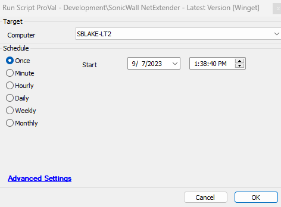

## Summary

This script is designed to store the latest version of SonicWall NetExtender in the system properties.

## Sample Run

#### System Properties

| Name                          | Example   | Required | Description                                                                                      |
|-------------------------------|-----------|----------|--------------------------------------------------------------------------------------------------|
| SonicWall.NetExtender | 10.3.2 | True     | This system property stores the latest version of SonicWall NetExtender, which was fetched by this script. |

## Output

- Script log

