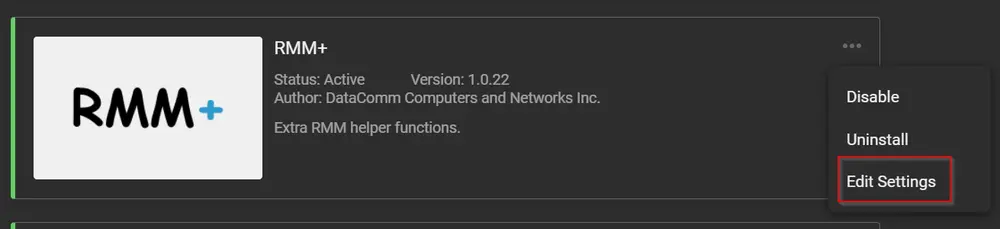
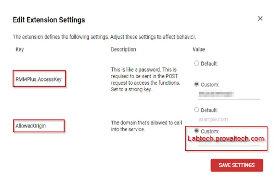
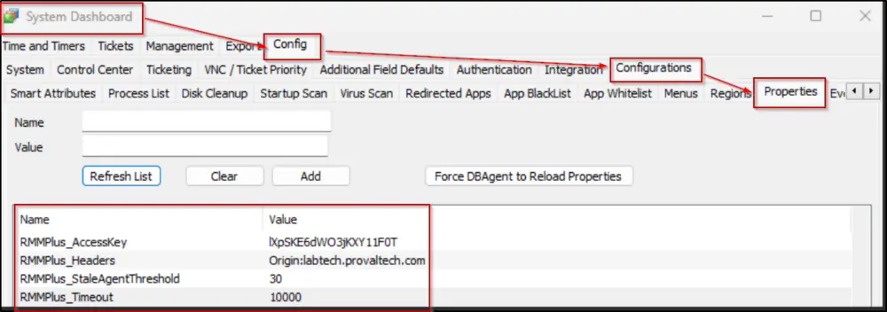
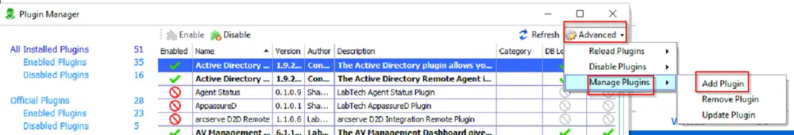
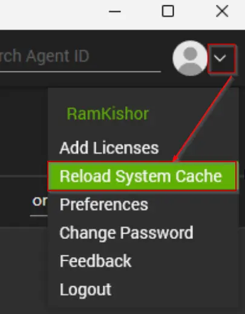
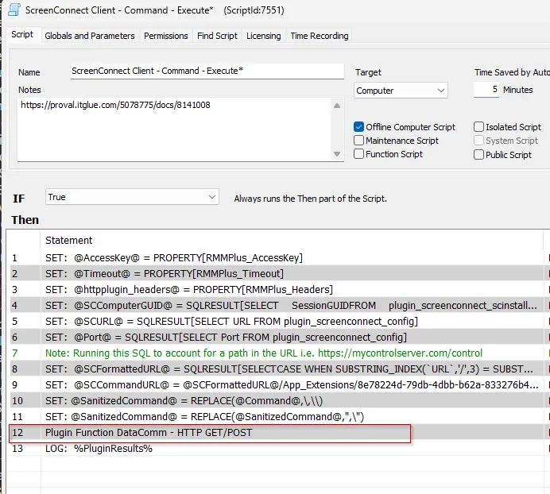
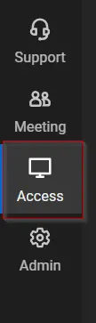
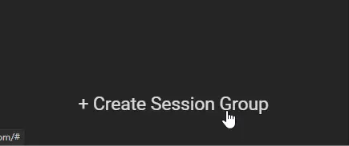
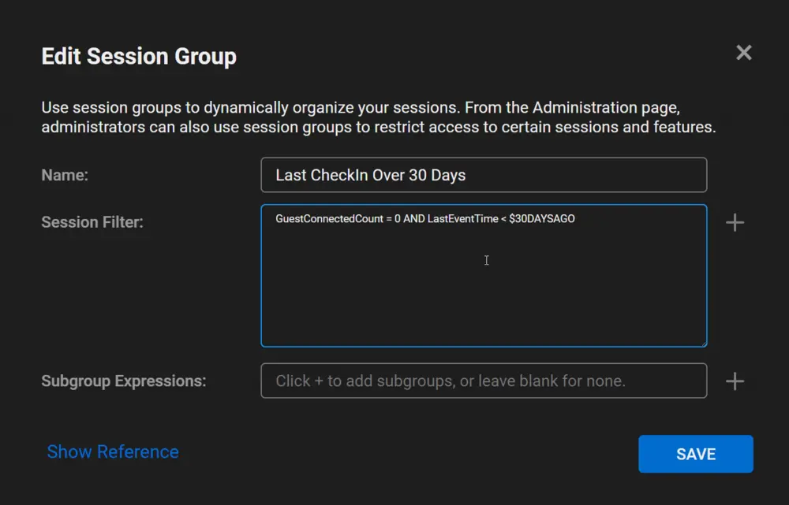

## Purpose

This document assists with configuring the RMM+ Plugin and explains how to create sessions for machines that have not checked in for over **`X`** number of days.

## Implementation

1. Log in to the client's control portal and check if the extension for RMM+ has been updated.

2. Go to `Edit Settings` for the RMM+ plugin.  
   

3. Navigate to RMMPlus.AccessKey and select the `Custom` option. Create a random password as the custom value.

4. Go to AllowedOrigin and select the `Custom` option. Enter the FQDN of the client's environment.  
   The FQDN should not contain `https://`.  
   For example, Origin: [labtech.provaltech.com](http://labtech.provaltech.com)  
   

5. Save the settings.

6. Open the Automate control center of the client. Navigate to System Dashboard > Config > Configuration > Properties.

7. Add the following values in Properties:  

   | Parameter                       | Value                                                                                      |
   |---------------------------------|--------------------------------------------------------------------------------------------|
   | RMMPlus_AccessKey               | Enter the value you entered in Step 3                                                     |
   | RMMPlus_Headers                 | Origin: FQDN as entered in Step 4 (For example - Origin: [labtech.provaltech.com](http://labtech.provaltech.com)) |
   | RMMPlus_StaleAgentThreshold     | 30                                                                                         |
   | RMMPlus_Timeout                 | 10000                                                                                      |  
   

8. Add the Get Post Plugin in the client's environment. Follow the steps below:  
   - Open Plugin Manager. Navigate to Advanced > Manage Plugins > Add Plugin.  
       
   - Select the .dll file for the Get Post Plugin. See attachment.  
   - Check the box for a remote agent.  
   - Enable the plugin. This will restart the DB agent.  
   - Reload DB agent plugins.

9. Reload the System Cache.  
   

10. Open the `ScreenConnect Client - Command - Execute` script and check if you can see the `Plugin Function DataComm - HTTP GET/POST` step.  
    

## Optional

Create a session group in the ScreenConnect portal for machines that have not checked into Control for over **`X`** days.  
- Go to the ScreenConnect Web Portal.  
- Navigate to the `Access` portal.  
    
- Click on the `+ Create Session Group` option available at the bottom of the screen.  
    
- Enter the name for the session and add the filter as below. You can customize it as per your requirements by clicking on the **`+`** icon in front of the `Session Filter` option. You can also select the `Show Reference` option for more clarity.  
  ```
  GuestConnectedCount = 0 AND LastEventTime < $30DAYSAGO
  ```  
  Change the number of days in `$30DAYSAGO` as per your requirement.  
    
- Click on Create. Now you can see the agents that have not checked in for over **`X`** days.
## Attachments
[HTTP-GET-POST.dll](<../../../static/attachments/itg/9770217/HTTP-GET-POST.dll>)