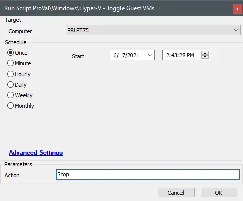

## Summary

This script will run the Optimize-Volume PowerShell command to defragment a drive whenever possible. If the command is not recognized, it will revert to using the standard defrag command. The script returns a verbose log of what the Optimize-Volume command outputs. Due to this being a simple log return, there typically would not be any known failure (there is never a failure log written with this agnostic solution) unless an environmental issue exists, which we are looking for in the script.

## Sample Run

\< This should be a screenshot of a manual run of the script >

## Dependencies

This should be a list of ITGlue documents listed in the Related Items sidebar on which this script depends.

- Agnostic Content Doc Link
- Custom Table Doc Link
- EDF Doc Link
- etc.

## Variables

#### Global Parameters

| Name                             | Example                           | Required     | Description                        |
|----------------------------------|-----------------------------------|--------------|------------------------------------|
| The name of the parameter        | An example value of the parameter | True or False| What the parameter represents      |

Document the various variables in the script. Delete any section that is not relevant to your script.

| Name                             | Description                        |
|----------------------------------|------------------------------------|
| The name of the Script State     | What the script state represents   |

#### User Parameters

| Name                             | Example                           | Required     | Description                        |
|----------------------------------|-----------------------------------|--------------|------------------------------------|
| The name of the parameter        | An example value of the parameter | True or False| What the parameter represents      |

#### System Properties

| Name                             | Example                           | Required     | Description                        |
|----------------------------------|-----------------------------------|--------------|------------------------------------|
| The name of the property         | An example value of the property  | True or False| What the property represents       |

#### Script States

| Name                             | Example                           | Description                        |
|----------------------------------|-----------------------------------|------------------------------------|
| The name of the Script State     | An example of the Script State    | What the script state represents    |

## Process

Describe the steps the script performs to accomplish the desired task. Note that if this script is just a front-end for a piece of Agnostic Content, then you can insert a link to the documentation for that content here instead.

## Output

The location and method by which this script returns data.

Example:

- Script log
- Script state
- Local file on computer
- Dataview
- etc.
