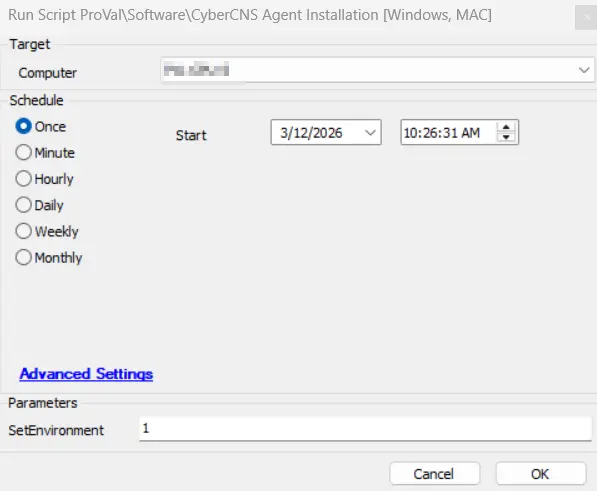
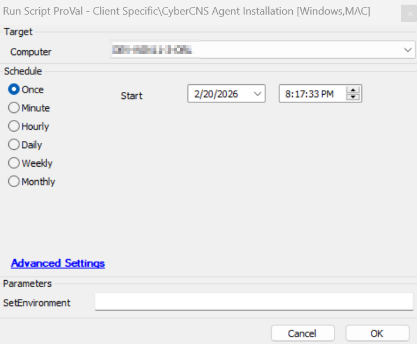

## Summary

This script installs the CyberCNS agent on a computer.

## Sample Run

Run the script with SetEnvironment = 1, after import to create the required client-EDFs and system properties.

Run without SetEnvironment, for the deployment

## Dependencies

[Solution - CyberCNS Agent](/docs/f68fc157-ae00-4c3f-bb05-b53cefab28ac)

### User Parameters

| Name         | Example                                                           | Required | Description                                                                                                                                                                                                                                                                                                                                                                     |
| ------------ | ----------------------------------------------------------------- | -------- | ------------------------------------------------------------------------------------------------------------------------------------------------------------------------------------------------------------------------------------------------------------------------------------------------------------------------------------------------------------------------------- |
| SetEnvironment | 1 | False     | Run the script with SetEnvironment = 1, after import to create the required client-EDFs and system properties.  |

## EDFs

 

| Name | Type | Level | Section | Editable | Required | Description |
| ------------- | ------ | ------ | ----- | ----- | ----- | -------------------------------------------- |
| `Cybercns Company ID` | Text | Client | CyberCNS| Yes | True | This client EDF is created to store the CyberCNS company ID from the portal for the company whose agent must be installed. | 
| `CyberCNS Tenant ID` | Text | Client | CyberCNS |Yes | Partial True | This client EDF is created to store the CyberCNS tenant ID from the portal. |
| `CyberCNS Token` | Text | Client | CyberCNS |  Yes | Partial True | This client EDF is created to store the CyberCNS token from the portal. |

## Properties

Document the various overwriting system properties in the script. 

| Name | Required | Description |
| ------------ | ------- | ------------------------------------------------------ |
| CyberCNS_TenantID | Partial True | If this is set to store the CyberCNS tenant ID from the portal, then the client-EDF `CyberCNS Tenant ID` will be overwritten by this property. |
| CyberCNS_Token | Partial True | If this is set to store the CyberCNS token from the portal, then the client-EDF `CyberCNS Token` will be overwritten by this property. |

## Process

1. Retrieve the values for the CompanyID, TenantID, and Token.
2. If anything is missing, create failure ticket.
3. If all values are present, download the installer.
4. Once downloaded, install the application.
5. After execution, verify the installation.

## Output

- Script log