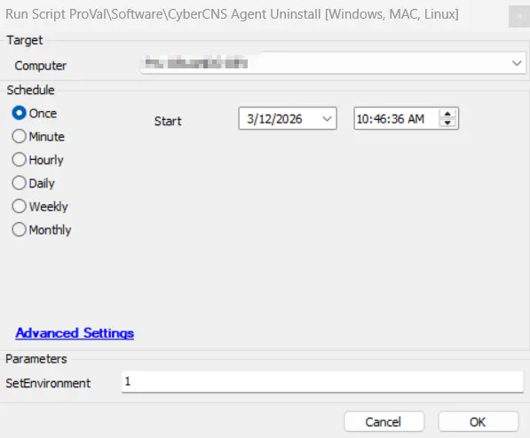
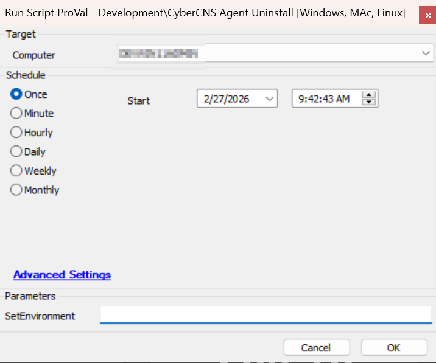

## Summary

This script will assist in uninstalling the ConnectSecure Vulnerability Scan Agent, otherwise known as the CyberCNS agent.

## Sample Run

Run the script with SetEnvironment = 1, after import to create the required EDFs for uninstallation automation.

Run without SetEnvironment, for the uninstallation

## Dependencies

- [Solution - CyberCNS Agent](/docs/f68fc157-ae00-4c3f-bb05-b53cefab28ac)

### User Parameters

| Name         | Example                                                           | Required | Description                                                                                                                                                                                                                                                                                                                                                                     |
| ------------ | ----------------------------------------------------------------- | -------- | ------------------------------------------------------------------------------------------------------------------------------------------------------------------------------------------------------------------------------------------------------------------------------------------------------------------------------------------------------------------------------- |
| SetEnvironment | 1 | False     | Run the script with SetEnvironment = 1, after import to create the required EDFs for the uninstallation. |

## EDFs

 

| Name | Type | Level | Section | Editable | Required | Description |
| ------------- | ------ | ------ | ----- | ----- | ----- | -------------------------------------------- |
| `CyberCNS Uninstall` | Checkbox | Client | CyberCNS  |  True | Yes | This EDF is required to be selected for the automated uninstallation of the CyberCNS Agent. |
| `Exclude CyberCNS Uninstall` | Checkbox | Location | Exclusions  |   False | Yes | If this EDF is checked, the agents of the location will be excluded from the CyberCNS uninstallation |
| `Exclude CyberCNS Uninstall` | Checkbox | Computer |  Exclusions |   False | Yes | If this EDF is checked, the agent will be excluded from the CyberCNS uninstallation |

## Output

- Script log

## Changelog

 ### 2026-03-12

 - Initial version of the document