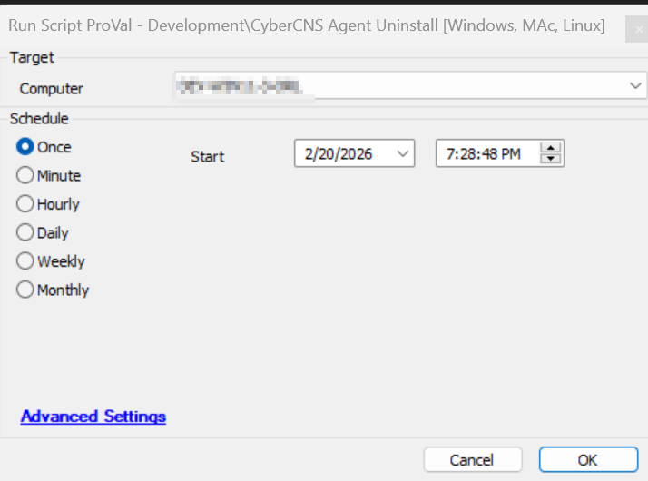

## Summary

This script will assist in uninstalling the ConnectSecure Vulnerability Scan Agent, otherwise known as the CyberCNS agent.

## Sample Run

## Process

1. Check for the exe `cybercnsagent.exe` exist or not, if found then uninstall using it else report error.
2. After execution, verify the uninstallation.

## Output

- Script log