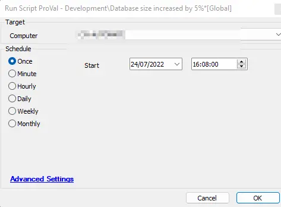
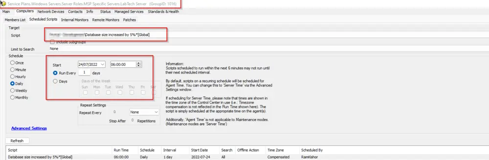
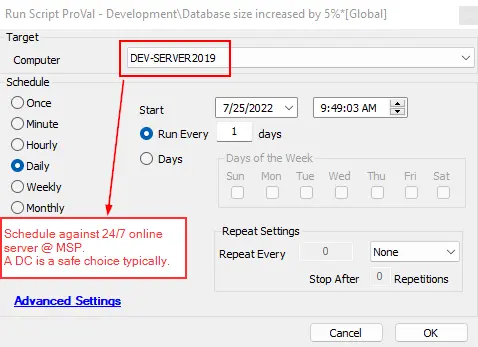

## Summary

This script should be scheduled on the `Labtech` group and run once per hour.

The script will create a ticket in our (ProVal's) AutoTask portal if the overall size of the Labtech Database increases by 5 (the threshold is flexible) within the last 24 hours (this depends on the frequency of the schedule).

## Sample Run

**On-Prem Partners:** Preferred way to run/schedule the script:

**Hosted Partners:** Preferred way to run/schedule the script:

The script can be scheduled against a 24x7 online server. A domain controller is typically a good choice as they tend to have high uptime. **Note:** If the agent on the DC is reinstalled or has a change to the computer ID, this script will need to be scheduled again against the new agent.

## Variables

| Name              | Description                                                   |
|-------------------|---------------------------------------------------------------|
| DBSize            | Current Size of the Labtech Database in Bytes                |
| SizeToCompare     | Stored/Yesterday's Size of the Labtech Database in Bytes     |
| Hours             | Hours since the last data/database size was gathered          |
| LargestTables     | Top 10 largest tables along with their size                   |
| CurrentDBSize     | Current Formatted (X GB XX MB) Size of the Labtech Database  |
| PreviousSize      | Stored/Yesterday's Formatted (X GB XX MB) Size of the Labtech Database |
| Subject           | Email Subject                                                |
| Body              | Email Contents                                               |
| When              | Default Variable, defines the current time                   |

#### Global Parameters

| Name                | Example                                      | Required | Description                                                                                                                                                       |
|---------------------|----------------------------------------------|----------|-------------------------------------------------------------------------------------------------------------------------------------------------------------------|
| Email               | [Alertsprovaltech.com](mailto:Alertsprovaltech.com) | True     | The only reason it is defined as global is to provide partners an option, if they so want, to add another email to receive notifications. Otherwise, [Alertsprovaltech.com](mailto:Alertsprovaltech.com) is hard set. |
| ThresholdInPercent  | 5, 10, 1, 3, 4                               | True     | This is the threshold that serves as a numerical indicator for what percentage increase in the database size to alert. By default, it is set to 5.               |

#### Script States

| Name                     | Example               | Description                                      |
|--------------------------|-----------------------|--------------------------------------------------|
| Labtech Database Size     | 23882225              | To store the DB size in Bytes for comparison.   |
| DB Size Gather Time      | 7/24/2022 6:59:44 AM | To store the run time of the script.             |

## Process

1. Fetch the current size of the Labtech Database in Bytes.
2. Check if the 'Labtech Database Size' script state exists. This checks whether the script has run before or if it's running for the first time.
3. For the first run, it will set the values for both 'Labtech Database Size' and 'DB Size Gather Time' script states and exit.
4. Otherwise, fetch the value from the 'Labtech Database Size' script state and compare it with the current size. If the previous size is lower than the current size by more than the ThresholdInPercent (currently set to 5), it will move to the alert section; otherwise, it will refresh the values for both script states and exit.
5. Gather the values for [Hours](http://Hours), [LargestTables](http://LargestTables), [CurrentDBSize](http://CurrentDBSize), and [PreviousSize](http://PreviousSize) variables and send an email to the address(es) stored in the global variable [Email](http://Email).
6. Refresh the values stored in both script states and exit.

**Email Subject:**
Database size increased by SizeToCompare percent within the last Hours hour.

**Email Body:**
Labtech Database's size increased by SizeToCompare percent within the last Hours hour. Previously, the size was PreviousSize and now it's CurrentDBSize. Here's the list of the 10 largest tables: LargestTables.

## Output

- Script States
- Email
