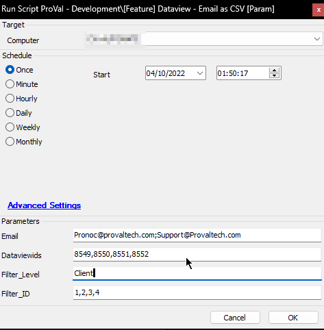
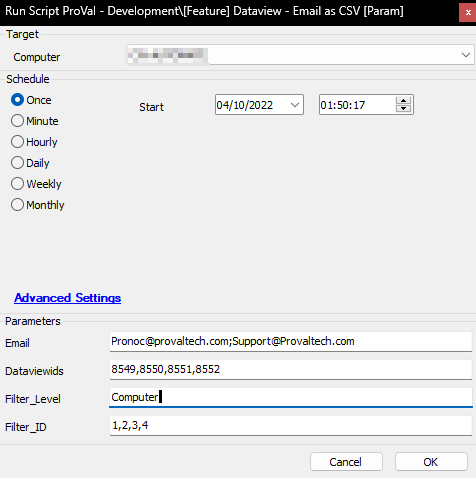
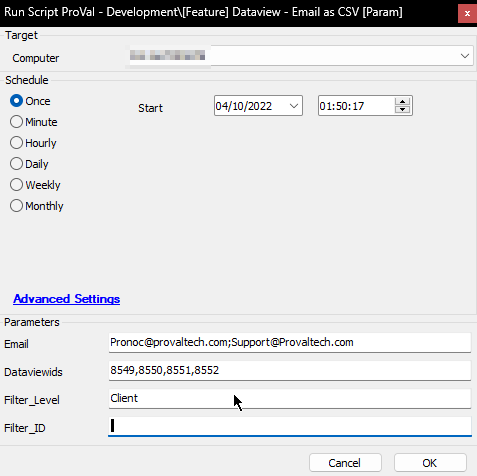
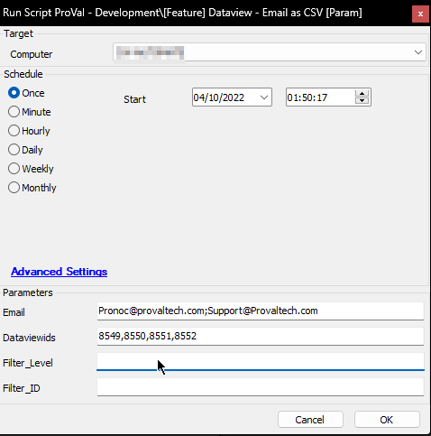

## Summary

The script can be used to email filterable content of any dataview. The CSV files for the requested dataview(s) will be emailed to the email address specified in the Email parameter. Dataview IDs should be an integer number or a comma-separated list of integers.

Dataviews can now be filtered by client, location, or computer.

## Sample Run

1.   
   Each Dataview ID provided will be filtered for each client ID in the Filter_ID variable, converted into a CSV report, and emailed out.  

2.   
   Each Dataview ID provided will be filtered for each computer ID in the Filter_ID variable, converted into a CSV report, and emailed out.  

3.   
   Four reports will be generated here, one report each for the current client. The reports will be filtered for the client ID of the computer on which the script is running.

4.   
   Four unfiltered reports will be sent to all provided email addresses. These CSV files will contain all the data from the dataviews defined in the Dataview IDs.

## Variables

| Name              | Description                                                                                                         |
| ----------------- | ------------------------------------------------------------------------------------------------------------------- |
| Dataview ID       | One of the Dataview IDs passed to the Dataview IDs parameter.                                                       |
| Email             | Email address passed as a parameter.                                                                                |
| Check             | For the verification of the existence of that Dataview ID                                                           |
| Cnt               | Row number to be used in the loop.                                                                                  |
| SQL_Query         | To store the modified SQL query for that dataview.                                                                  |
| To_csv            | To store the output of the SQL_Query                                                                                |
| DVName            | Name of the dataview with Dataview ID = Dataview ID. Its main purpose is to serve as the Subject line of the email. |
| DVNameFile        | DVName with a few special characters replaced in order to use that as the name of the CSV file.                     |
| Count             | Row number to be used in the inner loop applying filters.                                                           |
| Offset            | To be used along with SQL Query to find the IDs passed in the loop.                                                 |
| Filter ID         | Level ID (Client ID/Computer ID/Location ID) to generate the report for.                                            |
| Loop Verification | (Global/Filtered), to check whether the script is generating a global/unfiltered report or a filtered report.       |

### User Parameters

| Name         | Example                                                           | Required | Description                                                                                                                                                                                                                                                                                                                                                                     |
| ------------ | ----------------------------------------------------------------- | -------- | ------------------------------------------------------------------------------------------------------------------------------------------------------------------------------------------------------------------------------------------------------------------------------------------------------------------------------------------------------------------------------- |
| Dataview IDs | 1,2,3,4,5,6,819,111,765,15,61,55,123                              | True     | IDs of the dataview to be emailed. It can be a single integer for emailing just one dataview or multiple IDs separated by a comma.                                                                                                                                                                                                                                              |
| Email        | [someone@somewhere.something](mailto:someone@somewhere.something) | True     | Email address to receive the CSV file or the content of the dataview. To input multiple addresses, each email must be separated by a semicolon ';' without any space.                                                                                                                                                                                                           |
| Filter Level | Client                                                            | False    | Supported values are Client, Location, and Computer. This can be used to define the level of filter you would like to apply to the dataviews. Leaving it blank will generate an unfiltered report.                                                                                                                                                                              |
| Filter ID    | 1,2,3,5                                                           | False    | ID of the level defined in the Filter Level. e.g., Client ID(s), to filter the report against if Client is set as Filter Level. It can be a single integer for emailing all the Dataview IDs filtered by that single ID or multiple IDs separated by a comma. Any special characters or spaces are prohibited. A space here will not yield the expected result. |

## Process

1. Check for the number of Dataview IDs passed by the user.
2. Store the count in the `@cnt@` variable.
3. Run a loop and repeat the following steps for the number of `@cnt@` times, once for each Dataview ID.
4. Verify if the Dataview ID exists or not.
5. Skip the loop for the Dataview if it does not exist in the Dataviews table; otherwise, perform the following steps.
6. Select the SQL query for that Dataview ID from the Dataviews table and alter it so that the output of that SQL query can be stored in a single variable in a comma-separated format. Here, the SQL query is stored under the `@SQL_Query@` variable.
7. Filter out that SQL query if `@Filter_Level@` is defined.
8. Run the SQL query generated in step 6 and store the output under the name of the `@To_csv@` variable.
9. A file write text function writes the value stored in the `@To_csv@` variable into a CSV file on the machine it ran against.
10. Upload that CSV file saved in step 9 to the Automate server.
11. Email that `%uploadedfilepath%` to the email address(es) passed into the `@Email@` user variable.

## Output

An email with a `@DataviewName@.Csv` file attached.

