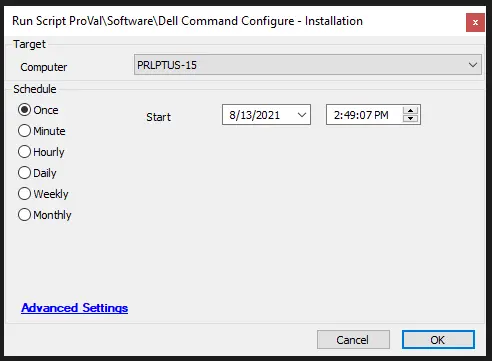

## Summary

This script installs version 3 or 4 of Dell Command Configure depending on the age of the system.

**Time Saved by Automation:** 10 Minutes

## Sample Run

## Variables

- `@v3_URL@` - [Dell Command Configure Version 3.3.0](https://dl.dell.com/FOLDER04457713M/4/Dell-Command-Configure_FVGF9_WIN_3.3.0.314_A00.EXE)
- `@v4_URL@` - [Dell Command Configure Version 4.5.0](https://dl.dell.com/FOLDER07308991M/1/Dell-Command-Configure_TMV11_WIN_4.5.0.205_A00.EXE)
- `@CompMfg@` - SQL Check to confirm Dell system.

## Process

- This script verifies whether a system is a Dell, then downloads and installs Dell Command | Configure version 3.3.0 for non-WMI-ACPI enabled systems or version 4.5.0 for systems with WMI-ACPI enabled. The WMI-ACPI check is done via a PowerShell command to verify if the PNP Device is installed or not.
- Confirms installation as successful.
- Removes the icon from the desktop if the installation is successful.

## Output

**Script Log:** Success or Failure