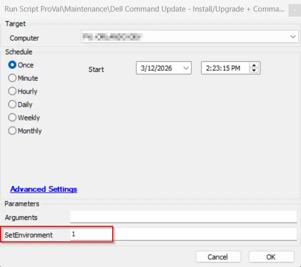
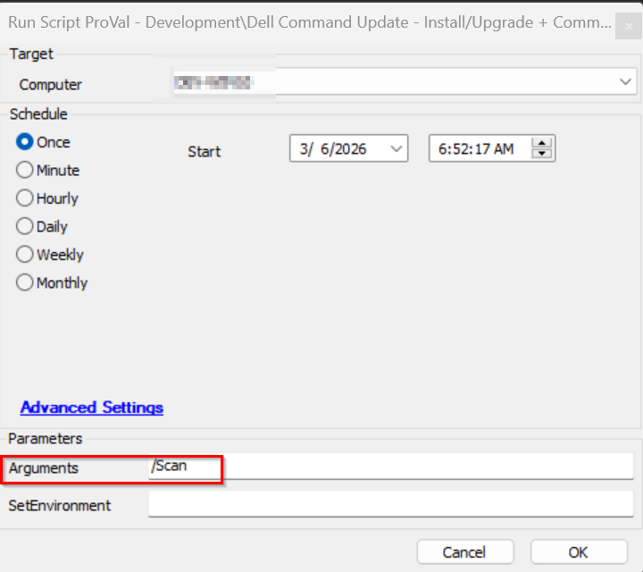
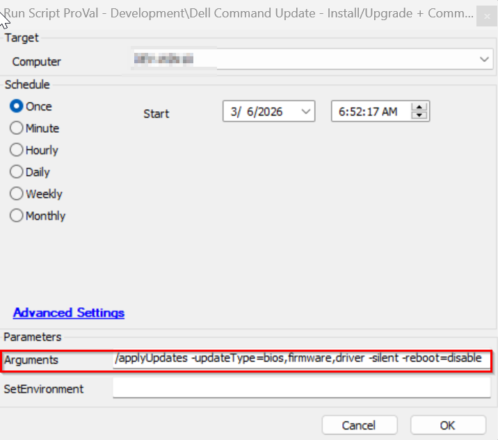
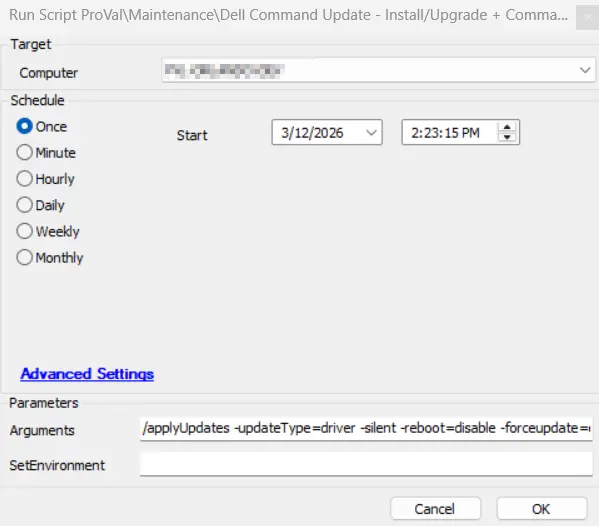
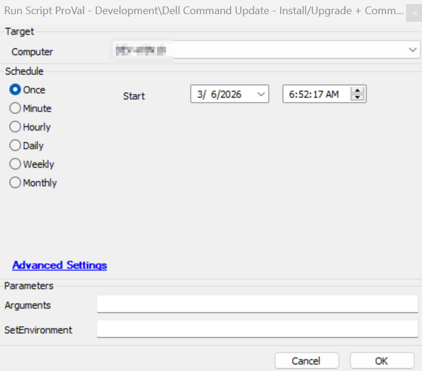

## Summary

The [Dell Command | Update](https://www.dell.com/support/kbdoc/en-in/000177325/dell-command-update) application is used by this script to carry out commands on Dell Workstations. If the application isn't already installed, it will be installed. If a version older than 5 is already present, it will upgrade the application to the latest available version.
This script provide feature to perform the Dell command scanning audit if no arguments are passed or the command update if the arguments are passed.

**Supported OS:** Windows 10, Windows 11

**Supported commands/arguments reference:**  
[Supported commands/arguments reference](https://www.dell.com/support/manuals/en-us/command-update/dcu_rg/dell-command-%7C-update-cli-commands?guid=guid-92619086-5f7c-4a05-bce2-0d560c15e8ed&lang=en-us)

**Exit codes reference:**  
[Exit codes reference](https://www.dell.com/support/manuals/en-aw/command-update/dcu_rg/command-line-interface-error-codes?guid=guid-fbb96b06-4603-423a-baec-cbf5963d8948&lang=en-us)

**Note:**

1. The systems must be compatible with the installation of Dell Command Update. For further details on compatible systems, please visit the compatible systems section of the following link: [Dell Command | Update Windows Universal Application | Driver Details | Dell US](https://www.dell.com/support/home/en-us/drivers/DriversDetails?driverId=0XNVX)  
2. ProVal does not recommend performing BIOS updates remotely. ProVal is not responsible for any failed devices due to remote BIOS updates. BIOS updates are performed at the MSP's risk.

## File Hash

- **File Path:** `C:\ProgramData\_automation\Script\Install-DCU\Initialize-DellCommandUpdate.ps1`  
- **File Hash (Sha256):** `4DB40E166F5E5F58F083FA8E0470CBA0869B465004502A911230601526DE369E`  
- **File Hash (MD5):** `995B90C55762ADE9528A1610BE65615D`  

## Sample Run

## Create EDFs and Table

- Run the script with the `SetEnvironment` parameter set to 1 after import to get the required EDFs imported for the Dell command scanning and exclusions. It will also create the [Table - pvl-dellcommand-audit](/docs/21a8afce-3a1c-4bdf-b2d2-a5581583e27c).
  

### Example 1

Running the script with basic `/scan` command to return the available updates.  
**Arguments:** `/Scan`  
  

### Example 2

Running the script to install available `bios`, `firmaware`, and `driver` updates.  
This command will not update any active driver as we are not using the `-forceupdate` switch.  
**Arguments:** `/applyUpdates -updateType=bios,firmware,driver -silent -reboot=disable`  
  

### Example 3

Running the script to forcefully install all available driver updates.  
**Caution:** It is recommended to restart the computer at the earliest convenience after using the `-forceupdate=enable` switch, as this switch updates active drivers as well. An active driver that requires a restart for the update may malfunction if the update is installed without rebooting the computer.

**Arguments:** `/applyUpdates -updateType=driver -silent -reboot=disable -forceupdate=enable`  
  

## Example 4

Running the script without passing arguments to perform the auditing and store data to the [Table - pvl-dellcommand-audit](/docs/21a8afce-3a1c-4bdf-b2d2-a5581583e27c).

**Arguments:** ''  
  

## Dependencies

[Agnostic - Initialize-DellCommandUpdate](/docs/aa963f3d-f149-4bfa-8fdc-30f12c21ce7f)
[Table - pvl-dellcommand-audit](/docs/21a8afce-3a1c-4bdf-b2d2-a5581583e27c)

## User Parameters

| Name     | Example | Required | Description                                                                                       |
|----------|---------|----------|---------------------------------------------------------------------------------------------------|
| `SetEnvironment`            | `1`               | `False`      | If set to `1`, it will import the required EDFs for the Dell command scanning and exclusions, and it will also create the [Table - pvl-dellcommand-audit](/docs/21a8afce-3a1c-4bdf-b2d2-a5581583e27c).           |
| Arguments  | <ul><li>`/version`</li><li>`/scan`</li><li>`/scan -updateType=bios,firmware,driver`</li><li>`/applyUpdates -updateType=bios,firmware -silent -reboot=disable`</li><li>`/applyUpdates -updateType=driver -silent -reboot=disable -forceupdate=enable`</li><li>`/driverInstall -silent -reboot=disable`</li></ul>   | False    | Command to execute on the computer; the /scan command will be executed if this parameter is left blank.   **Reference:** [Supported commands/arguments reference](https://www.dell.com/support/manuals/en-us/command-update/dcu_rg/dell-command-%7C-update-cli-commands?guid=guid-92619086-5f7c-4a05-bce2-0d560c15e8ed&lang=en-us) |
                  |

## EDFs

| Name | Type | Level | Section | Required | Editable | Description |
| ---------------- | -------- | -------- | ------- | ------- | ------- | --------------------------------------------------------------------------- |
| Dell Command Scan Deploy | Checkbox | Client | Dell  | True | Yes | This EDF is required to be selected for the automated deployment of the Dell command update scanning on the Dell Windows machines. |
| Exclude Dell Command Scan | Checkbox | Location | Exclusions  | False | Yes | If this EDF is checked, the agents of the location will be excluded from the Dell command update scanning. |
| Exclude Dell Command Scan | Checkbox | Computer |  Exclusions | False | Yes | If this EDF is checked, the agent will be excluded from the Dell command update scanning. |

## Output

- Script Log
- [Table - pvl_dellcommand_audit](/docs/21a8afce-3a1c-4bdf-b2d2-a5581583e27c)

## Changelog

### 2026-03-05

- Updated Automate Implementation version of the document to use the [Agnostic - Initialize-DellCommandUpdate](/docs/aa963f3d-f149-4bfa-8fdc-30f12c21ce7f) to perform the Dell command scan audit if no arguments is passed and update using arguments.
