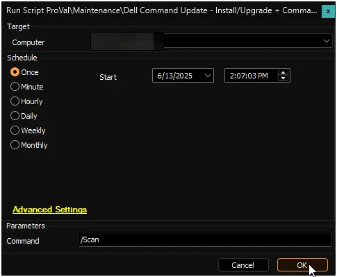
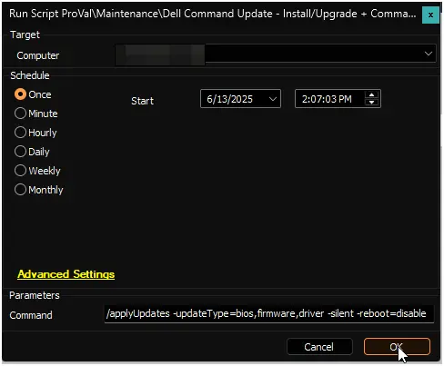
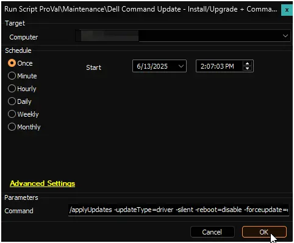

## Summary

The [Dell Command | Update](https://www.dell.com/support/kbdoc/en-in/000177325/dell-command-update) application is used by this script to carry out commands on Dell Workstations. If the application isn't already installed, it will be installed. If a version older than 5 is already present, it will upgrade the application to the latest available version.

**Supported OS:** Windows 10, Windows 11

**Supported commands/arguments reference:**  
[Supported commands/arguments reference](https://www.dell.com/support/manuals/en-us/command-update/dcu_rg/dell-command-%7C-update-cli-commands?guid=guid-92619086-5f7c-4a05-bce2-0d560c15e8ed&lang=en-us)

**Exit codes reference:**  
[Exit codes reference](https://www.dell.com/support/manuals/en-aw/command-update/dcu_rg/command-line-interface-error-codes?guid=guid-fbb96b06-4603-423a-baec-cbf5963d8948&lang=en-us)

**Note:**

1. The systems must be compatible with the installation of Dell Command Update. For further details on compatible systems, please visit the compatible systems section of the following link: [Dell Command | Update Windows Universal Application | Driver Details | Dell US](https://www.dell.com/support/home/en-us/drivers/DriversDetails?driverId=0XNVX)  
2. ProVal does not recommend performing BIOS updates remotely. ProVal is not responsible for any failed devices due to remote BIOS updates. BIOS updates are performed at the MSP's risk.

## File Hash

**File Path:** `C:\ProgramData\_automation\Script\Install-DCU\Install-DCU.ps1`  
**File Hash (Sha256):** `026D23CFC99893FC6DC34653EE625A7004D855B739B63C9D0631E6B59D2CE558`  
**File Hash (MD5):** `89A1DD1732125D1132E85234B3AE2956`  

## Sample Run

### Example 1

Running the script with basic `/scan` command to return the available updates.  
**Command:** `/Scan`  
  

### Example 2

Running the script to install available `bios`, `firmaware`, and `driver` updates.  
This command will not update any active driver as we are not using the `-forceupdate` switch.  
**Command:** `/applyUpdates -updateType=bios,firmware,driver -silent -reboot=disable`  
  

### Example 3

Running the script to forcefully install all available driver updates.  
**Caution:** It is recommended to restart the computer at the earliest convenience after using the `-forceupdate=enable` switch, as this switch updates active drivers as well. An active driver that requires a restart for the update may malfunction if the update is installed without rebooting the computer.  
**Command:** `/applyUpdates -updateType=driver -silent -reboot=disable -forceupdate=enable`  
  

## User Parameters

| Name     | Example | Required | Description                                                                                       |
|----------|---------|----------|---------------------------------------------------------------------------------------------------|
| Command  | <ul><li>`/version`</li><li>`/scan`</li><li>`/scan -updateType=bios,firmware,driver`</li><li>`/applyUpdates -updateType=bios,firmware -silent -reboot=disable`</li><li>`/applyUpdates -updateType=driver -silent -reboot=disable -forceupdate=enable`</li><li>`/driverInstall -silent -reboot=disable`</li></ul>   | False    | Command to execute on the computer; the /scan command will be executed if this parameter is left blank.   **Reference:** [Supported commands/arguments reference](https://www.dell.com/support/manuals/en-us/command-update/dcu_rg/dell-command-%7C-update-cli-commands?guid=guid-92619086-5f7c-4a05-bce2-0d560c15e8ed&lang=en-us) |

## Script States

| Name                               | Description                                             |
|------------------------------------|---------------------------------------------------------|
| DellCommandUpdateLastCommandPassed | Stores the command executed from the user parameter.   |
| DellCommandUpdateScriptLastRunTime | Stores the script run time.                            |
| DellCommandUpdateScriptLastResult  | Output of the command executed from Dell Command \| Update. |
| UpdatesNeeded                      | Number of updates needed to install on the computer, returned by the /scan command. |
| LastRunStatus                      | Exit code returned by Dell Command \| Update. |
| LastRunStatusReference             | Translation of the exit code.                          |

## Output

- Script State
- Script Log
