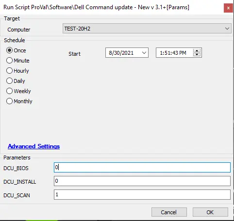

## Summary

This script installs and runs a scan for Dell Command Update.

**Time Saved by Automation:** 10 Minutes

## Sample Run

## Variables

| Variable | Description                                   |
|----------|-----------------------------------------------|
| Logs     | This contains the Dell command execution failure logs |

### User Parameters

| Name         | Example | Required | Description                                                                                                   |
|--------------|---------|----------|---------------------------------------------------------------------------------------------------------------|
| DCU_INSTALL  | 1       | False    | Set it to 1 to install/upgrade DCU. No scans or updates will be performed.                                   |
| DCU_SCAN     | 1       | False    | Set it to 1 to install/upgrade DCU, run a scan, and perform no updates.                                      |
| DCU_BIOS     | 1       | False    | Set it to 1 to install/upgrade DCU if needed, run a scan, execute updates, and attempt a BIOS update.       |

## Process

This script installs Dell Command Update if it is not present, updates it to version 3.1.2 if needed, configures it, runs a scan, and then performs a one-time Dell firmware update by default if no value is provided in the user parameters.

## Output

- Script log