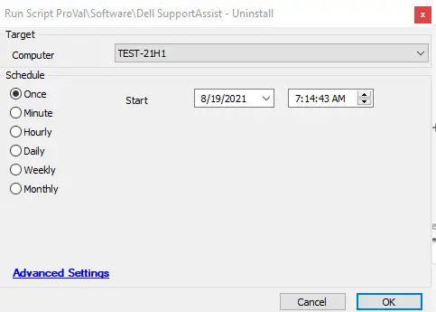

## Summary

The script will check if the Dell SupportAssist software is installed and then uninstall it from the Windows machines.

**Time Saved by Automation:** 10 Minutes

## Sample Run

## Process

This script will first check if the Dell SupportAssist software is installed and then attempt to uninstall it using a shell command. The script also verifies if the software was successfully uninstalled from the machine.

## Output

- Script log
