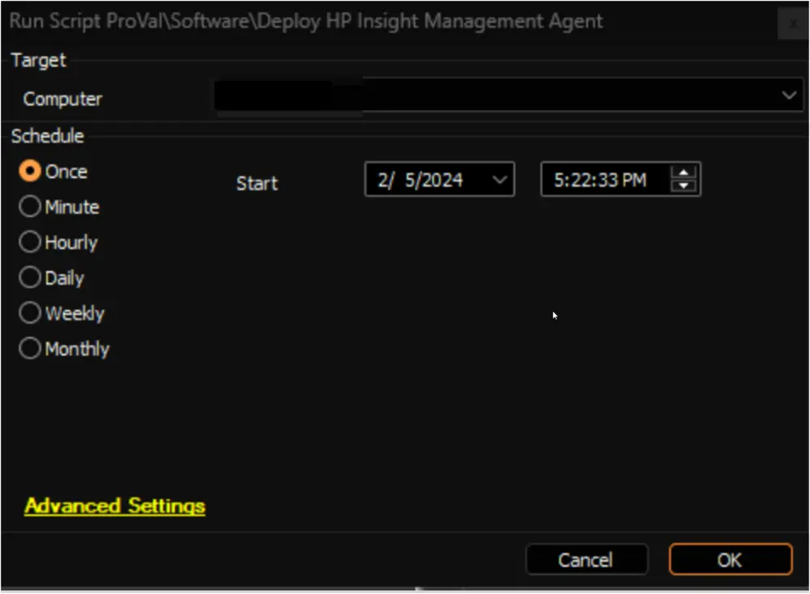
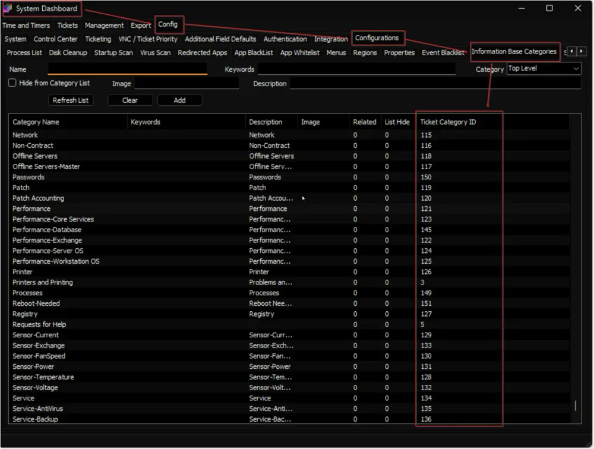

## Summary

This script installs the HP Insight Management Agent on Windows HP machines. The script downloads the installer from [Software Details - HPE Insight Management Agents for Microsoft Windows Server x64 Editions | HPE Support](https://support.hpe.com/connect/s/softwaredetails?language=en_US&softwareId=MTX_0084b7dc6d46464b8f7941db73).

## Sample Run

## Global Parameters

| Name                     | Required | Example | Description                                                                                                                                                                                                                                                                                                                                                                                                                                                                                                                                                                                                                                                                                                                                                          |
|--------------------------|----------|---------|----------------------------------------------------------------------------------------------------------------------------------------------------------------------------------------------------------------------------------------------------------------------------------------------------------------------------------------------------------------------------------------------------------------------------------------------------------------------------------------------------------------------------------------------------------------------------------------------------------------------------------------------------------------------------------------------------------------------------------------------------------------------|
| TicketCreationCategory    | False    | 298     | This global variable stores the ID of the `Ticket Category` to create the ticket. The default value is `0`, which means the script will not create any tickets for failures. To enable the ticket creation feature of the script for failures, this global variable must be configured with the ID of a ticket category. Ticket Categories are used to control the CW Manage service board of the tickets generated by Automate. Navigate to the **System Dashboard --> Config --> Information Base Categories** to find the ID of the required ticket category.  |

## Output

- Script Logs
- Ticket (if enabled)

## Ticketing

**Subject:** `HPE Insight Manager Installation Failed on %ComputerName% (%ComputerID%)`

**Ticket Body:** `Failed to Install HPE Insight Management Agent on %computername% at %clientname%. Here are the results returned from the installer: %shellresult%`

The PC information is outlined below:  
PC Name: %computername%  
Last Login: %lastuser%  
PC Model: @biosname@  
OS: %os%  
S/N OF PC: @biosver@

When the script fails to download the installer:

`HPE Insight Management Agent failed to download on %computername% at %clientname%. Please ensure that the computer is able to reach the download URL [https://downloads.hpe.com/pub/softlib2/software1/sc-windows/p14592108/v172199/cp041529.exe](https://downloads.hpe.com/pub/softlib2/software1/sc-windows/p14592108/v172199/cp041529.exe)`

The PC information is outlined below:  
PC Name: %computername%  
Last Login: %lastuser%  
PC Model: @biosname@  
OS: %os%  
S/N OF PC: @biosver@
