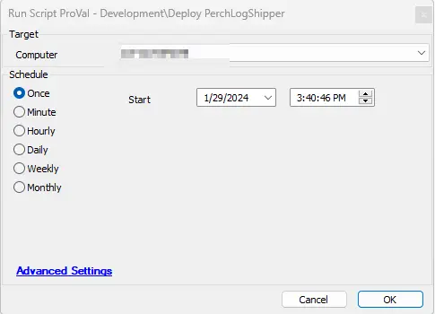
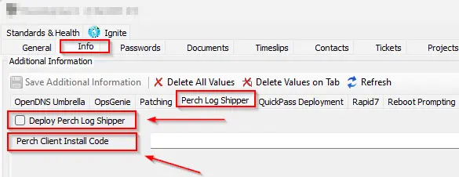
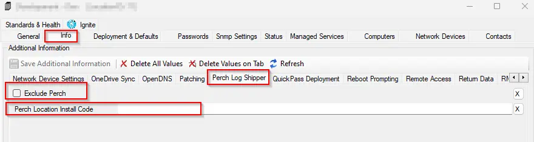
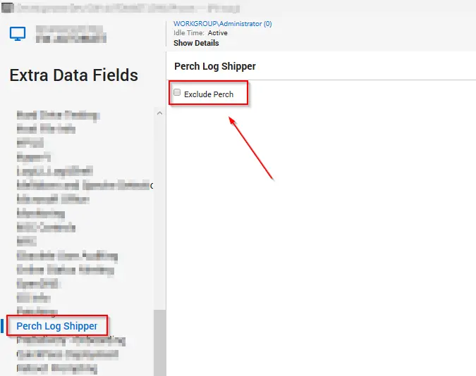
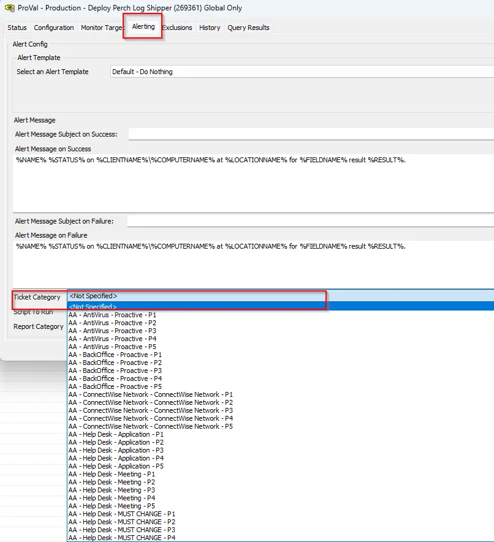

## Summary

This script deploys the Perch Log Shipper on Windows machines where it is not already installed. The client-level EDF `Deploy Perch Log Shipper` must be checked, and either the client-level EDF `Perch Client Install Code` or the location-level EDF `Perch Location Install Code` must be populated to enable the deployment of the Perch Log Shipper on the client machines.

## Script Target

Windows Machines

## Dependencies

[Install-PerchLogShipper](/docs/41fd7a2b-4604-4ef1-bd74-c7a4325da37e)

## Sample Run

It must be run with the [Agents Missing PerchLogShipper](/docs/bc410117-b7b7-4345-967c-965f15acdf07) monitor but can also be run individually.

## Extra Data Fields

| EDF Name                     | Level   | Type      | Description                                                                                                                                                          |
|------------------------------|---------|-----------|----------------------------------------------------------------------------------------------------------------------------------------------------------------------|
| Deploy Perch Log Shipper     | Client  | CheckBox  | Check it if you would like to enable the client for Perch Log Shipper deployment.                                                                                   |
| Perch Client Install Code     | Client  | TextField | Populate it with a client-based installation code.                                                                                                                 |
| Perch Location Install Code    | Location| TextField | Populate it with a location-based installation code. If nothing is mentioned at `Perch Client Install Code`, the script will check for the location-level installation code mentioned at `Perch Location Install Code`. |
| Exclude Perch                | Location| CheckBox  | Check it if you would like to exclude a location from Perch Log Shipper deployment.                                                                                 |
| Exclude Perch                | Computer| CheckBox  | Check it if you would like to exclude a computer from Perch Log Shipper deployment.                                                                                 |

Client-level EDFs to select Perch Log Shipper deployment and to populate the installation token.

Location-level EDF to exclude a location from Perch Log Shipper deployment and to populate the installation token.

Computer-level EDF to exclude a computer from Perch Log Shipper deployment.

## Output

- Script log
- Tickets

## Ticketing

The tickets will only be generated if the ticket category is defined on a global monitor.

**Ticket Subject:** `Perch Log Shipper Installation Failed on %ComputerName%(%ComputerID%)`

**Ticket Body:**  
Failed to install Perch Log Shipper on %computername% at %clientname%. Here are the script attempt results: @psout@

`@ErrorLog@`

The PC information is outlined below:  
PC Name: %computername%  
Last Login: %lastuser%  
PC Model: @biosname@  
OS: %os%  
S/N OF PC: @biosver@

## Ticket Category

The ticket category for the tickets generated by the script can be set from the alerting tab of the monitor.

- The ticket category can be selected at the monitor set (`ProVal - Production - Deploy Perch Log Shipper`) as shown below:

- If no ticket category is defined at the global monitor, the script will not generate any tickets.