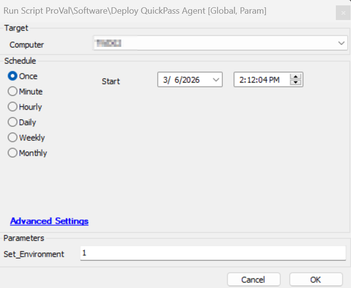
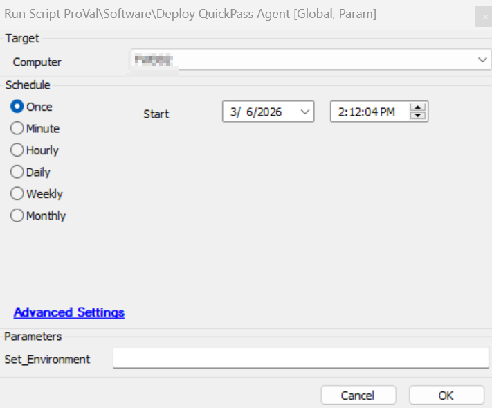
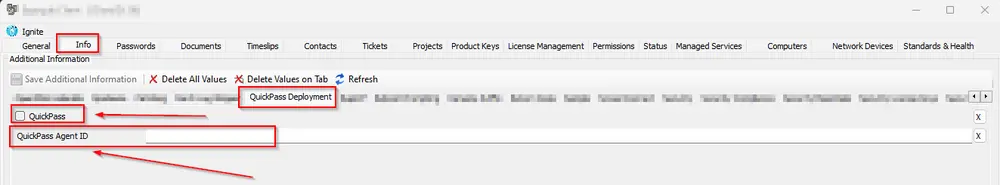
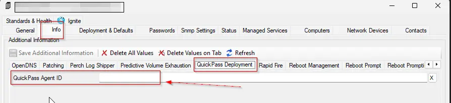
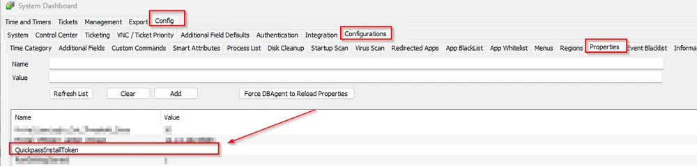
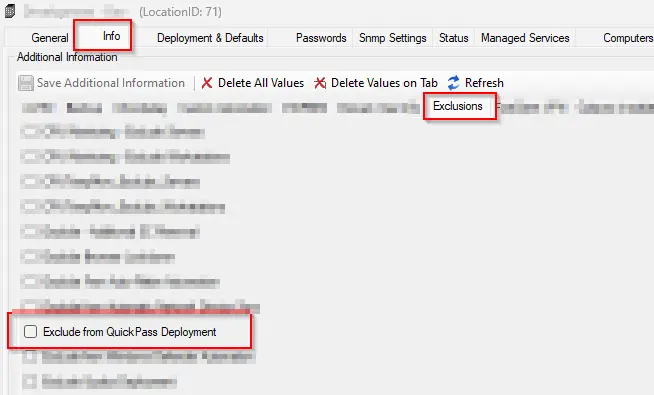
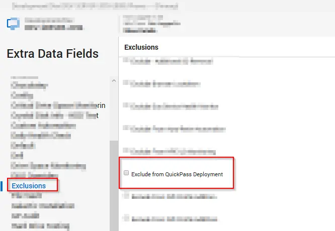

## Summary

This script installs the QuickPass Agent on Windows machines where it is not already installed. The `QuickPass` EDF must be selected, and the `QuickPass Agent ID` EDF should be populated with the specified CustomerID at the client level. Additionally, the System Property `QuickpassInstallToken` must be filled with the installation token to ensure the script installs the agent successfully.

**Note:** The script attempt to uninstall `QuickPass Agent` before installing `QuickPass Agent (64-bit)` if `QuickPass Agent` is installed on the machine.

## Sample Run

**First Run:** Execute the script with the user parameter `Set_Environment` as `1` to import the System Property `QuickpassInstallToken`, and deployment EDFs needed for the script.  


**Regular Run:**  


## Dependencies

- [Script - Uninstall QuickPass](/docs/632a4585-aa0a-11f0-9766-92000234cfc2)
- [Solution - QuickPass Deployment](/docs/65d0dbb6-29c1-4242-841c-1da9b92edab6)

## Global Parameters

| Name                    | Required | Example | Description                                                                                                    |
|-------------------------|----------|---------|----------------------------------------------------------------------------------------------------------------|
| region       | False    | NA       | Set it to the region code for the installation of the Quickpass |


## User Parameter

| Name              | Required | Example | Description                                                                                                    |
|-------------------|----------|---------|----------------------------------------------------------------------------------------------------------------|
| Set_Environment    | False    | 1       | Running the script with the user parameter `Set_Environment` as `1` will import the System Property `QuickpassInstallToken` and the required deployment EDFs needed for the script. <em><strong>Note:</strong> Set to 1 for first-time implementation.</em> |

## System Property

| Name                  | Required | Example                     | Description                                                                                                    |
|-----------------------|----------|-----------------------------|----------------------------------------------------------------------------------------------------------------|
| QuickpassInstallToken  | True     | d7ksgi-yh67-kdsh77-jd888   | It must be filled with the installation token to initiate the QuickPass Agent installation                     |

## Extra Data Fields

| EDF Name                              | Level    | Type      | Section | Description                                                                                                    |
|---------------------------------------|----------|-----------|----------|------------------------------------------------------------------------------------------------------|
| QuickPass                             | Client   | CheckBox  | QuickPass Deployment | Check it if you would like to enable the client for QuickPass Deployment                                      |
| QuickPass Agent ID                   | Client   | TextField | QuickPass Deployment | Populate it with the specified CustomerID at the client level to initiate the installation on targeted client machines |
| QuickPass Agent ID                   | Location   | TextField | QuickPass Deployment | Populate it with the specified CustomerID at the location level to override the value stored in client-level EDF `QuickPass Agent ID` |
| Exclude from QuickPass Deployment     | Location | CheckBox  | Exclusions | Check it if you would like to exclude a location from QuickPass Deployment                                     |
| Exclude from QuickPass Deployment     | Computer | CheckBox  | Exclusions | Check it if you would like to exclude a computer from QuickPass Deployment                                     |

- The `QuickPass` EDF must be selected, and the `QuickPass Agent ID` EDF should be populated with the specified CustomerID at the client level to initiate the installation on targeted client machines.  
  
<em>For more information on how to fetch the QuickPass Agent ID, refer to the document [Export Customers List, Status and Agent IDs – CyberQP (getquickpass.com)](https://support.getquickpass.com/hc/en-us/articles/360061942274-Export-Customers-List-Status-and-Agent-ID-s).</em>

- The `QuickPass Agent ID` EDF can be populated with the specified CustomerID at the location level to override the value set in the client-level EDF.  
  

- The System Property `QuickpassInstallToken` must be filled with the installation token to initiate the QuickPass Agent installation.  
  
<em>The QuickPass Installation Token can be fetched from the Quickpass Dashboard. Navigate to the Settings Menu and then to the Admin Login Details section. Click the COPY button for the Install Token.</em>

- Select the location-level EDF `Exclude from QuickPass Deployment` to exclude the desired location from receiving the QuickPass agent deployment.  


- Select the computer-level EDF `Exclude from QuickPass Deployment` to exclude the desired machine from receiving the QuickPass agent deployment.  


## Output

- Script Logs
- Ticketing

## Ticketing

**Subject:** `QuickPass Agent Installation Failed on %ComputerName%(%ComputerID%)`

**Ticket Body:**

```PlainText
Failed to start Quickpass Server Agent Service. Confirm the variables 'QPInstallTokenID' and 'QPAgentID' are defined and try again, or check the error logs: %shellresult%
```

**When the script fails to download the installer:**

```PlainText
Failed to download Quickpass-Agent-Setup.exe on %computername% at %clientname%. Please ensure that the computer can reach the download URL [https://storage.googleapis.com/qp-installer/production/Quickpass-Agent-Setup.exe](https://storage.googleapis.com/qp-installer/production/Quickpass-Agent-Setup.exe)

```

## Changelog

### 2025-04-10

- Initial version of the document

### 2026-03-06

- Modified the logic of the deployment
- Formatted it correctly, to fetch the EDFs and system property value using SQL rather than script functionality.
- Adjusted the script to create ticket if the `TicketCategory` is set in the monitor 
- Used latest vendor logic for the deployment
- Tested and ensured it works well now.