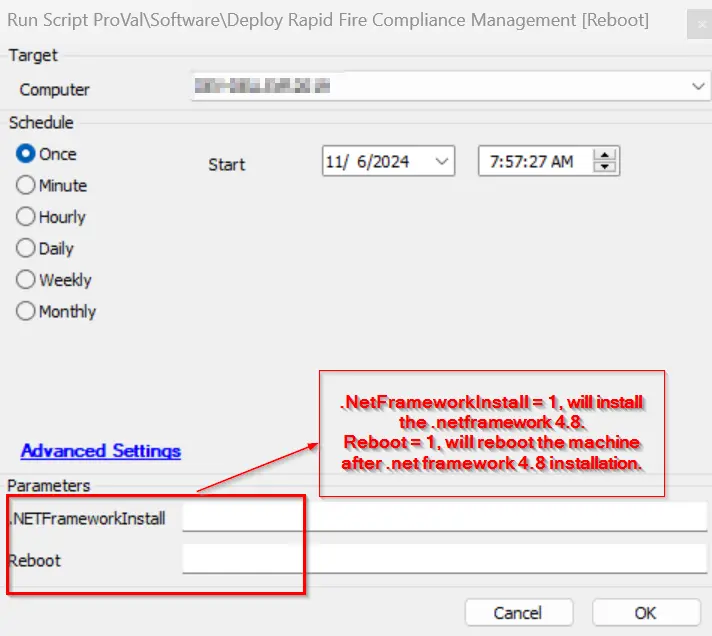
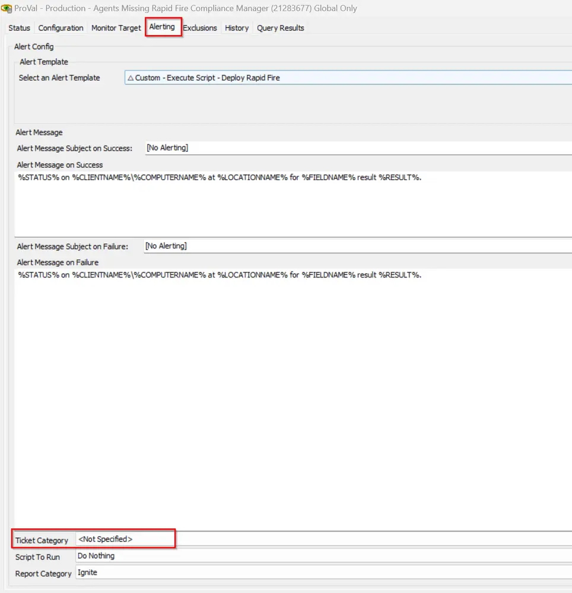

## Summary

This script deploys the Rapid Fire compliance management application.  
It first validates that the .NET Framework 4.8 is installed; if it is installed, then the deployment is possible.

## File Hash

`C01988F194AF3B508758190AB06E1E38`

## Sample Run

## Dependencies

Prerequisite: .NET Framework 4.8 should be installed  
[CWA Script - .NET 4.8 Framework Installation](/docs/bc595922-1293-432f-9b30-4a246d517606)

## Variables

| Name                | Description                                                                                                                                                                                                 |
|---------------------|-------------------------------------------------------------------------------------------------------------------------------------------------------------------------------------------------------------|
| BiosName            | This stores the BIOS name of the computer.                                                                                                                                                                   |
| BIOSVer             | This stores the BIOS version of the computer.                                                                                                                                                                |
| IsLocationEnabled    | This stores the location-EDF "Enable Compliance Management Deployment" value to check if the location-level compliance management deployment is enabled or not.                                          |
| IsLocationExcluded   | This stores the location-EDF "Exclude Rapid Compliance Management Deployment" value to check if the location-level compliance management deployment is excluded or not.                                    |
| IsMachineExcluded    | This stores the computer-EDF "Exclude Rapid Compliance Management Deployment" value to check if the endpoint compliance management deployment is excluded or not.                                          |
| ScriptPath          | This stores the working directory where the PS1 file will be saved and the execution of the deployment will be initiated.                                                                                 |
| LogContent          | This stores the PS1 execution logs.                                                                                                                                                                        |
| FrameWorkStatus     | This stores the Framework deployment status.                                                                                                                                                                |

## User Parameters

| Name                   | Example | Required | Description                                                                                                                                                           |
|------------------------|---------|----------|-----------------------------------------------------------------------------------------------------------------------------------------------------------------------|
| .NetFrameworkInstall    | 1       | False    | If this is set to 1, then if the agent does not have the .NET Framework 4.8 installed, it will get it installed.                                                     |
| Reboot                 | 1       | False    | If this is set to 1, then the endpoint will be rebooted only if the .NET Framework 4.8 installation is completed.                                                    |

## Ticketing

To enable ticketing, please set the ticket category at the monitor level: [CWA Internal Monitor - Agents Missing Rapid Fire Compliance Manager](/docs/c9e3891e-1588-4dbc-85eb-dc39a861a433).  

**Ticket Subject:**  
Rapid Fire Compliance Management Installation Failed on %ComputerName% (%ComputerID%)  

**Ticket Body:**  
Failed to install Compliance Management Agent on %computername% at %clientname%. Here are the results returned from the installer: %shellresult%  

## Output

- Script log
