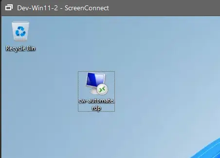

## Summary

This document describes a script that creates an RDP shortcut on the desktop of each user on a Windows computer. The script takes the target computer’s address or name from the `Target` parameter.

## Sample Run

#### User Parameters

| Name   | Example                      | Required | Description                     |
|--------|------------------------------|----------|---------------------------------|
| Name   | CW-Automate                  | True     | Shortcut Name                   |
| Target | CW-Automate or 192.168.168.13 | True     | Target Computer / IP Address    |

## Output

- Script Log
- RDP shortcut on the user's desktop:
  
  
