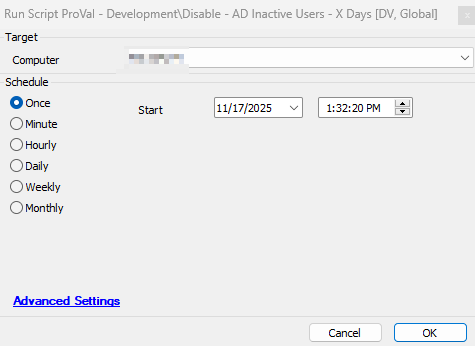

## Summary

This script detects the inactive users over X days to disable them, and records the data into the [Table - pvl_ad_inactive_users](/docs/2b118df6-1fef-4530-9303-0bb56c478361) so that it can be represented in the [Dataview - AD Inactive Users Audit](/docs/9c9888a7-678a-497f-8f61-11e21e020999).

This script excludes the default account `Administrator|Guest|krbtgt|DefaultAccount|.*\$`. 
Here, `*\$` meant any user that has $ its name at the end.

 For e.g. ``Computername$`` ``UserName$``

## Sample Run

Run normally to disable inactive AD users over threshold   

## File Hash

| Path | Algorithm | Hash |
| --- | --- | --- |
| `C:\ProgramData\_automation\script\Inactive_ADUsers\Inactive_ADUser.ps1` | MD5 | `8B49EC8D466054A8285CD53A93C97B5C` |
| `C:\ProgramData\_automation\script\Inactive_ADUsers\Inactive_ADUser.ps1` | SHA256 | `008A573E1FA9CE0F1D9D325ECE26DBBEBF59B65ADA548AF85A6683702B20CD04` |

## Dependencies

[Solution- Inactive AD Users Disable/Enable](/docs/d93ff68b-9515-4d4c-bfa4-ff551b3eac37)

## System Property

| Name           | Level                   | Required | Description      |
|---------------------------------|--------| ---------- | ----------------------------------- |
| Inactive_AD_Users_Threshold_Days | 90 | True | This is set to detect the inactive users those are not logged in from the provided days.  |
| Inactive_AD_Users_Exclude_Disable | demo,test,testuser | False | This will exclude the users from being included in the list to get disabled. The user's list should be provided in a comma-separated format. e.g., John,Kevin,demo. |  

## Process

1) If the property `Inactive_AD_Users_Exclude_Disable` is provided and the Client EDF `Exclude AD Inactive UserList` is set with the users, then script will exclude the users list from property `Inactive_AD_Users_Exclude_Disable` `+` `Exclude AD Inactive UserList` Client EDF list.

2) If the property `Inactive_AD_Users_Exclude_Disable` is empty and the Client EDF `Exclude AD Inactive UserList` is set, then the Client EDF `Exclude AD Inactive UserList` list of users will be excluded.

3) If property `Inactive_AD_Users_Exclude_Disable` has user lists and the EDFs at client level `Exclude AD Inactive UserList` is empty, then the script `Inactive_AD_Users_Exclude_Disable` will be accepted for the exclusion.

## Output

- [Table - pvl_ad_inactive_users](/docs/2b118df6-1fef-4530-9303-0bb56c478361)
- [Dataview - AD Inactive Users Audit](/docs/9c9888a7-678a-497f-8f61-11e21e020999)
- Script Log