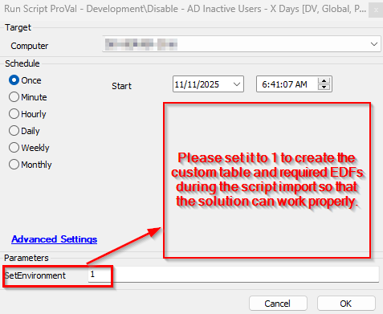
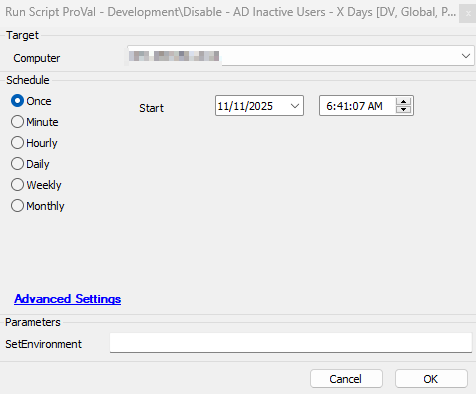
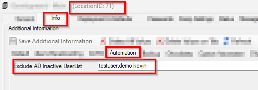
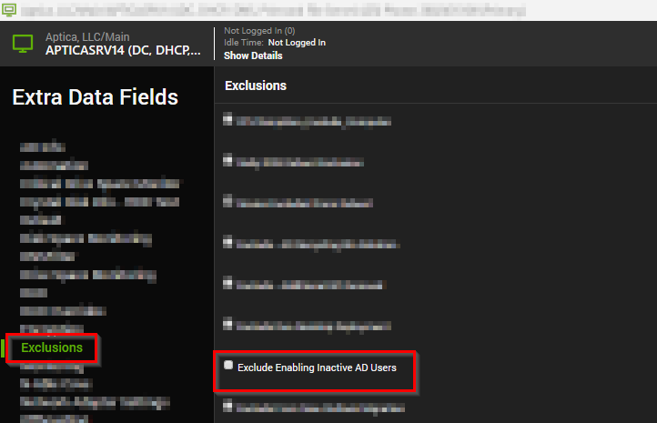

## Summary

This script detects the inactive users over X days and disables them, and records the data into the custom table so that it can be represented in a dataview.

## Sample Run

## File Hash

MD5 - `437700E0831610DC21C77F2AF7697205`

SHA256 - `F44ED5BF2380D9BAC15CD159E2B73ABF3649B652CCC8399925074528EA6BBD8E`

## Dependencies

[Solution- Inactive AD Users Disable/Enable](/docs/d93ff68b-9515-4d4c-bfa4-ff551b3eac37)

### User Parameters

| Name          | Example                                                                                   | Required | Description                                                       |
|---------------|-------------------------------------------------------------------------------------------|----------|-------------------------------------------------------------------|
| SetEnvironment     | 1 | False     |  It is needed to run this script initially with a value of 1 to create the custom table and import the required EDFs.                                             |

## Global Parameters

| Name          | Example                                                                                   | Required | Description                                                       |
|---------------|-------------------------------------------------------------------------------------------|----------|-------------------------------------------------------------------|
| Threshold_Days     | 90 | True     |  It defines the number of days since the user wasn't logged in to the domain environment.                                             |
| ExcludeList     | demo,test,testuser | False     |  This will exclude the users from being included in the list to get disabled. The user's list should be provided in a comma-separated format. e.g., John,Kevin,demo.                                             |

## EDFs

| Name           | Level  | Type  | Editable | Description             |
|-----------------|--------|--------|----------|-----------------------------------------------------------------------|
| Exclude AD Inactive UserList | Client | Text | Yes | This accepts the user list that is required to be excluded from the disable/enable of inactive AD users on the client.  |
| Exclude AD Inactive UserList | Location | Text | Yes | This accepts the user list that is required to be excluded from the disable/enable of inactive AD users on the location.  |
| Enable Inactive Disabled AD Users | Client | Checkbox | Yes | This will enable the inactive disabled users of the client's agents.  |
| Exclude Enabling Inactive AD Users | Location | Checkbox | Yes | This will exclude the enabling of inactive AD users for the location's agents.  |
| Exclude Enabling Inactive AD Users | Computer | Checkbox | Yes | This will exclude the enabling of the inactive disabled users of the agent.  |

## Process

This script detects the inactive users over X days and disables them, and records the data into the custom table so that it can be represented in a dataview.
Here X = `Threshold_Days` set in the Global Parameter.
This script excludes the default account `Administrator|Guest|krbtgt|DefaultAccount|.*\$`.

Here, `*\$` meant any user that has $ its name at the end.

For e.g. ``Computername$`` ``UserName$``

It also excludes users that are stored in the `Exclude AD Inactive UserList` EDFs at client/location level.

It works as follows:

1) If the Script `ExcludeList` is provided and the Location EDF `Exclude AD Inactive UserList` is set with the users, then script will exclude the `Excludelist` `+` `Exclude AD Inactive UserList` Location EDF list.

2) If the Script `ExcludeList` is provided and the Client EDF `Exclude AD Inactive UserList` is set with the users and the location EDF `Exclude AD Inactive UserList` is empty, then script will exclude the users list of `Excludelist` `+` `Exclude AD Inactive UserList` Client EDF list.

3)  If the Script `ExcludeList` is empty and the location EDF is set, then the Location EDF list will be excluded.

4) If the Script `ExcludeList` is empty and the location EDF `Exclude AD Inactive UserList` is empty too and only the Client EDF `Exclude AD Inactive UserList` is set, then the Client EDF `Exclude AD Inactive UserList` list of users will be excluded.

5) If Script `ExcludeList` has user lists and the EDFs at location/client level `Exclude AD Inactive UserList` is empty, then the script `ExcludeList` will be accepted for the exclusion.

## Output

- Custom table
- Dataview
- Output