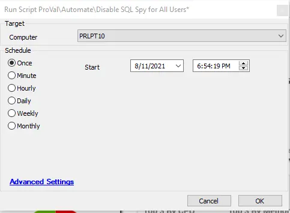

## Summary

The script will disable SQL Spy for all users in the environment.

**Time Saved by Automation:** 5 Minutes

## Sample Run

## Process

The script will execute a query against the Automate server to disable SQL Spy for all users in the environment. The change will take effect the next time the user logs in. The script will take the current value of the "windows" field in the `users_extend` table and remove the binary value of `524288` from it. This binary value is the switch used to display SQL Spy.