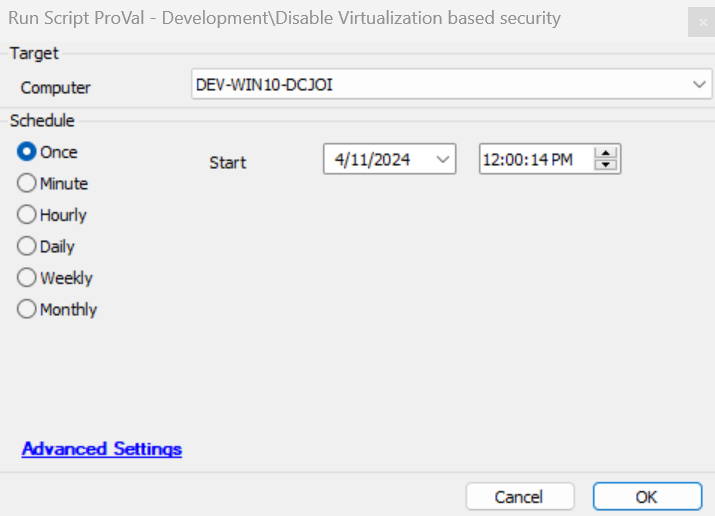

## Summary

This script will set the registry based on the following article:  
[Disable Windows Defender Credential Guard on Windows 11](https://windowsreport.com/disable-windows-defender-credential-guard-windows-11/).  
Once the registry is set, it will prompt the machine to reboot.

## Sample Run

## Dependencies

[EPM - Windows Configuration - Solution - User Prompt for Reboot](/docs/32d2254e-c2a4-4f2d-a029-b74f6d3c8b1a)

## Variables

| Name  | Description                                    |
|-------|------------------------------------------------|
| psout | Contains the status of whether the registry was set or not |

## Output

- Script log

