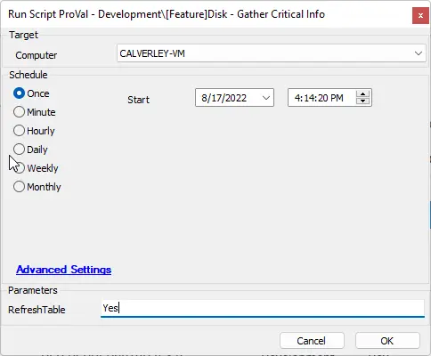

## Summary

This document should replace [EPM - Disk - Script - Disk - Gather Critical Info](/docs/ee31c873-0d1f-42fa-b698-cdfe1cbf75a6).

An Automate Script designed to retrieve data related to hard drive failures.  
It creates a custom table called `plugin_proval_cdi_data`.  
It appends data from that agnostic script to the created table.

## Sample Run

## Dependencies

- [EPM - Disk - Agnostic - Get-DiskInfo](/docs/5cba460d-9322-4c3b-9630-55cb46d57b1a)
- [EPM - Disk - Custom Table - plugin_proval_cdi_data](/docs/7a224177-45ff-4f2e-a8fe-a734a642a539)
- [CWM - Automate - Dataview - Disk - Critical Data](/docs/8a8b76b2-aa25-419c-b193-aa98f54ef274)

#### User Parameters

| Name           | Example | Required | Description                                                                                                                                                          |
|----------------|---------|----------|----------------------------------------------------------------------------------------------------------------------------------------------------------------------|
| RefreshTable   | Yes     | False    | If 'Yes' is provided, the table will be dropped and recreated. THIS MAY BE NECESSARY WHEN UPDATING THE SCRIPT TO NEWER VERSIONS!!!                                |

## Process

1. Executes the agnostic script and saves the System object, waits one minute, and does it again as another variable.
2. For each provided drive:
   1. Creates Drive objects [params]:
      - Calculated RAWValue formula: `/[D2 - D1/] / /[T2 - T1/] * 1000`
      - ID: The ID of the drive.
      - Model: The drive model.
      - Associated Drive Name (future development): If a request is made to link drive names to the associated drives, this can be done in the future.
      - FirmwareRevision: The drive firmware revision.
      - SerialNumber: The Serial Number of the drive.
      - Size: `$disk.DiskDrive.size / 1gb` (The disk size in GB).
      - RotationRate: `if(0 -eq $disk.Drive.SpindleSpeed) {$disk.Drive.MediaType} else {Write-Host $disk.Drive.SpindleSpeed}` (For SSD drives that have no spindle speed).
      - BufferSize: Unavailable at this time.
      - InterfaceType: The interface type of the drive.
      - BusType: The drive's bus type.
      - PowerCycles: `if($null -eq $disk.StorageReliabilityCounter.StartStopCycleCount) {(Get-EventLog System | Where EventId -in 41,1074,1076,6005,6006,6008,6009,6013).count} else {$disk.StorageReliabilityCounter.StartStopCycleCount}` (For drives that do not have compatible SMART values).
      - PowerOnHours: `if($null -eq $disk.StorageReliabilityCounter.PowerOnHours) {$disk.RawPerformanceData.Timestamp_Sys100NS / 3600000000000} else {$disk.StorageReliabilityCounter.PowerOnHours}` (For drives that do not have compatible SMART values).
      - HostReads: The total estimated host read actions in the drive's lifetime.
        - `= $disk.RawPerformanceData.Timestamp_Sys100NS / 1000000000 * $totaldiskQueue`
        - TotalDiskQueue is calculated as the average disk queue over the one minute this script ran, times the total amount of seconds that the machine has been on.
        - This result may vary; it is dependent on the computer's load over a one-minute period. During periods of inactivity, this result may be 0.
      - HostWrites: The total estimated host write actions in the drive's lifetime.
        - `= $disk.RawPerformanceData.Timestamp_Sys100NS / 1000000000 * $totalWriteQueue`
        - TotalWriteQueue is calculated as the average write queue over the one minute this script ran, times the total amount of seconds that the machine has been on.
        - This result may vary; it is dependent on the computer's load over a one-minute period. During periods of inactivity, this result may be 0.
      - Temperature: `if($null -ne $disk.StorageReliabilityCounter.Temperature) {'unsupported on virtual machines'} else {"/$($disk.StorageReliabilityCounter.Temperature) C ($(((9 / 5 * $disk.StorageReliabilityCounter.Temperature) + 32)) F)/"}` (For virtual machine drives that do not report temperature).
      - HealthStatus: The health status of the drive.
      - Features: The drive's capability descriptions joined with a comma.
      - APM: At this time, Adaptive Power Management is not available.
      - AAM: At this time, Adaptive Acoustic Management is not available and not applicable for SSD devices.
      - CriticalWarnings: `if($null -eq ($Disk.StorageReliabilityCounter.ReadErrorsUncorrected + $disk.StorageReliabilityCounter.WriteErrorsUncorrected)) {0} else {$Disk.StorageReliabilityCounter.ReadErrorsUncorrected + $disk.StorageReliabilityCounter.WriteErrorsUncorrected}` (The total amount of uncorrected errors either read or write on the drive).
      - CompositeTemperature: `if([math]::Round((((Get-CimInstance -Namespace Root/WMI -ClassName MSAcpi_ThermalZoneTemperature -ErrorAction silentlyContinue).CurrentTemperature) /10),2)-273.15 -lt 0) {'Not Supported on virtual machines'} else {"/$(([math]::Round((((Get-CimInstance -Namespace Root/WMI -ClassName MSAcpi_ThermalZoneTemperature -ErrorAction silentlyContinue).CurrentTemperature) /10),2) -273.15)) C ($((9/5 * ([math]::Round((((Get-CimInstance -Namespace Root/WMI -ClassName MSAcpi_ThermalZoneTemperature -ErrorAction silentlyContinue).CurrentTemperature) /10),2) -273.15) +32)) F)/"}` (For virtual machine correction).
      - AvailableSpare: At this time, available spare information is unavailable.
      - SpareThreshold: At this time, spare thresholds are unavailable.
      - PercentageUsed: `="$(($disk.DiskPartition.partition.size | Measure-Object -sum).sum / $disk.DiskDrive.Size * 100) %"` (This is important; there is a difference between a logical disk and a physical disk. This report displays physical drive percentages, i.e., how much of drive 0 is taken up by x partitions).
      - DataUnitsWritten: `= $disk.RawPerformanceData.Timestamp_Sys100NS / 1000000000 * $totalDiskWriteBytesPersec` (Disk writes per second times total seconds).
      - DataUnitsRead: `= $disk.RawPerformanceData.Timestamp_Sys100NS / 1000000000 * $totalDiskReadBytesPersec` (Disk reads per second times total seconds).
      - HostReadCommands: The total read queue times the total seconds.
      - HostWriteCommands: The total write queue times the total seconds.
      - ControllerBusyTime: 100 - the total idle time.
      - UnsafeShutdowns: This data is unavailable at this time.
      - IntegrityErrors: This data is unavailable at this time.
      - InformationalLogEntries: This data is unavailable at this time.
      - Date: The date this ran.
      - TotalDiskLatency: Future development.
      - TotalIdleTime: Future development.
      - TotalReadLatency: Future development.
      - TotalWriteLatency: Future development.
   3. Creates an insert statement based on the above information.
   4. Returns the full insert statement.

## Output

- Script log

## FAQ

1. **Will this work on virtual machines?**
   - Yes, this script will return all data relating to the physical hard disk that is available on the virtual machine. However, although this data is provided, it is only an estimation of the physical disk health and may not be completely accurate.
   
2. **How accurate are the results of this?**
   - Some calculations are based on the number of processes in the one-minute period between the checks. This will give you an average; however, due to its short timespan, the results may vary. Expanding the time between the two runs of the Get-DiskInfo script would increase the accuracy of the results.
   
3. **Why is my disk percentage used so high when my C drive has 60 percent free?**
   - This script is reporting on the state of the physical hard disk, not the logical drive. The percentage used is the percentage of the physical disk that is utilized by all designated partitions, and those partition sizes reflect the total physical disk usage.
   
4. **I updated this script to its newest version, and now the script fails every time.**
   - Please set the refresh table to 'Yes' on the first run after a version upgrade of this script.