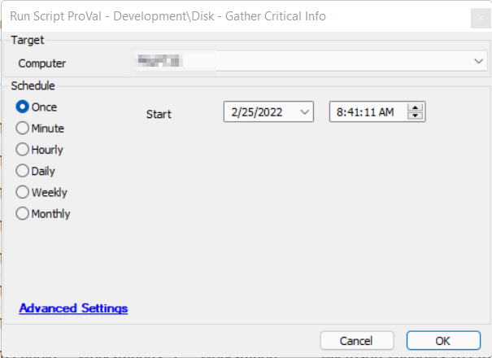

## Summary

Automate Script designed to handle the Agnostic Script [EPM - Disk - Agnostic - Get-CriticalDiskInfo](/docs/880d2a63-b304-40a3-8ec3-1fb13b272fa7).  
Creates a custom table called `plugin_proval_cdi_data`.  
Appends data from the agnostic script to the created table.

## Sample Run

## Dependencies

- [EPM - Disk - Agnostic - Get-CriticalDiskInfo](/docs/880d2a63-b304-40a3-8ec3-1fb13b272fa7)  
- [CWM - Automate - Dataview - Disk - Critical Data](/docs/8a8b76b2-aa25-419c-b193-aa98f54ef274)

## Process

Reference the Agnostic Script Process found in [EPM - Disk - Agnostic - Get-CriticalDiskInfo](/docs/880d2a63-b304-40a3-8ec3-1fb13b272fa7).

## Output

The location and method by which this script returns data:

- Script log
- Script state
- Local file on computer
- Dataview

