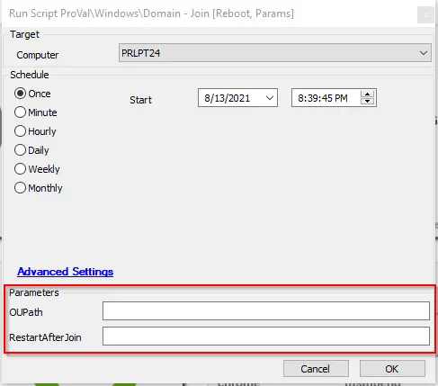

## Summary

This script joins the target machine to a domain.  
**Time Saved by Automation:** 10 Minutes

## Sample Run

#### User Parameters

| Name              | Example     | Required | Description                                                                                                                                         |
|-------------------|-------------|----------|-----------------------------------------------------------------------------------------------------------------------------------------------------|
| OUPath            | OU=servers  | False    | The distinguished name of the OU to place the computer into. If left blank, the default OU for computers will be used.                           |
| RestartAfterJoin  | True        | False    | Set to True to reboot the machine automatically after successfully joining the domain. Any other input (including no input) will not automatically reboot the machine. |

## Process

This script joins the target machine to a domain based on its current client and location affiliation. It does this by retrieving a comma-separated list of domains from the client via SQL and the local admin credentials from the target computer's location, then executes the script utilizing the variables.

## Output

- Script log
