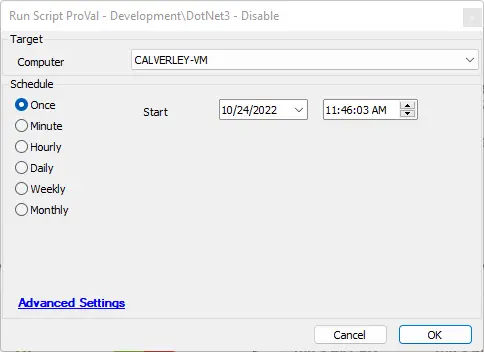

## Summary

This document describes the implementation of the Disable-DotNet3 agnostic script within ConnectWise Automate.

## Sample Run

## Dependencies

- [EPM - Windows Configuration - Agnostic - Disable-DotNet3](/docs/11fe51f7-8d56-485e-9342-3492254ae7ed)

## Process

Please review the agnostic content documentation for process information.