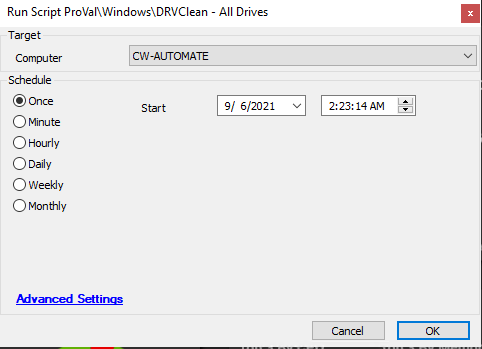

## Summary

This guide details the process of cleaning well-known directories of aging files and folders on all internal drives.  
**Time Saved by Automation:** 20 Minutes

## Sample Run

## Dependencies

[Download DRVClean.exe](https://file.provaltech.com/repo/app/DRVClean.exe)

## Variables

| Variable          | Description                                                                 |
|-------------------|-----------------------------------------------------------------------------|
| ProjectName       | Contains the application name and project title                            |
| WorkingDirectory   | Contains the path where this development workaround will be stored          |
| EXEURL            | Contains the URL link for direct download of drvclean.exe file            |
| EXEPATH           | Contains the directory information where the file will be downloaded on the local agent |
| EXELOG            | Contains the logging path where file execution logs will be stored          |
| EXEERRORLOG       | Contains the error log path where file execution errors will be stored      |

## Process

This process cleans well-known directories of aging files and folders on all internal drives.  
**Requirements:** Must run on a Windows machine.

## Output

- Script log

