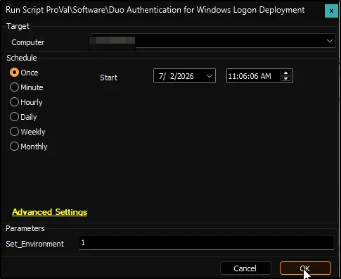
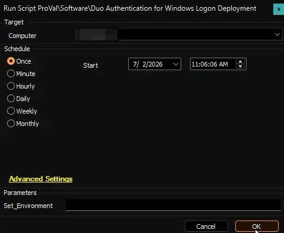
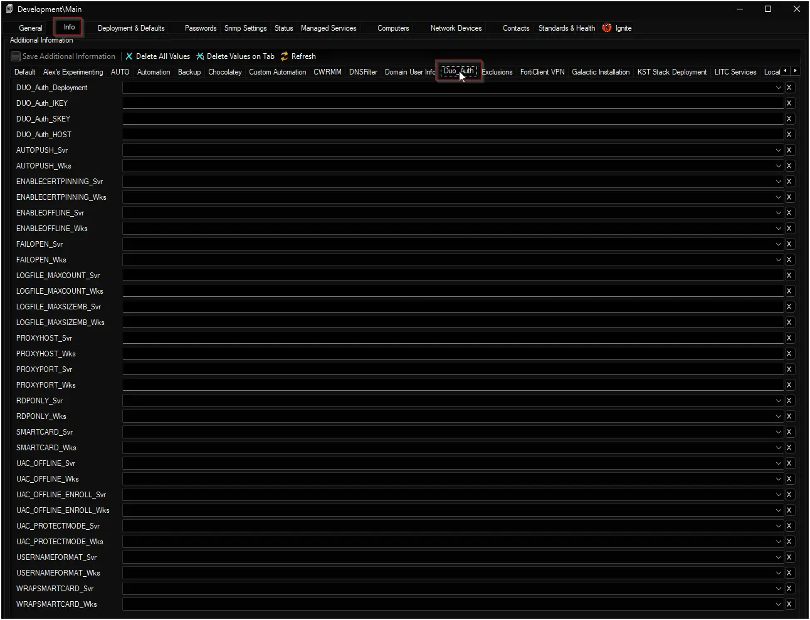
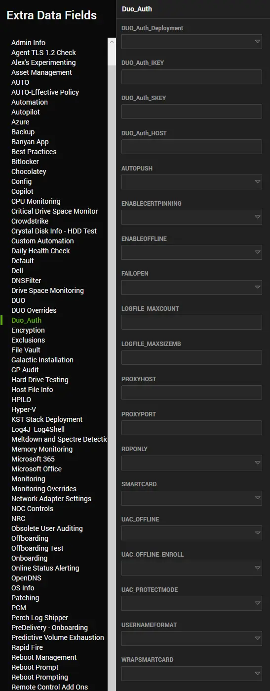

## Summary

This CW Automate script is the **Automate implementation** of the PowerShell installer **[Install-DuoAuthForWinLogon](/docs/10212d7-3608-4484-80fa-85dd23bc32ad)**. It downloads the latest Duo Authentication for Windows Logon setup directly from Duo, verifies the file’s integrity, and installs it with the configuration you define through Extra Data Fields (EDFs).

The script is designed to:

- **Set up Duo quickly** – on first run with `Set_Environment = 1`, it creates all necessary EDFs and migrates settings from the old DUO EDFs.
- **Keep Duo up‑to‑date** – a remote monitor (created automatically for managed machines) checks every hour whether Duo is installed and current. If not, the same script runs again to fix it.
- **Create tickets when things go wrong** – if an automated installation attempt fails, a ticket is generated and updated until the issue is resolved. Manual runs do **not** create tickets.

All installation parameters are taken from the [Duo Authentication for Windows Logon knowledge base](https://help.duo.com/s/article/1090?language=en_US). The script follows the instructions in that article.

## Sample Run

**First Run – Environment Setup**  
To create the EDFs and migrate values from the old Duo fields, run the script once with `Set_Environment = 1`. You can run it against any online Windows computer.

**Regular Execution**  

## Dependencies

- [PowerShell: Install-DuoAuthForWinLogon](/docs/10212d7-3608-4484-80fa-85dd23bc32ad)
- [Solution: Duo Authentication for Windows Logon Deployment](/docs/df469efc-a893-4332-91e6-7bbfcb019b4c)

## Global Variables

| Name | Default | Description |
|------|---------|-------------|
| Debug | `False` | Set to `True` to see detailed informational logs for troubleshooting. |
| ScriptEngineEnableLogger | `False` | Set to `True` to write final success/failure logs to the Automate script history. |

## User Parameters

| Name | Example | Required | Description |
|------|---------|----------|-------------|
| Set_Environment | `1` | Only for the first run | Creates all the EDFs in the **Duo_Auth** section and copies values from the old DUO fields. Run this once before using the solution. |

## Client‑Level EDFs

These fields are found in the **Duo_Auth** section of the client settings. They define the default behaviour for all computers under this client unless overridden at the location or computer level.

| Name | Example | Type | Options | Section | Description |
|------|---------|------|---------|---------|-------------|
| DUO_Auth_Deployment | `Both` | Dropdown | `Workstations` · `Servers` · `Both` · `Disable` | Duo_Auth | Replaces the old `Duo Enabled Client` checkbox. Determines whether Duo is deployed on workstations, servers, both, or not at all. |
| DUO_Auth_IKEY | `DIABCDEFGHIJKLMNOP` | Text | – | Duo_Auth | Replaces the old `DUO IKEY`. Your Duo integration key (obtained from the Duo Admin Panel). This value is mandatory for installation. |
| DUO_Auth_SKEY | `a1b2c3d4e5f6g7h8i9j0…` | Text | – | Duo_Auth | Replaces the old `DUO SKEY`. Your Duo secret key. Mandatory. |
| DUO_Auth_HOST | `api-XXXXXXXX.duosecurity.com` | Text | – | Duo_Auth | Replaces the old `DUO HOST`. Your Duo API hostname. Mandatory. |
| AUTOPUSH_Svr | `1` | Dropdown | `0` · `1` | Duo_Auth | Replaces `DUO - AUTOPUSH - Server`. `1` = automatically send a push notification when a server user logs in; `0` = user must manually request a push. |
| AUTOPUSH_Wks | `1` | Dropdown | `0` · `1` | Duo_Auth | Replaces `DUO - AUTOPUSH - Workstation`. Same as above, but applies to workstations. |
| ENABLECERTPINNING_Svr | `1` | Dropdown | `0` · `1` | Duo_Auth | Enables or disables certificate pinning for Duo traffic from servers. `1` = enabled, `0` = disabled. Certificate pinning helps prevent man‑in‑the‑middle attacks. |
| ENABLECERTPINNING_Wks | `1` | Dropdown | `0` · `1` | Duo_Auth | Same option for workstations. |
| ENABLEOFFLINE_Svr | `1` | Dropdown | `0` · `1` | Duo_Auth | Replaces `DUO - ENABLEOFFLINE - Server`. `1` = allow users to authenticate offline (e.g., when Duo’s service is unreachable); `0` = block offline access. |
| ENABLEOFFLINE_Wks | `1` | Dropdown | `0` · `1` | Duo_Auth | Replaces `DUO - ENABLEOFFLINE - Workstation`. Same as above for workstations. |
| FAILOPEN_Svr | `0` | Dropdown | `0` · `1` | Duo_Auth | Replaces `DUO - FAILOPEN - Server`. `1` = if Duo’s service cannot be reached, allow the user to log in (fail open); `0` = deny access (fail closed). |
| FAILOPEN_Wks | `0` | Dropdown | `0` · `1` | Duo_Auth | Replaces `DUO - FAILOPEN - Workstation`. Same as above for workstations. |
| LOGFILE_MAXCOUNT_Svr | `10` | Text | – | Duo_Auth | Maximum number of rotated Duo log files to keep on servers. Once exceeded, the oldest file is deleted. |
| LOGFILE_MAXCOUNT_Wks | `10` | Text | – | Duo_Auth | Same setting for workstations. |
| LOGFILE_MAXSIZEMB_Svr | `50` | Text | – | Duo_Auth | Maximum size (in megabytes) of each rotated log file on servers. When a file reaches this size, it is rotated. |
| LOGFILE_MAXSIZEMB_Wks | `50` | Text | – | Duo_Auth | Same setting for workstations. |
| PROXYHOST_Svr | `proxy.corp.local` | Text | – | Duo_Auth | Hostname or IP address of an upstream HTTP proxy that Duo should use for its API calls from servers. Leave blank if no proxy is needed. |
| PROXYHOST_Wks | `proxy.corp.local` | Text | – | Duo_Auth | Same setting for workstations. |
| PROXYPORT_Svr | `8080` | Text | – | Duo_Auth | TCP port of the HTTP proxy for servers. Only used if `PROXYHOST_Svr` is set. |
| PROXYPORT_Wks | `8080` | Text | – | Duo_Auth | Same setting for workstations. |
| RDPONLY_Svr | `0` | Dropdown | `0` · `1` | Duo_Auth | Replaces `DUO - RDPONLY - Server`. `1` = require Duo authentication only for remote (RDP) logons; `0` = require Duo for both local console and RDP logons. |
| RDPONLY_Wks | `0` | Dropdown | `0` · `1` | Duo_Auth | Replaces `DUO - RDPONLY - Workstation`. Same as above for workstations. |
| SMARTCARD_Svr | `0` | Dropdown | `0` · `1` | Duo_Auth | Replaces `DUO - SMARTCARD - Server`. `1` = allow smart card login as an alternative to Duo; `0` = disable the Windows smart card provider (users cannot use smart cards). |
| SMARTCARD_Wks | `0` | Dropdown | `0` · `1` | Duo_Auth | Replaces `DUO - SMARTCARD - Workstation`. Same as above for workstations. |
| UAC_OFFLINE_Svr | `1` | Dropdown | `0` · `1` | Duo_Auth | When enabled (`1`), allows offline Duo authentication during User Account Control (UAC) elevation prompts on servers. |
| UAC_OFFLINE_Wks | `1` | Dropdown | `0` · `1` | Duo_Auth | Same option for workstations. |
| UAC_OFFLINE_ENROLL_Svr | `1` | Dropdown | `0` · `1` | Duo_Auth | When enabled (`1`), allows a user to enroll for offline access during a UAC elevation prompt on servers. |
| UAC_OFFLINE_ENROLL_Wks | `1` | Dropdown | `0` · `1` | Duo_Auth | Same option for workstations. |
| UAC_PROTECTMODE_Svr | `0` | Dropdown | `0` · `1` · `2` | Duo_Auth | Controls how Duo interacts with UAC elevation. `0` = respect existing Duo logon rules, `1` = disable Duo at Windows logon and only require it when a program requests elevation, `2` = enforce Duo at both logon and UAC elevation. For servers. |
| UAC_PROTECTMODE_Wks | `0` | Dropdown | `0` · `1` · `2` | Duo_Auth | Same options for workstations. |
| USERNAMEFORMAT_Svr | `1` | Dropdown | `0` · `1` · `2` | Duo_Auth | Specifies the username format sent to Duo from servers. `0` = sAMAccountName (short name), `1` = NTLM format (domain\username), `2` = userPrincipalName (email‑style). |
| USERNAMEFORMAT_Wks | `1` | Dropdown | `0` · `1` · `2` | Duo_Auth | Same options for workstations. |
| WRAPSMARTCARD_Svr | `0` | Dropdown | `0` · `1` | Duo_Auth | When smart card logon is enabled (`SMARTCARD_Svr` = 1), this setting determines if Duo is additionally required after the smart card authentication. `1` = require Duo after smart card, `0` = skip Duo. For servers. |
| WRAPSMARTCARD_Wks | `0` | Dropdown | `0` · `1` | Duo_Auth | Same option for workstations. |

## Location‑Level EDFs

These fields, also in **Duo_Auth**, override the client settings for a specific location. Setting a value here will apply to all computers in that location, unless it is further overridden at the computer level.

| Name | Example | Type | Options | Section | Description |
|------|---------|------|---------|---------|-------------|
| DUO_Auth_Deployment | `Both` | Dropdown | `Workstations` · `Servers` · `Both` · `Disable` | Duo_Auth | Replaces the old `DUO Agent Exclusion` checkbox. Overrides the client‑level deployment mode for this location. |
| DUO_Auth_IKEY | `DIABCDEFGHIJKLMNOP` | Text | – | Duo_Auth | Overrides the Duo integration key for this location. |
| DUO_Auth_SKEY | `a1b2c3d4e5f6g7h8i9j0…` | Text | – | Duo_Auth | Overrides the Duo secret key for this location. |
| DUO_Auth_HOST | `api-XXXXXXXX.duosecurity.com` | Text | – | Duo_Auth | Overrides the Duo API hostname for this location. |
| AUTOPUSH_Svr | `1` | Dropdown | `0` · `1` | Duo_Auth | Overrides the automatic push setting for servers in this location. `1` = auto‑send push, `0` = manual. |
| AUTOPUSH_Wks | `1` | Dropdown | `0` · `1` | Duo_Auth | Overrides the automatic push setting for workstations in this location. |
| ENABLECERTPINNING_Svr | `1` | Dropdown | `0` · `1` | Duo_Auth | Overrides certificate pinning for servers in this location. `1` = enabled, `0` = disabled. |
| ENABLECERTPINNING_Wks | `1` | Dropdown | `0` · `1` | Duo_Auth | Overrides certificate pinning for workstations in this location. |
| ENABLEOFFLINE_Svr | `1` | Dropdown | `0` · `1` | Duo_Auth | Overrides offline access for servers in this location. `1` = allow, `0` = block. |
| ENABLEOFFLINE_Wks | `1` | Dropdown | `0` · `1` | Duo_Auth | Overrides offline access for workstations in this location. |
| FAILOPEN_Svr | `0` | Dropdown | `0` · `1` | Duo_Auth | Overrides fail‑open mode for servers in this location. `1` = allow login if Duo unreachable, `0` = deny. |
| FAILOPEN_Wks | `0` | Dropdown | `0` · `1` | Duo_Auth | Overrides fail‑open mode for workstations in this location. |
| LOGFILE_MAXCOUNT_Svr | `10` | Text | – | Duo_Auth | Overrides the maximum number of rotated log files for servers in this location. |
| LOGFILE_MAXCOUNT_Wks | `10` | Text | – | Duo_Auth | Overrides the maximum number of rotated log files for workstations in this location. |
| LOGFILE_MAXSIZEMB_Svr | `50` | Text | – | Duo_Auth | Overrides the maximum log file size (MB) for servers in this location. |
| LOGFILE_MAXSIZEMB_Wks | `50` | Text | – | Duo_Auth | Overrides the maximum log file size (MB) for workstations in this location. |
| PROXYHOST_Svr | `proxy.corp.local` | Text | – | Duo_Auth | Overrides the proxy hostname for Duo traffic from servers in this location. |
| PROXYHOST_Wks | `proxy.corp.local` | Text | – | Duo_Auth | Overrides the proxy hostname for Duo traffic from workstations in this location. |
| PROXYPORT_Svr | `8080` | Text | – | Duo_Auth | Overrides the proxy port for servers in this location. |
| PROXYPORT_Wks | `8080` | Text | – | Duo_Auth | Overrides the proxy port for workstations in this location. |
| RDPONLY_Svr | `0` | Dropdown | `0` · `1` | Duo_Auth | Overrides RDP‑only protection for servers in this location. `1` = RDP only, `0` = local + RDP. |
| RDPONLY_Wks | `0` | Dropdown | `0` · `1` | Duo_Auth | Overrides RDP‑only protection for workstations in this location. |
| SMARTCARD_Svr | `0` | Dropdown | `0` · `1` | Duo_Auth | Overrides smart card alternative for servers in this location. `1` = allow, `0` = disable. |
| SMARTCARD_Wks | `0` | Dropdown | `0` · `1` | Duo_Auth | Overrides smart card alternative for workstations in this location. |
| UAC_OFFLINE_Svr | `1` | Dropdown | `0` · `1` | Duo_Auth | Overrides offline access during UAC elevation for servers in this location. |
| UAC_OFFLINE_Wks | `1` | Dropdown | `0` · `1` | Duo_Auth | Overrides offline access during UAC elevation for workstations in this location. |
| UAC_OFFLINE_ENROLL_Svr | `1` | Dropdown | `0` · `1` | Duo_Auth | Overrides offline enrollment during UAC elevation for servers in this location. |
| UAC_OFFLINE_ENROLL_Wks | `1` | Dropdown | `0` · `1` | Duo_Auth | Overrides offline enrollment during UAC elevation for workstations in this location. |
| UAC_PROTECTMODE_Svr | `0` | Dropdown | `0` · `1` · `2` | Duo_Auth | Overrides UAC protection mode for servers. `0` = respect logon rules, `1` = UAC only, `2` = both. |
| UAC_PROTECTMODE_Wks | `0` | Dropdown | `0` · `1` · `2` | Duo_Auth | Overrides UAC protection mode for workstations. |
| USERNAMEFORMAT_Svr | `1` | Dropdown | `0` · `1` · `2` | Duo_Auth | Overrides the username format sent to Duo from servers. `0` = sAM, `1` = domain\user, `2` = UPN. |
| USERNAMEFORMAT_Wks | `1` | Dropdown | `0` · `1` · `2` | Duo_Auth | Overrides the username format for workstations. |
| WRAPSMARTCARD_Svr | `0` | Dropdown | `0` · `1` | Duo_Auth | Overrides whether Duo is required after smart card logon on servers. `1` = require Duo, `0` = skip. |
| WRAPSMARTCARD_Wks | `0` | Dropdown | `0` · `1` | Duo_Auth | Overrides the same for workstations. |

## Computer‑Level EDFs

Computer overrides are also in **Duo_Auth**. They use the same names as the client EDFs but without the `_Svr` or `_Wks` suffix – the script automatically picks the right setting based on the computer’s operating system.

| Name | Example | Type | Options | Section | Description |
|------|---------|------|---------|---------|-------------|
| DUO_Auth_Deployment | `Disable` | Dropdown | `Workstations` · `Servers` · `Both` · `Disable` | Duo_Auth | Replaces the old `Duo Agent Exclusion` computer checkbox. Overrides the deployment mode for this specific computer. |
| DUO_Auth_IKEY | – | Text | – | Duo_Auth | Overrides the integration key for this machine. |
| DUO_Auth_SKEY | – | Text | – | Duo_Auth | Overrides the secret key. |
| DUO_Auth_HOST | – | Text | – | Duo_Auth | Overrides the API hostname. |
| AUTOPUSH | `0` | Dropdown | `0` · `1` | Duo_Auth | Replaces the old `DUO - AUTOPUSH` computer override. `1` = auto‑send push, `0` = manual push. |
| ENABLECERTPINNING | `1` | Dropdown | `0` · `1` | Duo_Auth | Overrides certificate pinning setting for this computer. |
| ENABLEOFFLINE | `1` | Dropdown | `0` · `1` | Duo_Auth | Replaces `DUO - ENABLEOFFLINE`. `1` = allow offline access, `0` = block. |
| FAILOPEN | `0` | Dropdown | `0` · `1` | Duo_Auth | Replaces `DUO - FAILOPEN`. `1` = fail open, `0` = fail closed. |
| RDPONLY | `0` | Dropdown | `0` · `1` | Duo_Auth | Replaces `DUO - RDPONLY`. `1` = RDP only, `0` = local + RDP. |
| SMARTCARD | `0` | Dropdown | `0` · `1` | Duo_Auth | Replaces `DUO - SMARTCARD`. `1` = allow smart cards, `0` = disable. |
| UAC_OFFLINE | `1` | Dropdown | `0` · `1` | Duo_Auth | Overrides offline access for UAC elevation on this computer. |
| UAC_OFFLINE_ENROLL | `1` | Dropdown | `0` · `1` | Duo_Auth | Overrides offline enrollment during UAC elevation. |
| UAC_PROTECTMODE | `0` | Dropdown | `0` · `1` · `2` | Duo_Auth | Overrides UAC protection mode. See client‑level description for meaning of each value. |
| USERNAMEFORMAT | `1` | Dropdown | `0` · `1` · `2` | Duo_Auth | Overrides the username format for this computer. |
| WRAPSMARTCARD | `0` | Dropdown | `0` · `1` | Duo_Auth | Overrides whether Duo is required after smart card logon. |
| LOGFILE_MAXCOUNT | – | Text | – | Duo_Auth | Overrides the maximum number of rotated log files. |
| LOGFILE_MAXSIZEMB | – | Text | – | Duo_Auth | Overrides the maximum log file size. |
| PROXYHOST | – | Text | – | Duo_Auth | Overrides the proxy hostname. |
| PROXYPORT | – | Text | – | Duo_Auth | Overrides the proxy port. |

## Output

**Installation**  
Duo Authentication for Windows Logon is installed silently. After a successful run, you will find the application in **Programs and Features** as “Duo Authentication for Windows Logon”.

**Logs**  
All actions are logged by the PowerShell script. The logs are saved in the same folder where the script runs and are named:

- `Install-DuoAuthForWinLogon-log.txt`
- `Install-DuoAuthForWinLogon-error.txt`

**Remote Monitor**  
When the script is triggered by the [internal monitor](/docs/01a557b0-e14a-4c87-885d-7ad2e79bf74e) (i.e., automatically for a managed computer), it also creates a remote monitor called **[Duo Authentication for Windows Logon Version Check](/docs/b75e9b1e-2035-4d68-bb4c-4d852012cace)**. This monitor runs every hour and checks:

- Is Duo installed?
- Is it the latest version?

If the answer to either question is “no”, the monitor returns a failure message (for example, `Failure: Not Installed`). That failure triggers the alert template **△ Custom - Execute Script - Duo Authentication for Windows Logon Deployment**, which immediately runs this script again to fix the problem.

The remote monitor is **not** created when you run the script manually. It is only placed on computers that are part of the automated deployment (i.e., where the internal monitor decided to run the script).

## Ticketing

- **When a ticket is created** – If the script fails while being run by the internal monitor or the remote monitor (i.e., automatically), a ticket is opened automatically.
- **Ticket subject** – `DUO Authentication for Windows Logon Install/Update Failed on %ComputerName% at %ClientName%`
- **Consecutive failures** – If the script fails again on the same machine, a new comment is added to the existing open ticket rather than creating a duplicate ticket.
- **Automatic closure** – When a later run of the script succeeds, the ticket is automatically closed.

Manual runs of the script (not triggered by a monitor) will **never** create or modify tickets.

## Changelog

### 2025-07-02

- Initial version of the document.
- New script replaces the old **DUO Install & Upgrade - Latest Version**.
- Introduced the **Duo_Auth** EDF section with separate fields for servers and workstations.
- Added automatic migration of settings from the old Duo EDFs.
- Added the **Duo Authentication for Windows Logon Version Check** remote monitor.
- Implemented automatic ticket creation, comment appending, and closure.
